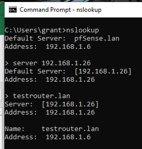

# Running DNS from OS10

## Physical Configuration

    OS10# show version
    Dell EMC Networking OS10 Enterprise
    Copyright (c) 1999-2020 by Dell Inc. All Rights Reserved.
    OS Version: 10.5.1.3
    Build Version: 10.5.1.3.190
    Build Time: 2020-06-19T21:48:07+0000
    System Type: S4112F-ON
    Architecture: x86_64
    Up Time: 00:30:27

## Software Configuration

    OS10(config)# configure terminal
    OS10(config)# ip name-server 192.168.1.6
    OS10(config)# interface vlan 1
    OS10(conf-if-vl-1)# ip address 192.168.1.26/24
    OS10(conf-if-vl-1)# exit
    OS10(config)# ip route 0.0.0.0/0 192.168.1.6 interface vlan1
    OS10(config)# end
    OS10# system bash
    sudo passwd root
    su -
    sudo apt-get update -y && sudo apt-get install dnsmasq vim dnsutils
    vim /etc/hosts

Inside of /etc/hosts add some random entry. I added `192.168.1.26 testrouter.lan`

Run `:wq!` to save and exit vim

Inside of my config /etc/resolv.conf had an erroneous search entry. I had to clear that out to ensure it was valid.

Now run `systemctl start dnsmasq`

## Test on another host

## Warning!

I have only tried this with VLAN interfaces which show up as a bridge with an IP under the hood. I'm not sure if you apply an IP address directly to an interface that it would still work. Would have to test it.
