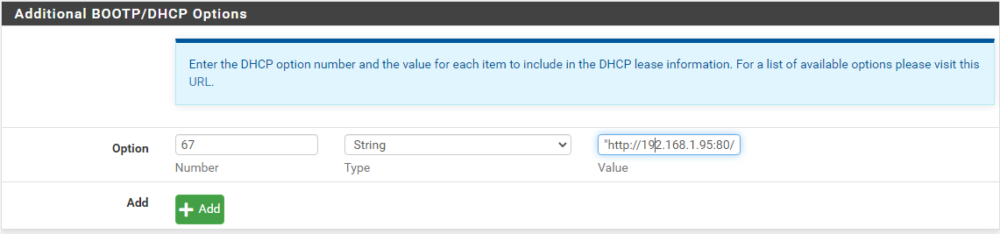

# SONiC - Fully Automated Build

## Install the Operating System

1. Download SONiC OS for whatever manufacturer. In my case I pulled Dell's stable image.
   1. Note: My testing is on a Z9264F-ON.
2. Follow the instructions [for setting up and running ONIE](../README.md#how-to-configure-onie)

## Configure ZTP

The official ZTP documentation for SONiC is [here](https://github.com/Azure/SONiC/blob/master/doc/ztp/ztp.md).

### Configure DHCP for ZTP

The first thing you will need to do is configure the DHCP server servicing the devices to provide option 67 which will point to initial boot file used by SONiC's ZTP agent. The options for URL are defined [here](https://github.com/Azure/SONiC/blob/master/doc/ztp/ztp.md#url-object). I used PFSense to provide DHCP. On the DHCP server section I added option 67 with type string and value "http://192.168.1.95:80/initial.json".



The name of the JSON file doesn't matter.

### Configure Your HTTP Server

Next on the HTTP server you will need to add two files. The first is the aforementioned initial configuration file. A copy of mine is below.

```json
{
  "ztp": {
    "configdb-json" : {
      "url": {
        "source": "http://192.168.1.95:80/config_db.json"
      }
    }
  }
}
```

The *source* field points to the actual configuration file you want to deploy to the networking device. On your web server you will also need to provide this configuration file. In my case I only had it update the device's management IP address:

```json
{
  "MGMT_INTERFACE": {
      "eth0|192.168.1.96/24": {
          "gwaddr": "10.11.12.1"
      }
  }
}
```

This file's sections are identical to what is in */etc/sonic/config_db.json*. If you want to see what something should look like you can look there and then copy/paste.

## Running ZTP

ZTP will run by default on a new device but if you want to force it to run you can make sure it is on with `ztp enable` and then `ztp run` to force it to run.

## Get Command Line

Run `sonic-cli` to get an OS-10 style command line.

## TODO

- First I want to get it working with a fixed file, then we'll do dynamic content
- Build out a templating system for provisioning multiple switches in Ansible