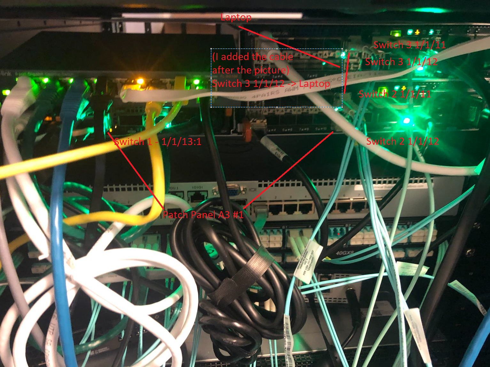
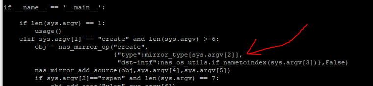

# Set Up RSPAN on OS10

## Setup

Source port for span is Switch 1, 1/1/9
Our goal is to move the traffic through switch 2, which is just an intermediary switch, to port 1/1/11 on switch 3 which will finally move it out port 1/1/12 where our laptop is listening.

We will use VLAN 99 to transport our RSPAN traffic

## Explanation

One of the things that's different about the Dell configuration is the use of ACLs in the configuration. The way OS10 sees RSPAN is on the source side you grab whatever source you want and then you push that to a special "remote" VLAN. This is indicated only on the source switch itself. Then, each other intermediate and destination switch uses an ACL to indicate what traffic should be captured from that VLAN and subsequently forwarded. Finally, on the destination a regular local monitor session is used to pull the traffic from the RSPAN VLAN and push it t o network sensors.

## Switch 1

### Version

    OS10# show version
    Dell EMC Networking OS10 Enterprise
    Copyright (c) 1999-2020 by Dell Inc. All Rights Reserved.
    OS Version: 10.5.1.3
    Build Version: 10.5.1.3.190
    Build Time: 2020-06-19T21:48:07+0000
    System Type: S4112F-ON
    Architecture: x86_64
    Up Time: 18 weeks 3 days 11:10:52

### Setup

    configure terminal
    interface vlan 99
    description remote_span
    remote-span
    exit
    interface ethernet 1/1/13:1
    no shutdown
    switchport mode trunk
    switchport trunk allowed vlan 99
    exit
    monitor session 18 type rpm-source
    source interface ethernet 1/1/9 both
    destination remote-vlan 99
    no shut

## Switch 2

### Version

    Dell EMC Networking OS10 Enterprise
    Copyright (c) 1999-2020 by Dell Inc. All Rights Reserved.
    OS Version: 10.5.1.3
    Build Version: 10.5.1.3.190
    Build Time: 2020-06-19T21:48:07+0000
    System Type: S4112F-ON
    Architecture: x86_64
    Up Time: 00:48:32

### Setup

    configure terminal
    interface vlan 99
    exit
    interface range ethernet 1/1/11
    switchport mode trunk
    switchport trunk allowed vlan 99
    exit
    interface ethernet 1/1/12
    mac access-group rspan in
    switchport mode trunk
    switchport trunk allowed vlan 99
    exit
    monitor session 1
    destination interface ethernet1/1/11
    flow-based enable
    source interface ethernet1/1/12
    no shut
    mac access-list rspan
    seq 10 permit any any capture session 1 vlan 99

## Switch 3

### Version

    OS10# show version
    Dell EMC Networking OS10 Enterprise
    Copyright (c) 1999-2020 by Dell Inc. All Rights Reserved.
    OS Version: 10.5.1.3
    Build Version: 10.5.1.3.190
    Build Time: 2020-06-19T21:48:07+0000
    System Type: S4112F-ON
    Architecture: x86_64
    Up Time: 03:00:15

### Setup

    configure terminal
    interface vlan 99
    no shut
    exit
    mac access-list rpan
    seq 10 permit any any capture session 1 vlan 99
    interface ethernet 1/1/11
    switchport mode trunk
    switchport trunk allowed vlan 99
    mac access-group rpan in
    exit
    interface ethernet 1/1/12
    no shut
    exit
    monitor session 1
    destination interface ethernet1/1/12
    flow-based enable
    source interface ethernet1/1/11
    no shut

Notice here that there is an access list which captures the traffic on the inbound trunk interface. This access list is required. Also notice that on our monitor session we have `flow-based enable` which is also a requirement.

## How RSPAN Works Under the Hood

1. When you run commands in OS10 what you're really doing is calling into wrapper functions which ultimately do two things: configure the NPU and configure Debian. The commands you run are actually governed by a series of YANG files which exhaustively define what commands are acceptable and in what contexts. For example, the `rpm-source` command is defined in an enum here in `/alt/opt/dell/os10/share/yang-models/dell-span.yang`:

        typedef monitoring-types {
        type enumeration {
            enum "local" {
            value 1;
            description
                "PM local session.";
            }
            enum "rpm-source" {
            value 2;
            description
                "RPM source session.";
            }
            enum "erpm-source" {
            value 3;
            description
                "ERPM source session.";
            }
        }
        description
            "Monitor session types.";
        }

2. These definitions are combined with XML files which ultimately define the exact syntax of each command. For example, `/alt/opt/dell/os10/clisystem/command-tree/span.xml` defines the syntax for SPAN commands (note how the yang_name key references ):

        <!-- monitor session <id> type [local|rpm-source|rpm-destination|erpm-source]-->
        <PARAM name="type" help="Monitor session type" optional="true" ptype="SUBCOMMAND" mode="subcommand">
        <PARAM name="spantype" help="PM/RPM/ERPM sessions" default="local" ptype="SPANMODE" yang_name="/sessions/session/monitortype=${spantype}"> </PARAM>
        </PARAM>

3. I didn't exhaustively reverse engineer this part but at some point those commands and their arguments are interpreted and pushed to a series of Python modules. You'll see below how VLANs are set up using `brctl`. That setup seems to be handled by `/alt/opt/dell/os10/lib/python/dn_base_br_tool.py`. Ex:

        def create_br(bname):

            """Method to create a bridge.
            Args:
                bname (str): Name of the Bridge
            Returns:
                bool: The return value. True for success, False otherwise
            """
            res = []
            if run_command([BRCTL_CMD, 'addbr', bname], res) == 0:
                return True
            return False

4. Remote SPAN VLAN gets setup as a bridge and a new dummy interface is created which is a member of that bridge:

        admin@OS10:/home/admin$ ip a s
        .....
        38: br99: <BROADCAST,MULTICAST,PROMISC,UP,LOWER_UP> mtu 1500 qdisc noqueue state UP group default qlen 1000
            link/ether 50:9a:4c:d6:0a:a1 brd ff:ff:ff:ff:ff:ff
            inet6 fe80::529a:4cff:fed6:aa1/64 scope link
            valid_lft forever preferred_lft forever
        39: e101-013-1.99@e101-013-1: <BROADCAST,MULTICAST,UP,LOWER_UP> mtu 1500 qdisc noqueue master br99 state UP group default qlen 1000
            link/ether 50:9a:4c:d6:0a:7d brd ff:ff:ff:ff:ff:ff

        root@OS10:~# brctl show br99
        bridge name     bridge id               STP enabled     interfaces
        br99            8000.509a4cd60aa1       no              e101-013-1.99

5. Under the hood the NPU is instructed to push traffic coming in on port 1/1/9 to this bridge which will then forward it. If you really want to dig under the covers this is how that works. CPS (the userland tool which interacts with a database for configuring the switch) will receive the command. You can drop to command line with `system bash` and then go take a look at `/alt/opt/dell/os10/bin/cps_config_mirror.py` and actually see where the call to NAS is made. Note: The NAS (Network Abstraction Service) is responsible for abstracting the chipset (broadcom) API from the rest of the OS above.

6. This is the definition for nas_mirror_add_source and nas_mirror_op:

        def nas_mirror_op(op, data_dict,commit=True):
            obj = cps_utils.CPSObject(
                module="base-mirror/entry",
                data=data_dict)
            if commit:
                nas_common.get_cb_method(op)(obj)
            else:
                return obj

        def nas_mirror_add_source(obj,intf,direction):
            l = ["intf","0","src"]
            obj.add_embed_attr(l,nas_os_utils.if_nametoindex(intf))
            l[2]="direction"
            obj.add_embed_attr(l,direction_type[direction])

7. `if commit` is referring to a commit to the CPS database. The definition for `get_cb_method` is in `/alt/opt/dell/os10/lib/python/nas_common_utils.py`

        str_to_cps_cb = {
            "create": create,
            "set": set,
            "delete": delete,
            "get": get,
            "rpc": rpc,
        }

        def get_cb_method(op):
            return str_to_cps_cb[op]

8. What's happening here is it's taking the CPS object which has our instructions which basically say "make me an RSPAN" and the argument (op) will be either create or set. What this is going to do is update the CPS database with our new configuration.
9. This is the NAS' Northbound CPS APi being called here. on the southbound end it will call into the SAI which is the actual manufacturer's (Broadcom in our case) API. This process is described in detail [here](https://github.com/open-switch/opx-docs/wiki/NAS-L2).
10.  The NDI represents this call to the SAI API. For remote mirrors that is defined [here](https://github.com/open-switch/opx-nas-ndi/blob/1ba4c72309ef33d8600b18dedabc8aed2a8665ac/src/nas_ndi_mirror.cpp). You can explore it function by function but the TLDR version is it's going to create a struct with the info relevant to creating the monitor session and it's going to feed that info the SAI. That magic happens in this function:

        t_std_error ndi_mirror_create_session(ndi_mirror_entry_t * entry){

            if(entry == NULL ){
                NDI_MIRROR_LOG(ERR,0,"NDI Mirror entry passed to create Mirror session is NULL");
                return STD_ERR(MIRROR,PARAM,0);
            }

            sai_status_t sai_ret;
            sai_attribute_t sai_mirror_attr_list[MAX_MIRROR_SAI_ATTR];
            unsigned int ndi_mirror_attr_count = 0;

            if(!ndi_mirror_fill_common_attr(entry,sai_mirror_attr_list,ndi_mirror_attr_count)){
                return STD_ERR(MIRROR,PARAM,0);
            }

            if(entry->mode == BASE_MIRROR_MODE_RSPAN || entry->mode == BASE_MIRROR_MODE_ERSPAN){
                ndi_mirror_fill_rspan_attr(entry,sai_mirror_attr_list,ndi_mirror_attr_count);
            }

            if(entry->mode == BASE_MIRROR_MODE_ERSPAN){
                ndi_mirror_fill_erspan_attr(entry,sai_mirror_attr_list,ndi_mirror_attr_count);
            }

            nas_ndi_db_t *ndi_db_ptr = ndi_db_ptr_get(entry->dst_port.npu_id);

            if ((sai_ret = ndi_mirror_api_get(ndi_db_ptr)->create_mirror_session((sai_object_id_t *)
                        &entry->ndi_mirror_id,ndi_switch_id_get(),ndi_mirror_attr_count,sai_mirror_attr_list))
                        != SAI_STATUS_SUCCESS) {
                NDI_MIRROR_LOG(ERR,0,"Failed to create a new Mirroring Session");
                return STD_ERR(MIRROR, FAIL, sai_ret);
            }

            NDI_MIRROR_LOG(INFO,3,"Created new mirroring session with Id %" PRIu64 " ",entry->ndi_mirror_id);

            return STD_ERR_OK;
        }

11.  What's going on here is the function `ndi_mirror_create_session` is going to receive a pointer to a struct of type [ndi_mirror_entry_t](https://github.com/open-switch/opx-nas-ndi-api/blob/d5ae56c08907243a4cefafbf7d377577158c9b3a/inc/nas_ndi_mirror.h#L56). That struct contains all the relevant info for creating the mirror, port ID, mode (RSPAN), VLAN, etc. That struct is going to be filled out by two functions - `ndi_mirror_fill_common_attr` and `ndi_mirror_fill_rspan_attr`. Finally it will be fed into the code at line [199](https://github.com/open-switch/opx-nas-ndi/blob/1ba4c72309ef33d8600b18dedabc8aed2a8665ac/src/nas_ndi_mirror.cpp#L199) and this is where we lose track of it.
12.  This is where we drop off because below this is Broadcom's API and they don't publicly publish that stuff. At this point though you're calling into Broadcom's SDK which is going to program the NPU to behave a certain way.