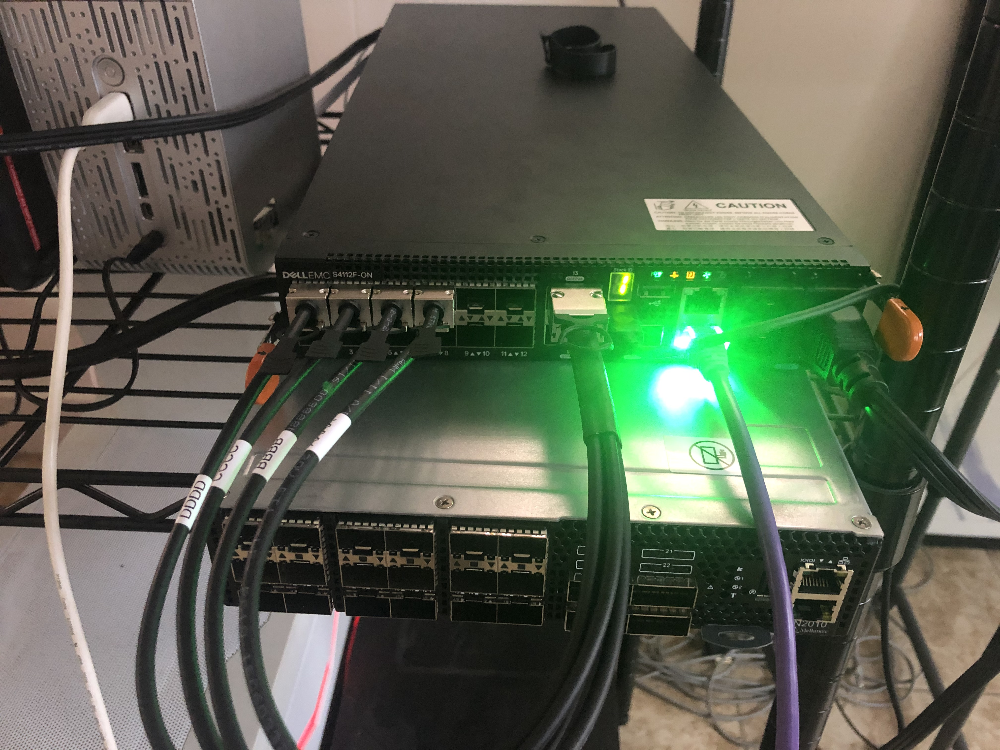
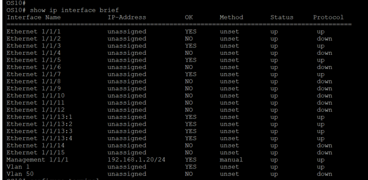

# Setting Up Breakout Cables

## Helpful Links

[Dell OS10 Manual](https://downloads.dell.com/manuals/common/os10_enterprise-ug_en-us.pdf)

## Platform Information

**WARNING** If you are using QSFPs you must use Dell branded QSFPs! For breakout mode to work it requires physical modification of the QSFP. It is possible other vendors may make these modifications, but most of the time they do not. When I tested with Intel QSFPs it did not work.

### Physical Configuration

### OS Information

    OS10# show version
    Dell EMC Networking OS10-Enterprise
    Copyright (c) 1999-2019 by Dell Inc. All Rights Reserved.
    OS Version: 10.4.2.2
    Build Version: 10.4.2.2.265
    Build Time: 2019-01-14T15:15:14-0800
    System Type: S4112F-ON
    Architecture: x86_64
    Up Time: 00:13:36

## Configure Management Port

See [Configure Management Interface on Dell OS10](/README.md#configure-managment-interface-on-dell-os10)

## Configure Breakout Port Automatically

Run:

    OS10(config)# feature auto-breakout
    OS10(config)# do write memory

You can then access the interfaces individually using the subport:

    OS10(config)# interface ethernet 1/1/13:1

## Configure Breakout Port Manually

Run:

    OS10(config)# interface breakout 1/1/13 map 10g-4x
    OS10(config)# do write memory
