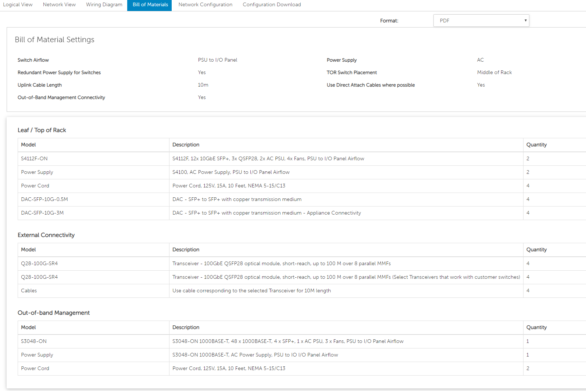
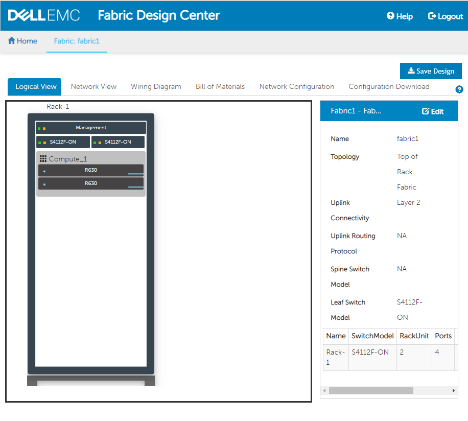
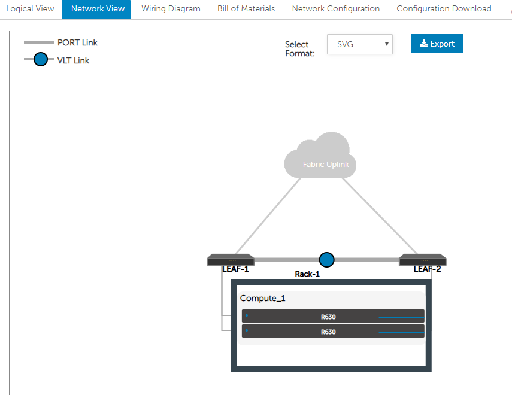

# Setting Up SmartFabric Director

## Helpful Links

[SmartFabric Director Download Page](https://www.force10networks.com/CSPortal20/Software/SmartFabric.aspx)

[Dell OS10 User's Guide](https://topics-cdn.dell.com/pdf/smartfabric-os10-5-0_en-us.pdf)

[Dell SmartFabric Director User's Guide](https://topics-cdn.dell.com/pdf/smart-fabric-director_users-guide10_en-us.pdf)

## My Configuration

### Dell 4112F-ON

    Dell EMC Networking OS10 Enterprise
    Copyright (c) 1999-2020 by Dell Inc. All Rights Reserved.
    OS Version: 10.5.1.0
    Build Version: 10.5.1.0.124
    Build Time: 2020-02-12T09:05:20+0000
    System Type: S4112F-ON
    Architecture: x86_64
    Up Time: 01:06:30

### Dell OS10 Running in GNS3

I used the GNS3 VM and tied the switch with a virtual cloud into my actual infrastructure.

    Dell EMC Networking OS10 Enterprise
    Copyright (c) 1999-2019 by Dell Inc. All Rights Reserved.
    OS Version: 10.5.0.0
    Build Version: 10.5.0.0.326
    Build Time: 2019-08-07T00:12:30+0000
    System Type: S5248F-VM
    Architecture: x86_64
    Up Time: 00:32:14

## Setup

1. Download, extract, upload to vCenter (or ESXi)
2. Fill in network settings.
3. When it finishes importing, keep in mind that the username and password is:
   1. Username: admin@sfd.local
   2. Password: The password you set
4. I had problems when I used a DNS name for NTP. See: [BUG](./BUG.md)
5. Go to the [Fabric Designer](https://fdc.emc.com/#!/network-fabric) online.
   1. Enter your design in the Fabric Designer. The point of the Fabric Designer is to determine all of those materials you will need in order to build out your stack.
   2. It will provide you a lot of useful info, for example a bill of materials:

        

   3. It will also give you a logical view of your network

        

   4. A view of your networking

        

   5. It will also allow you to download the configurations for each switch - either as a regular config or as a zero touch configuration. You can also save the overall design.
6. 

## Problems Encountered

### On the 4112F-ON

These were taken from the physical switch running 10.5.0.4.638

I have confirmed I am in full switch mode:

    OS10# show switch-operating-mode

    Switch-Operating-Mode : Full Switch Mode

- Page 10 step 6 of [the manual](https://downloads.dell.com/manuals/all-products/esuprt_networking_int/esuprt_networking_mgmt_software/smart-fabric-director_users-guide_en-us.pdf) does not work. There is no cert command.
- Page 11 step 1 of [the manual](https://downloads.dell.com/manuals/all-products/esuprt_networking_int/esuprt_networking_mgmt_software/smart-fabric-director_users-guide_en-us.pdf) does not work. There is no switch-port-profile command.

### With the VM

See [bug notes](./BUG.md).