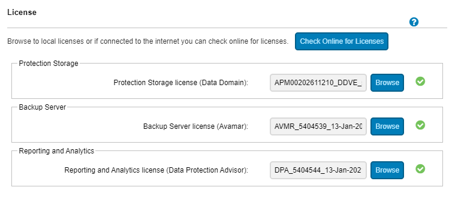

# Setup IDPA

## Version

    DP4400

## Current Documentation

[Manual](https://dl.dell.com/content/docu97727_Integrated_Data_Protection_Appliance_2.5_Product_Guide.pdf?language=en_US)

[Setup Guide](https://www.delltechnologies.com/el-gr/collaterals/unauth/technical-guides-support-information/2019/06/docu94051.pdf)

### Notes

IDPA DP4400 model is a hyperconverged, 2U system that a user can install and configure onsite. The DP4400 includes a virtual edition of Avamar server (AVE) as the Backup Server node, a virtual edition of Data Domain system (DDVE) as the Protection Storage node, Cloud Disaster Recovery, IDPA System Manager as a centralized system management, an Appliance Configuration Manager(ACM) for simplified configuration and upgrades, Search, Reporting and Analytics, and a compute node that hosts the virtual components and the software.

## Components

### Appliance administration

The ACM provides a web-based interface for configuring, monitoring, and upgrading the appliance.The ACM dashboard displays a summary of the configuration of the individual components. It also enables the administrators to monitor the appliance, modify configuration details such as expanding the Data Domain disk capacity, change the common password for the appliance, change LDAP settings, update customer information, and change the values in the General Settings panel. The ACM dashboard enables you to upgrade the system and its components. It also displays the health information of the Appliance Server and VMware components.

### Backup administration

The IDPA uses Avamar Virtual Edition (AVE) servers fo-r the DP5xxx and DP4xxx models and a physical Avamar for DP8xxxx to perform backup operations, with the data being stored in a Data Domain system. Generally, when using the Avamar Administrator Management Console, all Avamar servers look and behave the same. The main differences among the Avamar server configurations are the number of nodes and disk drives that are reported in the Server Monitor console. You can also add an Avamar NDMP Accelerator (one NDMP Accelerator node is supported in DP4400 and DP5800) to enable backup and recovery of NAS systems. For more information about the configuration details, see Table 3. Configuration options for each model on page 9. The Avamar NDMP Accelerator uses the network data management protocol (NDMP) to enable backup and recovery of network attached storage (NAS) systems. The accelerator  performs NDMP processing and then sends the data directly to the Data Domain Server (Data Domain Virtual Edition Storage).

## Instructions

### Network Setup

1. Set up 12 continuous IP addresses in DNS plus idrac. They must be in the same subnet. idrac can be separate
2. TODO Register the 13 IP addresses in DNS with forward and reverse lookup entries for each address. Ensure that the router for the 13 IP addresses can be pinged.
      1.Cannot use _ in the hostname
      2.Addresses should cover the following:

#### My Configuration

   192.168.2.64 acm.lan
   192.168.2.65 idpa-esxi.lan
   192.168.2.66 idpa-ddve-backup-1.lan
   192.168.2.67 idpa-ddve-backup-2.lan
   192.168.2.68 idpa-ave-server.lan
   192.168.2.69 idpa-proxy.lan
   192.168.2.70 idpa-system-manager.lan
   192.168.2.71 idpa-application-server.lan
   192.168.2.72 datastore-server-host.lan
   192.168.2.73 index-master-node.lan
   192.168.2.74 cdra.lan

### Configuration

1. On the switch:

        switch(config)# interface range ethernet 1/1/1
        switch(config)# interface range ethernet 1/1/1-1/1/5
        switch(conf-range-eth1/1/1-1/1/5)# switchport mode access
        switch(conf-range-eth1/1/1-1/1/5)# switchport access vlan 2

2. On a jump box set an IP of 192.168.100.98
3. Verify you can ping 192.168.100.100
4. Browse to: https://192.168.100.100:8543/
5. Log in with default creds:
      1.User root, password Idpa_1234
6. Follow the prompts and set up the networking.
7. After you finish setting up the networking the UI will wait while the network settings are applied. Afterwards, it usually autoreconnects with updated IP information. Otherwise you can browse to `https://<YOUR_IP>:8543
8. Provide the information in the following screens:

Proxy does image level backups. The system will backup the local VMs.

## Adding Backups

Do not use change block tracking with vCenter

Static vs dynamic - dynamic is dependent on it being in a folder. If the VMs are in a sub folder and you select the folder itself, then when you import the folder, the folder will be purple. That means dynamic, if someone creates another VM it will automatically add it.

You can do rule based filtering and assign it to a policy.

Recursive protection - Subfolders

