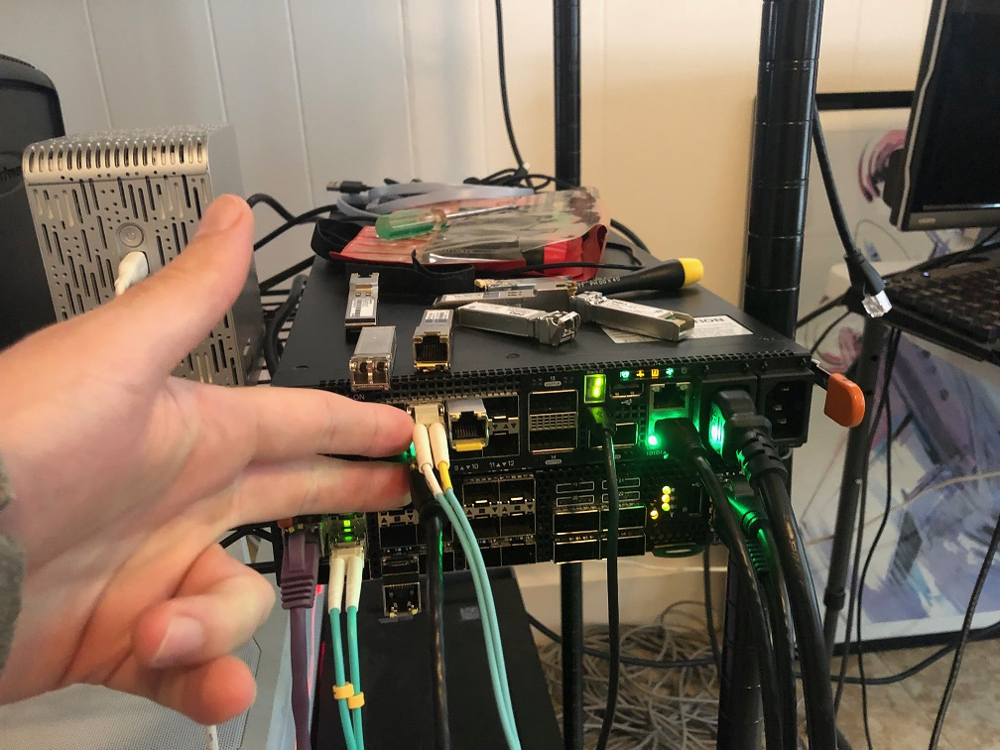
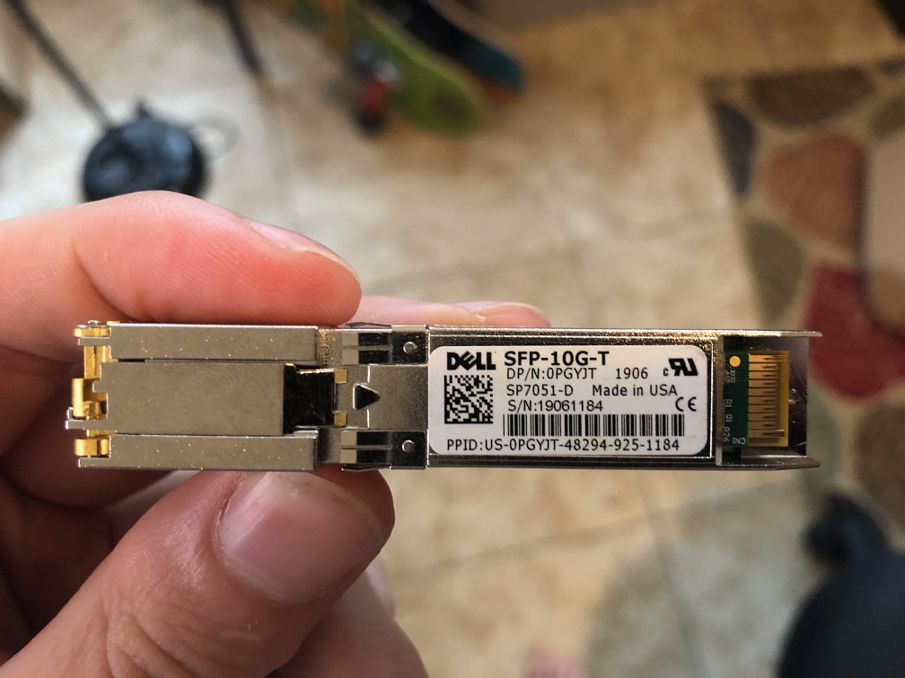
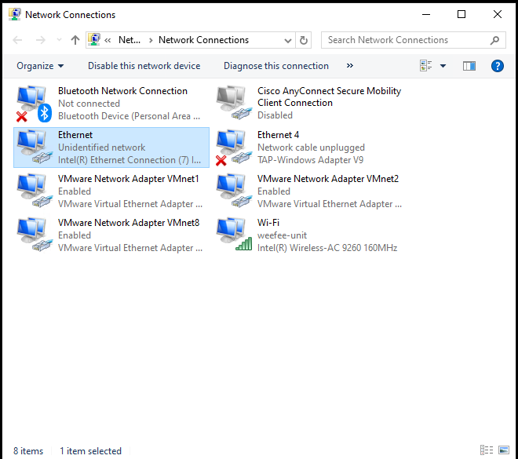

# Switch Directly to Client Test

The purpose of this test is to see if a 10Gb/s switch with a 10Gb/s SFP will
autonegotiate when plugged directly to a client.

## OS 10 Version

    OS10# show version
    Dell EMC Networking OS10 Enterprise
    Copyright (c) 1999-2019 by Dell Inc. All Rights Reserved.
    OS Version: 10.5.0.2
    Build Version: 10.5.0.2.468
    Build Time: 2019-10-19T00:29:00+0000
    System Type: S4112F-ON
    Architecture: x86_64
    Up Time: 00:03:39

## Setup

I first plugged a Dell Precision 7730 with Intel I219-LM network card into
Ethernet 1/1/8.

I later plugged in an ESXi instance with an Intel x710 to Ethernet 1/1/7.

### SFP Used

## Results

I had to set the interface speed for it to pick up, but once the interface speed
was set it worked.

    OS10# show ip interface brief
    Interface Name            IP-Address          OK       Method       Status     Protocol
    =========================================================================================
    Ethernet 1/1/1             unassigned          NO       unset        up          down
    Ethernet 1/1/2             unassigned          NO       unset        up          down
    Ethernet 1/1/3             unassigned          NO       unset        up          down
    Ethernet 1/1/4             unassigned          NO       unset        up          down
    Ethernet 1/1/5             unassigned          NO       unset        up          down
    Ethernet 1/1/6             unassigned          NO       unset        up          down
    Ethernet 1/1/7             unassigned          NO       unset        up          down
    Ethernet 1/1/8             unassigned          NO       unset        up          down
    Ethernet 1/1/9             unassigned          NO       unset        up          down
    Ethernet 1/1/10            unassigned          NO       unset        up          down
    Ethernet 1/1/11            unassigned          NO       unset        up          down
    Ethernet 1/1/12            unassigned          NO       unset        up          down
    Ethernet 1/1/13            unassigned          NO       unset        up          down
    Ethernet 1/1/14            unassigned          NO       unset        up          down
    Ethernet 1/1/15            unassigned          NO       unset        up          down
    Management 1/1/1           192.168.1.20/24     YES      manual       up          up
    Vlan 1                     unassigned          NO       unset        up          down
    Port-channel 1             unassigned          NO       unset        up          down
    OS10# configure terminal
    OS10(config)# interface ethernet 1/1/8
    OS10(conf-if-eth1/1/8)# speed 10
    1000  10000
    OS10(conf-if-eth1/1/8)# speed 1000
    OS10(conf-if-eth1/1/8)# show ip interface brief
    Interface Name            IP-Address          OK       Method       Status     Protocol
    =========================================================================================
    Ethernet 1/1/1             unassigned          NO       unset        up          down
    Ethernet 1/1/2             unassigned          NO       unset        up          down
    Ethernet 1/1/3             unassigned          NO       unset        up          down
    Ethernet 1/1/4             unassigned          NO       unset        up          down
    Ethernet 1/1/5             unassigned          NO       unset        up          down
    Ethernet 1/1/6             unassigned          NO       unset        up          down
    Ethernet 1/1/7             unassigned          NO       unset        up          down
    Ethernet 1/1/8             unassigned          YES      unset        up          up
    Ethernet 1/1/9             unassigned          NO       unset        up          down
    Ethernet 1/1/10            unassigned          NO       unset        up          down
    Ethernet 1/1/11            unassigned          NO       unset        up          down
    Ethernet 1/1/12            unassigned          NO       unset        up          down
    Ethernet 1/1/13            unassigned          NO       unset        up          down
    Ethernet 1/1/14            unassigned          NO       unset        up          down
    Ethernet 1/1/15            unassigned          NO       unset        up          down
    Management 1/1/1           192.168.1.20/24     YES      manual       up          up
    Vlan 1                     unassigned          YES      unset        up          up
    Port-channel 1             unassigned          NO       unset        up          down

On the client side the network showed Unidentified both before and after the change
in the speed configuration.

After I brought the interface up I connect Ethernet 1/1/7 to the Intel x710 with
ESXi hosting the card. I connected it to a RHEL 8 VM and confirmed ping worked
between the 7730 and the ESXi instance.

    [root@rhel8 ~]# ping 10.0.0.1
    PING 10.0.0.1 (10.0.0.1) 56(84) bytes of data.
    64 bytes from 10.0.0.1: icmp_seq=1 ttl=128 time=0.953 ms
    64 bytes from 10.0.0.1: icmp_seq=2 ttl=128 time=0.775 ms
    64 bytes from 10.0.0.1: icmp_seq=3 ttl=128 time=0.571 ms
    64 bytes from 10.0.0.1: icmp_seq=4 ttl=128 time=0.613 ms
    ^C
    --- 10.0.0.1 ping statistics ---
    4 packets transmitted, 4 received, 0% packet loss, time 114ms
    rtt min/avg/max/mdev = 0.571/0.728/0.953/0.150 ms
