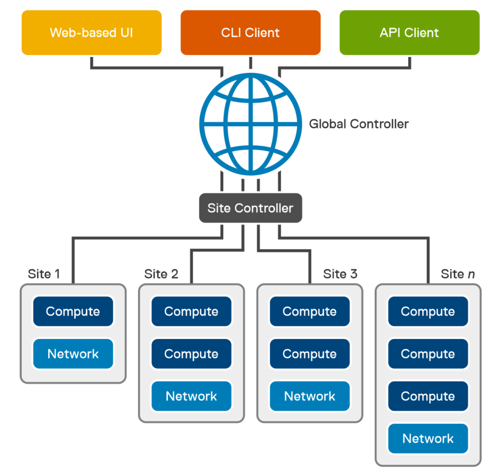
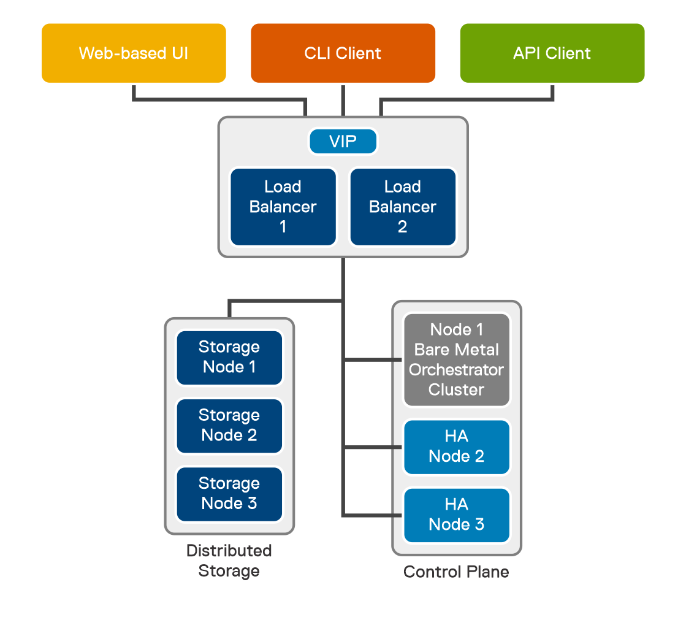
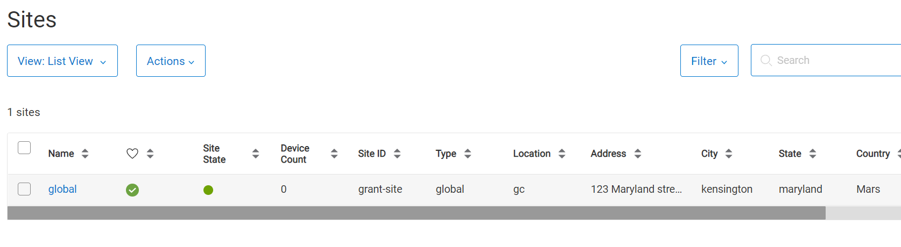

# Testing Bare Metal Orchestrator

## Supported Operating Systems

https://infohub.delltechnologies.com/l/bare-metal-orchestrator-1-2-command-line-interface-user-s-guide-1/validated-hypervisors-and-operating-systems-7

## License Requirements

https://infohub.delltechnologies.com/l/bare-metal-orchestrator-1-2-command-line-interface-user-s-guide-1/license-and-firmware-requirements-1

## Architecture

- What it does https://infohub.delltechnologies.com/l/bare-metal-orchestrator-1-2-command-line-interface-user-s-guide-1/bare-metal-orchestrator-introduction-7



User interfaces— Bare Metal Orchestrator provides a web-based User Interface (UI), a Command Line Interface (CLI) client, and an Application Programming Interface (API) to perform remote infrastructure management tasks. All requests and actions from these interfaces reach the global controller.
Global Controller—The Global Controller (GC) is a fully contained management cluster that is deployed at the central office. The Global Controller can manage sites and servers that are associated with it. It constitutes core components and site components. For more information, see [Bare Metal Orchestrator components](https://infohub.delltechnologies.com/l/bare-metal-orchestrator-1-2-command-line-interface-user-s-guide-1/bare-metal-orchestrator-architecture-7#GUID-5461A14B-FB5C-416C-BEAA-85857D7A3F1D).

## BMO Features and Functions

https://infohub.delltechnologies.com/l/bare-metal-orchestrator-1-2-command-line-interface-user-s-guide-1/bare-metal-orchestrator-infrastructure-management-features-and-functions-7

### Archecture with HA



GlusterFS provides distributed file storage for the Global Controller and the two redundant HA nodes in the control plane cluster. The distributed storage volumes replicate the Bare Metal Orchestrator cluster data when using PersistentVolumeClaim (PVC).

Distributed storage can be deployed locally in the three-node control plane cluster or externally. For external storage deployments, the VMs hosting the storage volumes must be reachable by the HA cluster. A minimum of three storage nodes are required.

Note: The remote site uses local-path as the storage class.

## Setup

**Note: I'm going to try the single node first**

1. Log in with installer / Dell1234
2. Configure networking (just fill in the blanks) with `vim /etc/network/interfaces`
3. Update DNS `vim /etc/resolv.conf`
4. Update the hosts file with `<address you used above> localregistry.io`
5. Reboot
6. `cd mw-ova-ansible`
7. Edit inventory/my-cluster/hosts.ini to have the following (replace the IP with your global IP address)

```
;  ansible-playbook -v site.yml -i inventory/sample/hosts.ini
[global_controller]
192.168.1.67

[ha]

[loadbalancer]

[gluster_nodes]
192.168.1.67

[secondary_ip]
; cp1 - secondary IP address. set this for single node and HA cluster. (OPTIONAL)
; cp2 - secondary IP address. set for HA cluster. (OPTIONAL)
; cp3 - secondary IP address. set for HA cluster. (OPTIONAL)

[node]
; host1
; host2

[node-remove]
; host1

[hosts]
192.168.1.67 ansible_python_interpreter=/usr/bin/python3
; 192.168.dd152.160 ansible_python_interpreter=/usr/bin/python3
```

7. Edit inventory/my-cluster/group_vars/all.yml and change `gluster_volume_type` to `"none"`
8. Run `lsblk` and make sure that you see:
   1. Note: on mine the swap drive wasd SDA5 and I choose to ignore it. We'll see if I'm punished.

```
sda
 ——sda1
 ——sda2
 ——sda3
sdb
 ——sdb1
 ```

9.  Update singlenode-site.yaml with your info
10. Run 

```
sudo ansible-playbook ssh-copy-heketi.yaml -i inventory/my-cluster/hosts.ini
sudo ansible-playbook setup.yaml -i inventory/my-cluster/hosts.ini
```

### Create a User for Global Admin

1. On BMO create a YAML file with the below

```
name: Admin
email: admin@dell.com
country: USA
city: Denver
organization: Dell
orgUnit: BDC
province: Co
roles:
- global-admin
```

2. After you have created the file run `bmo create user -f <username>.yaml > <config>.yaml`
3. Download the output file and browse to `https://BMO_ADDRESS`
4. Use the config file to login

## Deploy a Server


## Questions

- I see the API proxy - how does billing / licensing work if you are offline?

## Problems

- A lot o the documentation links are broken. Ex:
  - https://infohub.delltechnologies.com/l/bare-metal-orchestrator-1-2-command-line-interface-user-s-guide-1/managed-device-discovery-overview-1#GUID-C1AEBE7E-0569-4E04-83CB-5CD77FFA6615
  - The mMetadata link for servers: https://infohub.delltechnologies.com/l/bare-metal-orchestrator-1-2-command-line-interface-user-s-guide-1/create-a-server-or-multiple-servers-and-update-configurations-3#GUID-12309190-709C-4436-8937-D367B5978993
- Error when adding server. When I was in sites I just used the name.
  - I had to look under inventory, actions, discover device to realize that the global site name was actually gc



```
dell@bmo-manager-1:/tmp$ bmo create server -f r7525_perc.yaml
Failed to create server in the 'metalweaver' namespace, server :dell-perc-r7525, reason: site does not exist: global

dell@bmo-manager-1:/tmp$ cat r7525_perc.yaml
apiVersion: mw.dell.com/v1
kind: Server
metadata:
  name: dell-perc-r7525
  labels:
    profile: baseline-profile
    site: global
spec:
  # Add fields here
  bmcEndPoint: "https://192.168.1.46"
  userName: "root"
  password: "password"


```

- 
  - 