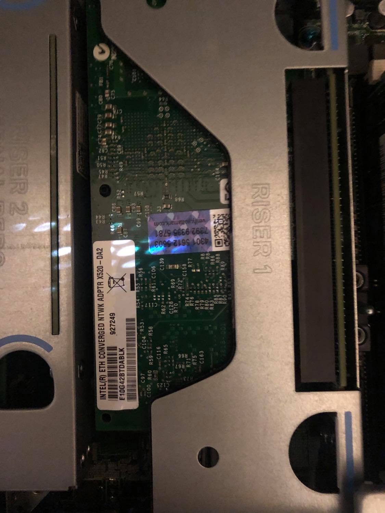
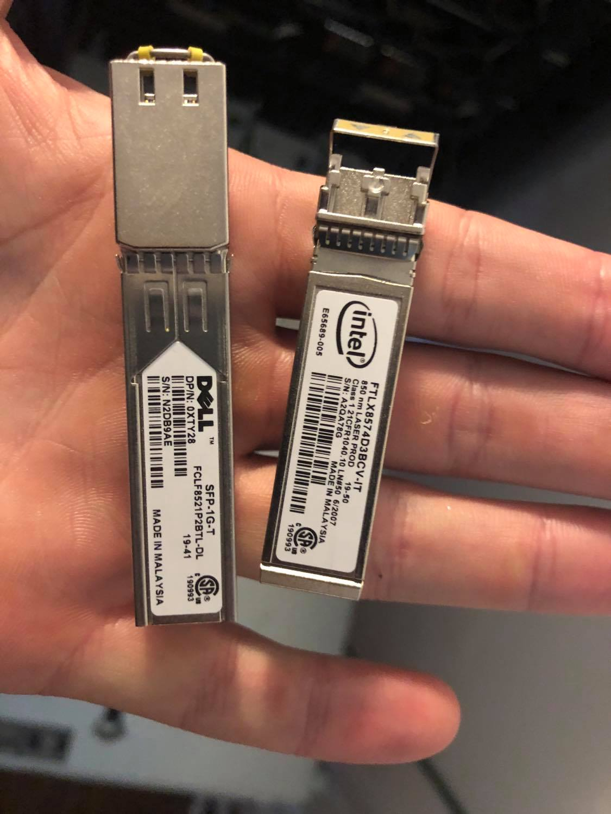
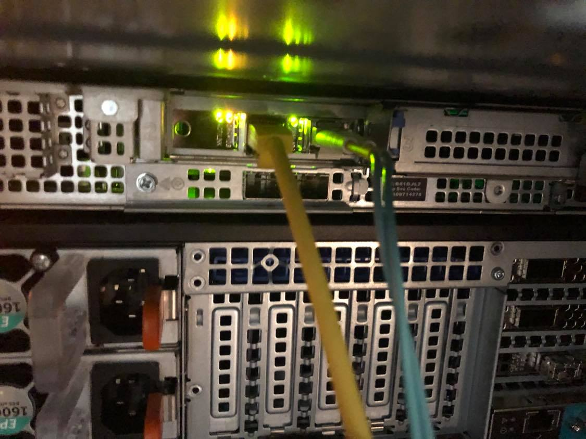
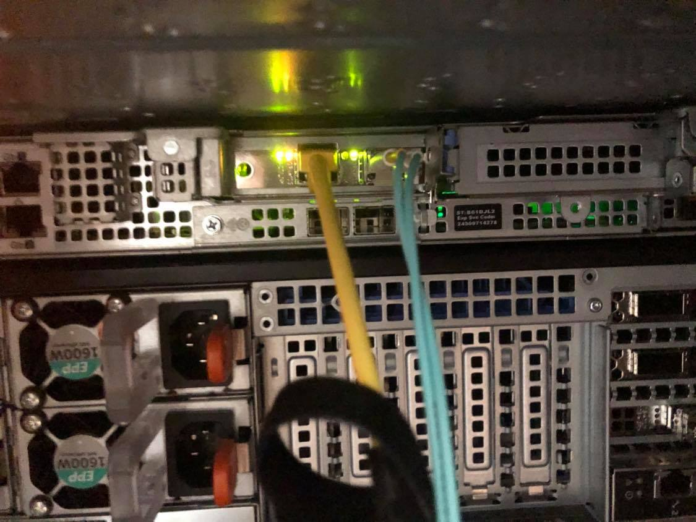

# Testing Intel x520 on RHEL 6

## RHEL Release

    [root@r440 ~]# cat /etc/*-release
    LSB_VERSION=base-4.0-amd64:base-4.0-noarch:core-4.0-amd64:core-4.0-noarch:graphics-4.0-amd64:graphics-4.0-noarch:printing-4.0-amd64:printing-4.0-noarch
    Red Hat Enterprise Linux Server release 6.10 (Santiago)
    Red Hat Enterprise Linux Server release 6.10 (Santiago)

## Server/Card Model

    # Server
    Dell R440

    # Card Model
    [root@r440 ~]# lspci | grep Network
    3b:00.0 Ethernet controller: Intel Corporation 82599ES 10-Gigabit SFI/SFP+ Network Connection (rev 01)
    3b:00.1 Ethernet controller: Intel Corporation 82599ES 10-Gigabit SFI/SFP+ Network Connection (rev 01)

**Note:** As shown in the [product documentation](https://www.intel.com/content/dam/www/public/us/en/documents/product-briefs/ethernet-x520-server-adapters-brief.pdf) is the name of the controller for the Intel x520.

## Server Inventory

I have attached [the server inventory](r440_inventory.csv) so that it can be used for comparison. **Note:** Because I did not use an x520 that came with the box or flash it with idrac compatible drivers it does not appear under network devices, but it does appear under PCI devices as expected.

## SFPs Used

## Testing

### Basic Connectivity

On initial install of RHEL 6.10 both the 1Gb/s ethernet SFP and the 10Gb/s fiber SFP were detected without issue and pulled DHCP addresses as expected:

    4: p2p1: <BROADCAST,MULTICAST,UP,LOWER_UP> mtu 1500 qdisc mq state UP qlen 1000
        link/ether 90:e2:ba:8b:88:14 brd ff:ff:ff:ff:ff:ff
        inet 192.168.1.214/24 brd 192.168.1.255 scope global p2p1
        inet6 2601:152:4100:212f:92e2:baff:fe8b:8814/64 scope global dynamic
        valid_lft 86393sec preferred_lft 14393sec
        inet6 fe80::92e2:baff:fe8b:8814/64 scope link
        valid_lft forever preferred_lft forever
    5: p2p2: <BROADCAST,MULTICAST,UP,LOWER_UP> mtu 1500 qdisc mq state UP qlen 1000
        link/ether 90:e2:ba:8b:88:15 brd ff:ff:ff:ff:ff:ff
        inet 192.168.1.242/24 brd 192.168.1.255 scope global p2p2
        inet6 2601:152:4100:212f:92e2:baff:fe8b:8815/64 scope global dynamic
        valid_lft 86393sec preferred_lft 14393sec
        inet6 fe80::92e2:baff:fe8b:8815/64 scope link
        valid_lft forever preferred_lft forever

They both operated without modification at the correct speed:

    [root@r440 ~]# ethtool p2p1 | grep -i speed && ethtool p2p2 | grep -i speed
            Speed: 10000Mb/s
            Speed: 1000Mb/s

My initial firmware version was:

    [root@r440 ~]# ethtool -i p2p1
    driver: ixgbe
    version: 4.2.1-k
    firmware-version: 0x61c10001
    bus-info: 0000:3b:00.0
    supports-statistics: yes
    supports-test: yes
    supports-eeprom-access: yes
    supports-register-dump: yes
    supports-priv-flags: no

Lights operated as expected:

I went to Dell's support website and pulled the latest driver for the R440 / x520 which was released 30 November 2018.

When I ran the script I was given additional version info:

    Update Package 18.08.200 (BLD_311)
    Copyright (c) 2003 Dell, Inc. All Rights Reserved.
    Release Title:
    Intel NIC Family Version 18.8.0 Firmware for I350, I354, X520, X540, and X550 adapters, 18.8.9, A00

    Release Date:
    October 05, 2018

However this got me `This Update Package is not compatible with your system configuration.`. I didn't investigate why. I took the card out of another box and added it to this one so I wasn't overly surprised.

I decided to pull directly from Intel. The latest driver I could find was [5.5.5 available here](https://downloadcenter.intel.com/download/28945/Intel-Network-Adapter-Driver-for-PCIe-Intel-10-Gigabit-Ethernet-Network-Connections-under-Linux-?product=39776). 

    Detailed Description
    Overview

    This is the most current release of the ixgbe driver for Linux*, which supports kernel versions 2.6.18 up through 4.20.

    It also has been tested on the following distributions:

    RHEL* 6.10
    RHEL 7.6
    SLES* 12SP4
    SLES 15
    Ubuntu* 18.04
    

    Changes in this release:

    Added support for 4.20 kernel version
    Added support for SLES 12SP4
    Added support for RHEL 7.6

I ran:

    make install
    rmmod ixgbe && insmod /root/Downloads/ixgbe-5.5.5/src/ixgbe.ko

to load the driver. I did not see any problems with a speed drop:

    [root@r440 ~]# ethtool p2p1 | grep -i speed && ethtool p2p2 | grep -i speed
            Speed: 10000Mb/s
            Speed: 1000Mb/s

Version confirmation:

    [root@r440 ~]# ethtool -i p2p1
    driver: ixgbe
    version: 5.5.5
    firmware-version: 0x61c10001, 255.65535.255
    bus-info: 0000:3b:00.0
    supports-statistics: yes
    supports-test: yes
    supports-eeprom-access: yes
    supports-register-dump: yes
    supports-priv-flags: yes

I confirmed the lights continued to work as expected.

