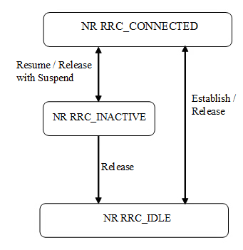

# 5G Troubleshooting

## Troubleshooting

### Problem Description

- This output is telling us that the base station is sending both message 1 (peramble transmission) and message 2 (random access response). However, the `pmRadioRaCbFailMsg3Dtx` field tells us that message 3 is never sent from the UE back to the baseband.
- In the next few sections I explain what that field means, how it tells us where the failure is, and where we should look to troubleshoot.

### What is `pmRadioRaCbFailMsg3Dtx` and What Does it Tell Us

- In message 2, the base station sends the following information: Time Advance (TA) command for timing adjustment, the RAPID (Random Access Preamble ID) matching the preamble sent by the UE, and an initial uplink grant for the UE. The gNB also assigns a temporary identifier called RA-RNTI (Random Access Radio Network Temporary Identifier) to the UE. The grant tells the UE what time slot it can use to transmit message 3 back to the baseband.
- DTX means detect transmission. The baseband tells the UE in message 2 what time slot to use so during that time slot it begins listening to see if the identified UE responds during the pre-coordinated time. If it **does not** respond during that window, the `pmRadioRaCbFailMsg3Dtx` counter is incremented. This output is telling us that 17 times the baseband sent the UE message 2 and the UE failed to respond.
- We can asertain from this that at a minimum the downlink is working correctly because the UE is able to decode message one which tells us the broadcast is working.

### Where the Failure Is

- From the above we know that one of the following is happening:
  - The UE is not receiving message 2
  - The UE receives message 2 but due to a paramater mismatch is either rejecting message 2 or one of the settings in message 2 is causing a failed send of message 3 back to the baseband
  - The baseband is failing to receive message 3

### Top Priorities

1. Determine if message 2 is being received by the UE
2. Determine if the UE is sending message 3

### Possible Problems

- Time Advance (TA) Issues: If the Time Advance (TA) value provided by the base station in message 2 is incorrect or not correctly interpreted by the UE, the UE might transmit message 3 at the wrong time, outside the expected time window. This could cause the base station to miss the response, leading to the increment of the pmRadioRaCbFailMsg3Dtx counter.
- Network Delay: Variations in network delay or timing synchronization issues between the UE and the base station could also result in the UE transmitting message 3 outside the expected time window.
- Frequency Interference: Interference or noise on the uplink channel might prevent the UE from successfully transmitting message 3, or it might cause the base station to fail in detecting the transmission.
- Power Control Problems: If the UE is unable to transmit at the required power level (due to poor battery conditions, power control issues, or hardware limitations), it might not be able to send message 3 with the correct power for the base station to detect it. This doesn't inherently mean it is too 
- RA-RNTI Mismatch - If the UE does not use the RA-RNTI (Random Access Radio Network Temporary Identifier) assigned by the base station (beacuse it is not correctly interpreted), the base station would not recognize the UEs response.
- Interference or Noise: External interference or noise in the RF environment could be causing the UE's message 3 to be lost or corrupted before it reaches the base station.
  - Seems unlikely unless UE is too close
- RAR (Random Access Request) window problem. The UE must listen in the correct RAR window in order to receive the DCI. The RAR window should be in the SIB.
- Resource allocation problem. This seems unlikely, but the baseband has to allocate domain and frequency resources to the UE. If for some reason it thinks there isn't enough or they are incorrect, the UE may not be able to transmit message 3
- Subcarrier Spacing and Cyclic Prefix Consistency - Any inconsistency in subcarrier spacing or cyclic prefix between the PDCCH, PDSCH, and SIB1 might cause the UE to fail in correctly decoding the PDSCH or sending Message 3.
- In message 3, the transform precoding could be incorrect
- In message 3, we could have a subcarrier mismatch
- Problems with HARQ/PUSCH in message 3

# Academics 

- [5G Troubleshooting](#5g-troubleshooting)
  - [Troubleshooting](#troubleshooting)
    - [Problem Description](#problem-description)
    - [What is `pmRadioRaCbFailMsg3Dtx` and What Does it Tell Us](#what-is-pmradioracbfailmsg3dtx-and-what-does-it-tell-us)
    - [Where the Failure Is](#where-the-failure-is)
    - [Top Priorities](#top-priorities)
    - [Possible Problems](#possible-problems)
- [Academics](#academics)
  - [Sources](#sources)
  - [Overview of Pre-RRC Connect Process](#overview-of-pre-rrc-connect-process)
    - [Leading Up to RRC Connection Request](#leading-up-to-rrc-connection-request)
    - [SIB Summary](#sib-summary)
      - [1. **MIB (Master Information Block)**](#1-mib-master-information-block)
      - [2. **SIB1**](#2-sib1)
      - [3. **SIB2**](#3-sib2)
      - [4. **SIB3**](#4-sib3)
      - [5. **SIB4**](#5-sib4)
      - [6. **SIB5**](#6-sib5)
      - [7. **SIB6**](#7-sib6)
      - [8. **SIB7**](#8-sib7)
      - [9. **SIB8**](#9-sib8)
      - [10. **SIB9**](#10-sib9)
      - [11. **SIB10 to SIB13**](#11-sib10-to-sib13)
      - [12. **SIB14 to SIB25 (including SIB17bis, SIBpos, etc.)**](#12-sib14-to-sib25-including-sib17bis-sibpos-etc)
  - [RRC Connection Control](#rrc-connection-control)
    - [1. **Conditions for RRC Connection Establishment**](#1-conditions-for-rrc-connection-establishment)
    - [2. **Preconditions Before Initiating RRC Connection**](#2-preconditions-before-initiating-rrc-connection)
    - [3. **Random Access Procedure Initiation**](#3-random-access-procedure-initiation)
    - [4. **RRCSetupRequest Message Transmission**](#4-rrcsetuprequest-message-transmission)
    - [5. **Network Response: RRCSetup Message**](#5-network-response-rrcsetup-message)
    - [6. **UE Actions Upon Receiving RRCSetup**](#6-ue-actions-upon-receiving-rrcsetup)
    - [7. **RRCSetupComplete Message Transmission**](#7-rrcsetupcomplete-message-transmission)
    - [8. **Finalization**](#8-finalization)
    - [9. **Handling Failures**](#9-handling-failures)
    - [10. **Abortion of RRC Connection Establishment**](#10-abortion-of-rrc-connection-establishment)
  - [Message 2 Description](#message-2-description)
    - [1. **Sending DCI with RA-RNTI:**](#1-sending-dci-with-ra-rnti)
    - [2. **PDCCH Detection and RAR-Window:**](#2-pdcch-detection-and-rar-window)
    - [3. **DCI Format for RAR Scheduling:**](#3-dci-format-for-rar-scheduling)
    - [4. **Resource Allocation Types:**](#4-resource-allocation-types)
    - [5. **RAR-Window Configuration:**](#5-rar-window-configuration)
    - [6. **Decoding PDCCH and PDSCH:**](#6-decoding-pdcch-and-pdsch)
    - [7. **Matching RAPID in RAR:**](#7-matching-rapid-in-rar)
    - [8. **Consistency in Subcarrier Spacing and Cyclic Prefix:**](#8-consistency-in-subcarrier-spacing-and-cyclic-prefix)
  - [Message 3 Description](#message-3-description)
      - [1. **Determining Transform Precoding:**](#1-determining-transform-precoding)
      - [2. **Subcarrier Spacing (SCS) for Msg3 PUSCH:**](#2-subcarrier-spacing-scs-for-msg3-pusch)
      - [3. **Timing Between Msg2 (RAR) and Msg3 (PUSCH):**](#3-timing-between-msg2-rar-and-msg3-pusch)
      - [4. **Timing and Contents Example:**](#4-timing-and-contents-example)

## Sources

- [https://www.sharetechnote.com/html/5G/5G_RACH.html]
- [https://www.3gpp.org/ftp/Specs/archive/38_series/38.331/]

## Overview of Pre-RRC Connect Process

1. **MIB (Master Information Block)**:
   - **Transmission**: The MIB is broadcast by the base station on the BCH (Broadcast Channel) and provides essential information that the UE needs to acquire the SIB1.
   - **Content**: The MIB contains information such as the system frame number, the bandwidth configuration, and the information needed to decode the SIB1.
   - **Timing**: The MIB is transmitted with a periodicity of 80 ms and is repeated within this period. It is closely tied to the SSB (Synchronization Signal Block) scheduling.

2. **SIB1 (System Information Block 1)**:
   - **Transmission**: SIB1 is transmitted on the DL-SCH (Downlink Shared Channel) and provides critical information about the cell, including the availability and scheduling of other SIBs.
   - **Content**: SIB1 includes parameters such as cell selection information, scheduling information for other SIBs, and configuration details for UEs to perform SI requests if needed.
   - **Timing**: SIB1 is transmitted with a periodicity of 160 ms, and the repetition period can vary depending on network implementation.

3. **Other SIBs**:
   - **Content and Transmission**: SIBs other than SIB1 carry various other types of system information, such as information related to cell reselection, neighboring cells, and public warning systems. These SIBs are grouped into System Information (SI) messages, each with its own periodicity.
   - **SI Windows**: Each SI message is transmitted within a specific time window, known as the SI-window, during which the message can be repeated.

4. **System Information Acquisition**:
   - **Initial Acquisition**: The UE must first acquire the MIB to synchronize with the cell and obtain the information necessary to decode SIB1. Once SIB1 is acquired, the UE can decode the scheduling information for the remaining SIBs.
   - **Subsequent Acquisitions**: After the initial acquisition, the UE continues to monitor and acquire other SIBs as indicated by SIB1. This ensures that the UE has all the necessary system information to proceed with network access and service initiation.

### Leading Up to RRC Connection Request

- **Cell Search and Synchronization**: Before acquiring the SI, the UE performs cell search and synchronization, where it detects the cell's synchronization signals (PSS and SSS) and synchronizes with the base station.
- **System Information Acquisition**: The UE then acquires the MIB and SIB1, followed by other SIBs, to gather all necessary parameters and network configurations.
- **Random Access Procedure**: After acquiring the system information and determining that the cell is suitable for connection, the UE initiates the Random Access Procedure (RACH) to request initial resources from the network.
- **RRC Connection Request**: Once the UE has successfully completed the random access procedure, it sends the **RRC Connection Request** to the base station, marking the formal start of the connection setup process.

### SIB Summary

#### 1. **MIB (Master Information Block)**
   - **Purpose**: The MIB provides fundamental information that the UE needs to acquire SIB1, synchronize with the network, and access the system.
   - **Actions**: The UE stores the MIB, checks whether the cell is barred, and if not, proceeds to acquire SIB1.

#### 2. **SIB1**
   - **Purpose**: SIB1 contains essential information about the cell, including details on how other SIBs are scheduled, cell selection parameters, and the configuration needed for the UE to make further system information requests.
   - **Actions**: The UE stores SIB1 and checks if the cell is barred based on specific criteria (e.g., for NTN, ATG, RedCap UEs). If the cell is not barred, the UE uses the information to proceed with network access.

#### 3. **SIB2**
   - **Purpose**: SIB2 provides information related to radio resource configuration, including uplink and downlink parameters, access barring information, and common channels.
   - **Actions**: The UE applies the configuration for the selected frequency band, including uplink and downlink parameters, and any additional spectrum emissions if supported.

#### 4. **SIB3**
   - **Purpose**: SIB3 typically includes information on cell reselection parameters, especially in LTE and 5G NR, guiding the UE on when and how to perform cell reselection to maintain or improve service.
   - **Actions**: No specific actions are outlined for the UE beyond using the information in SIB3 within other relevant procedures, such as cell reselection.

#### 5. **SIB4**
   - **Purpose**: SIB4 contains information about inter-frequency cell reselection, including details on neighboring cells on different frequencies.
   - **Actions**: The UE stores and uses this information to perform inter-frequency cell reselection, particularly ensuring that the UE can identify and connect to suitable neighboring cells.

#### 6. **SIB5**
   - **Purpose**: SIB5 provides information on inter-frequency and inter-RAT (Radio Access Technology) cell reselection, particularly focusing on UEs that may need to transition between different network technologies (e.g., LTE to 5G).
   - **Actions**: Similar to SIB3 and SIB4, the UE uses this information within cell reselection and other system information-dependent procedures.

#### 7. **SIB6**
   - **Purpose**: SIB6 is used to transmit emergency warning messages to the UE, part of the public warning system implemented by mobile networks.
   - **Actions**: The UE forwards any received emergency warning messages to the upper layers for user notification.

#### 8. **SIB7**
   - **Purpose**: SIB7 also relates to public warning messages, often containing additional information or segments of a warning message that are to be assembled by the UE.
   - **Actions**: The UE assembles the warning message from the segments, forwards it to the upper layers, and manages the message reception and storage as needed.

#### 9. **SIB8**
   - **Purpose**: SIB8 may contain further emergency warning information, including geographical area coordinates relevant to the warning.
   - **Actions**: The UE processes and forwards the complete warning message and geographical data to the upper layers.

#### 10. **SIB9**
   - **Purpose**: SIB9 may include information related to time synchronization or specific network parameters relevant for network access, particularly in specialized or non-public networks.
   - **Actions**: The UE processes this timing information and applies it as required for synchronization or other network-specific configurations.

#### 11. **SIB10 to SIB13**
   - **Purpose**: These SIBs can include a variety of additional information such as network slicing priorities, additional public warning systems, or system configurations for specific use cases.
   - **Actions**: The UE processes each SIB as required, storing, applying, or forwarding the information to the upper layers as relevant.

#### 12. **SIB14 to SIB25 (including SIB17bis, SIBpos, etc.)**
   - **Purpose**: These SIBs generally provide more specialized information, such as details for disaster roaming (SIB15), slicing for mobile broadband, additional sidelink configurations, or public safety information.
   - **Actions**: Depending on the content, the UE processes, stores, applies, or forwards the relevant information to ensure correct operation and support for specialized services or configurations.

## RRC Connection Control

### 1. **Conditions for RRC Connection Establishment**
   - **General Initiation**: The UE initiates the RRC connection when it is in **RRC_IDLE** or **RRC_INACTIVE** and needs to send data or perform specific actions (e.g., NAS signaling, sidelink communication).
   - **Sidelink Communication**: For NR sidelink communication (e.g., V2X or sidelink discovery), the UE only initiates the RRC connection under specific conditions, such as when configured to transmit and the frequency is available in the system information blocks (e.g., SIB12).

### 2. **Preconditions Before Initiating RRC Connection**
   - **System Information Acquisition**: Before initiating the RRC connection, the UE must ensure that it has valid and up-to-date essential system information, such as SIB1, which includes necessary configuration parameters for access and random access procedures.
   - **Unified Access Control**: If the upper layers provide an access category and identities, the UE performs access control to ensure the attempt is not barred. If the access is barred, the procedure ends.

### 3. **Random Access Procedure Initiation**
   - If the UE is not barred, it proceeds with the random access procedure. This procedure involves the following steps:
     1. **Selection of NSAG (Network Slice Assistance Group)**: The UE selects the NSAG with the highest priority based on the information provided in SIB1.
     2. **Random Access Preamble**: The UE transmits a random access preamble on the selected frequency using the PRACH (Physical Random Access Channel).
     3. **Random Access Response**: The network responds with timing advance information, uplink grant, and a temporary identity (C-RNTI).

### 4. **RRCSetupRequest Message Transmission**
   - The UE sets up the contents of the **RRCSetupRequest** message, which includes:
     1. **UE Identity**: If the upper layers provide a 5G-S-TMSI (Temporary Mobile Subscriber Identity), the UE includes it in the request. Otherwise, the UE generates a random value.
     2. **Establishment Cause**: The UE includes the cause for initiating the connection, such as "emergency" or "high priority access."
     3. **TA (Timing Advance) Report**: If required, the UE indicates the need for a TA report.

   - **Transmission**: The RRCSetupRequest message is then transmitted to the network, initiating the formal connection setup process.

### 5. **Network Response: RRCSetup Message**
   - The network processes the RRCSetupRequest and, if accepted, sends an **RRCSetup** message back to the UE. The message includes:
     1. **Configuration Information**: The network provides configuration for the radio bearer (SRB1), MAC, RLC, and PDCP layers. It also provides information about the physical layer, such as time alignment.
     2. **Cell Group Configuration**: If applicable, the message includes configuration for master and secondary cell groups.

### 6. **UE Actions Upon Receiving RRCSetup**
   - The UE performs several actions upon receiving the RRCSetup message:
     1. **Stop Timers**: The UE stops any running timers related to the connection setup, such as T300, T301, and T319.
     2. **Apply Configuration**: The UE applies the received configuration for the radio bearers, MAC, RLC, and PDCP layers.
     3. **Release Old Resources**: The UE releases any old radio resources or configurations that are no longer needed.
     4. **Enter RRC_CONNECTED State**: The UE transitions to the **RRC_CONNECTED** state, indicating that the connection has been successfully established.
     5. **Handle Failures**: If the UE has any stored information about previous connection failures or handover failures, it updates this information as needed.

### 7. **RRCSetupComplete Message Transmission**
   - After applying the configuration, the UE sends an **RRCSetupComplete** message back to the network, which:
     1. **Confirms Configuration**: Confirms that the UE has successfully applied the configuration provided by the network.
     2. **NAS Message Transfer**: Includes any initial NAS (Non-Access Stratum) messages, such as registration or session establishment requests, which are forwarded to the core network.
     3. **Optional Information**: The UE may also include additional information, such as logging available measurements, mobility history, or any application layer configurations that need to be reported.

### 8. **Finalization**
   - Once the **RRCSetupComplete** message is received by the network, the RRC connection is fully established, and the UE can now communicate with the core network for data transfer, service requests, or any other necessary operations.

### 9. **Handling Failures**
   - **RRCReject**: If the network rejects the connection (RRCReject), the UE follows specific procedures to handle the rejection, such as waiting before retrying or logging the failure for reporting.
   - **T300 Expiry**: If the T300 timer expires without a response from the network, the UE resets the MAC layer, releases the configuration, and may attempt cell reselection.

### 10. **Abortion of RRC Connection Establishment**
   - If the connection establishment is aborted due to an upper-layer request (e.g., due to NAS procedure failure), the UE stops the timers, resets the MAC, and releases the configurations.

## Message 2 Description

- [https://www.sharetechnote.com/html/5G/5G_RACH.html#InitialAttach_Step_B](https://www.sharetechnote.com/html/5G/5G_RACH.html#InitialAttach_Step_B)

### 1. **Sending DCI with RA-RNTI:**
   - **DCI (Downlink Control Information):** DCI is a message sent on the PDCCH (Physical Downlink Control Channel) that provides the UE with information about how to receive and decode data sent on the PDSCH (Physical Downlink Shared Channel).
   - **RA-RNTI (Random Access Radio Network Temporary Identifier):** RA-RNTI is a temporary identifier assigned to the UE during the Random Access procedure. It is calculated based on the parameters of the Random Access Preamble that the UE transmitted in Msg1 (the first message in the RACH procedure).
   - **Scrambling with RA-RNTI:** The DCI sent by the gNB is scrambled with the RA-RNTI, meaning the DCI is encoded in a way that only the UE that generated or was assigned the matching RA-RNTI can correctly decode it. This ensures that only the intended UE receives and processes the DCI.

### 2. **PDCCH Detection and RAR-Window:**
   - **PDCCH (Physical Downlink Control Channel):** The PDCCH is the channel used by the gNB to send control information (like DCI) to the UE. The UE must monitor the PDCCH to receive the DCI.
   - **RAR-Window:** The RAR-Window is a time period during which the UE expects to receive the Random Access Response (RAR). This window is configured by the gNB and communicated to the UE through system information (e.g., in SIB1). The UE must continuously monitor the PDCCH during this window to catch the DCI.
   - **Type 1 PDCCH Common Search Space:** This refers to the specific search space within the PDCCH that the UE is monitoring. Search spaces define where in the time-frequency grid the UE should look for control messages. Type 1 Common Search Space is shared among UEs and is specifically used for common DCI messages like those during the RACH procedure.

### 3. **DCI Format for RAR Scheduling:**
   - **DCI Format 1_0:** This is the format of the DCI used by the gNB to schedule the PDSCH that carries the Random Access Response (RAR). Format 1_0 is used to provide scheduling information such as resource allocation, modulation, and coding scheme for the PDSCH.
   - **RA-RNTI:** As mentioned earlier, the DCI is scrambled with the RA-RNTI, ensuring that the intended UE can identify and decode the DCI.

### 4. **Resource Allocation Types:**
   - **Resource Allocation Type 1:** This is the resource allocation method used for scheduling the PDSCH. In Resource Allocation Type 1, the gNB allocates resources using a bitmap that specifies which resource blocks (RBs) in the frequency domain are assigned to the UE. This allows flexible allocation of non-contiguous resources, which is useful for optimizing spectral efficiency.
   - **Frequency Domain Resource Allocation:** The DCI Format 1_0 carries the frequency domain resource allocation information. This tells the UE which resource blocks it should use to receive the PDSCH.
   - **Time Domain Resource Allocation:** In addition to frequency resources, the DCI Format 1_0 and the PDSCH-ConfigCommon (configured in the SIB) specify the time domain allocation, indicating when the UE should listen for the PDSCH carrying the RAR.

### 5. **RAR-Window Configuration:**
   - **rar-WindowLength IE (Information Element):** This parameter, configured in a System Information Block (SIB) message (likely SIB1), defines the duration of the RAR-Window. This is the time during which the UE should monitor the PDCCH for the DCI message. The length of this window can affect how quickly the UE can respond to the gNB.

### 6. **Decoding PDCCH and PDSCH:**
   - **Decoding PDCCH:** If the UE successfully detects and decodes the DCI message on the PDCCH within the RAR-Window, it now has the information needed to decode the subsequent PDSCH.
   - **PDSCH Carrying RAR Data:** The PDSCH is where the actual Random Access Response (RAR) data is transmitted. This data includes the Time Advance (TA), RAPID (Random Access Preamble ID), uplink grant, and the RA-RNTI.

### 7. **Matching RAPID in RAR:**
   - **RAPID (Random Access Preamble ID):** The RAR message includes the RAPID, which is the identifier of the Random Access Preamble that the UE sent in Msg1. The UE checks this value in the RAR to confirm that the response is intended for it. If the RAPID matches the one used by the UE, the UE knows that the RAR is for it.

### 8. **Consistency in Subcarrier Spacing and Cyclic Prefix:**
   - **Same Subcarrier Spacing and Cyclic Prefix as SIB1:** The PDCCH and PDSCH used in this RAR process should have the same subcarrier spacing and cyclic prefix configuration as the SIB1 message. This ensures consistency in how the UE and gNB communicate during the initial access procedure, reducing the risk of errors due to misalignment of subcarrier spacing or cyclic prefix.

## Message 3 Description

- Source: [https://www.sharetechnote.com/html/5G/5G_RACH.html#InitialAttach_Step_D](https://www.sharetechnote.com/html/5G/5G_RACH.html#InitialAttach_Step_D)

In the 5G NR Random Access Procedure, Msg3 refers to the message sent by the UE to the gNB after it has received the Random Access Response (RAR). Msg3 is transmitted on the PUSCH (Physical Uplink Shared Channel), and its timing, frequency, and other parameters are crucial for ensuring that the gNB successfully receives and processes this message.

#### 1. **Determining Transform Precoding:**
   - The UE checks whether it needs to apply transform precoding for Msg3 PUSCH. This decision is based on the `msg3-tp` parameter from the RRC (Radio Resource Control) configuration. Transform precoding is a technique used to spread the signal across multiple subcarriers, which can help in certain conditions to improve robustness against interference.

#### 2. **Subcarrier Spacing (SCS) for Msg3 PUSCH:**
   - The subcarrier spacing for Msg3 PUSCH is determined by the RRC parameter called `msg3-scs` (Subcarrier Spacing). Subcarrier spacing is a critical parameter that determines the spacing between subcarriers in the frequency domain. This can vary in 5G depending on the deployment scenario, with common values being 15 kHz, 30 kHz, 60 kHz, etc.
   - The UE must use the same subcarrier spacing for Msg3 as was used for PRACH (Physical Random Access Channel) to maintain consistency in the transmission.

#### 3. **Timing Between Msg2 (RAR) and Msg3 (PUSCH):**
   - The timing of Msg3 is determined by two key parameters:
     - **k2:** This value, determined by the RAR, specifies the time offset (in slots) between the last symbol of Msg2 (PDSCH) and the first symbol of Msg3 (PUSCH). This ensures that the UE knows when to start transmitting Msg3 after receiving Msg2.
     - **Δ (Delta):** This is an additional offset value that depends on the subcarrier spacing (`μPUSCH`) used for Msg3. This value is defined in the 3GPP standard (TS 38.214) and varies depending on the subcarrier spacing.

   - **Minimum Delay Calculation:**
     - The formula `N_{T,1} + N_{T,2} + 0.5 ms` defines the minimum delay between Msg2 and Msg3. Here:
       - **N_{T,1}:** Represents the time duration of symbols corresponding to a PDSCH reception period required by the UE for processing (based on its capability).
       - **N_{T,2}:** Represents the time duration required for the UE to prepare the PUSCH for Msg3.
     - This delay ensures the UE has sufficient time to decode Msg2 and prepare for Msg3 transmission.

#### 4. **Timing and Contents Example:**
   - The example shown in the image demonstrates the exact timing between the RAR and Msg3 PUSCH as observed in a protocol log. The key timings are:
     - **RAR Timing (`120.7`):** The RAR was sent at time 120.7.
     - **Msg3 PUSCH Timing (`120.17`):** Msg3 PUSCH was sent at time 120.17.

   - The difference in timing between these events is explained by the sum of `k2` and `Δ`:
     - **k2 = 7 slots:** As per the information, the value of `k2` is 7, determined by the RAR and corresponding subcarrier spacing.
     - **Δ = 3 slots:** This is derived based on the numerology (`μ`) of the subcarrier spacing.

   - The total time delay of 10 slots between RAR and Msg3 PUSCH is consistent with the values of `k2` and `Δ`.
