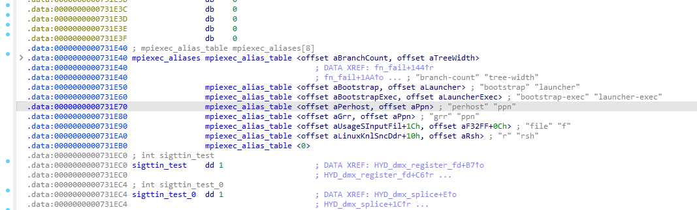
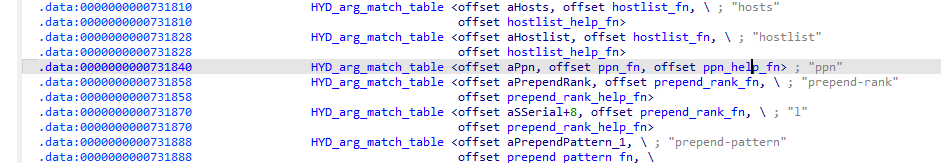
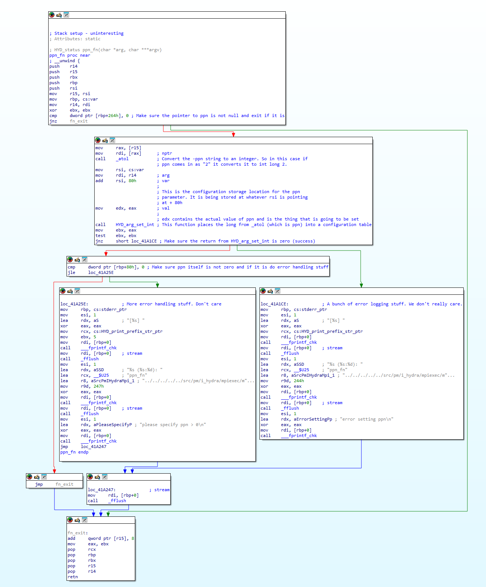
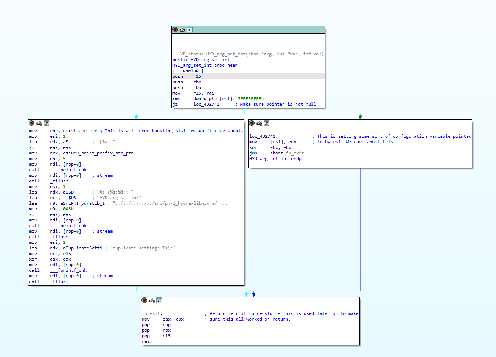

# Understand and Run LINPACK

- [Understand and Run LINPACK](#understand-and-run-linpack)
  - [Understanding Intel's MKL LINPACK Process Flow](#understanding-intels-mkl-linpack-process-flow)
    - [A Word of Warning on Job Managers](#a-word-of-warning-on-job-managers)
    - [runme\_intel\_dynamic](#runme_intel_dynamic)
      - [-hostfile  or -f ](#-hostfile--or--f-)
      - [-machinefile  or -machine ](#-machinefile--or--machine-)
      - [I\_MPI\_HYDRA\_HOST\_FILE](#i_mpi_hydra_host_file)
    - [mpirun](#mpirun)
    - [mpiexec.hydra](#mpiexechydra)
      - [But What the Heck Does that Mean](#but-what-the-heck-does-that-mean)
    - [runme\_intel64\_prv](#runme_intel64_prv)
    - [xhpl\_intel64\_dynamic](#xhpl_intel64_dynamic)
  - [How to Select Values and Optimize Intel's MKL LINPACK Benchmark](#how-to-select-values-and-optimize-intels-mkl-linpack-benchmark)
  - [How MPI Processes Work](#how-mpi-processes-work)
    - [What are MPI Processes?](#what-are-mpi-processes)
    - [How MPI Processes Communicate](#how-mpi-processes-communicate)
    - [Creating MPI Processes](#creating-mpi-processes)
    - [Distribution of Work](#distribution-of-work)
    - [Running MPI Programs](#running-mpi-programs)
    - [MPI Ranks](#mpi-ranks)
      - [MPI Ranks as Related to LU Decomposition](#mpi-ranks-as-related-to-lu-decomposition)
  - [Understanding the Benchmark's Math - LU Decomposition (Factorization)](#understanding-the-benchmarks-math---lu-decomposition-factorization)
    - [Why LU Decomposition](#why-lu-decomposition)
      - [Solving $Ax=b$ Through Matrix Inversion](#solving-axb-through-matrix-inversion)
      - [Example of Using Matrix Inversion](#example-of-using-matrix-inversion)
      - [Issues with Direct Inversion:](#issues-with-direct-inversion)
      - [Using LU Decomposition for Matrix Inversion](#using-lu-decomposition-for-matrix-inversion)
      - [Example of Using LU Decomposition for Matrix Inversion](#example-of-using-lu-decomposition-for-matrix-inversion)
      - [Advantages of LU Decomposition:](#advantages-of-lu-decomposition)
  - [How the Benchmark Measures Performance - Calculating FLOPS](#how-the-benchmark-measures-performance---calculating-flops)
  - [Understanding Benchmark Parameters](#understanding-benchmark-parameters)
      - [1. Problem Size (N)](#1-problem-size-n)
    - [2. Block Size (NB)](#2-block-size-nb)
      - [Understanding Block Size Math](#understanding-block-size-math)
    - [3. Process Grid (P x Q)](#3-process-grid-p-x-q)
  - [Interpreting Benchmark Results for Single Node Test](#interpreting-benchmark-results-for-single-node-test)
    - [What is Numerical Stability](#what-is-numerical-stability)
    - [Right Looking LU Factorization](#right-looking-lu-factorization)
    - [Row Partial Pivoting](#row-partial-pivoting)
  - [Some Related Binary Reverse Engineering](#some-related-binary-reverse-engineering)
    - [Usage in `do_spawn`](#usage-in-do_spawn)
  - [Installing Offline](#installing-offline)
  - [Optimizing](#optimizing)


## Understanding Intel's MKL LINPACK Process Flow

Assuming you change nothing, Intel's MKL has the following process flow:

```
                +---------------------+
                | runme_intel_dynamic |
                +---------------------+
                         |
                         v
                     +-------+
                     | mpirun |
                     +-------+
                         |
                         v
                 +--------------+
                 | mpiexec.hydra|
                 +--------------+
                         |
                         v
             +-------------------+
             | runme_intel64_prv |
             +-------------------+
                         |
                         v
           +-----------------------+
           | xhpl_intel64_dynamic  |
           +-----------------------+
                         |
                         v
        +---------------------------------+
        | xhpl_intel64_dynamic - threads  |
        +---------------------------------+

```

### A Word of Warning on Job Managers

I started this on SLURM. `mpirun` specifically checks a series of environment variables that modify how everything runs. I recommend not running this under a job manager. If you do, you will need to examine the contents of [`mpirun`](./binary/mpirun) and understand the mapping of your job manager's environment variables to Intel syntax.

### [runme_intel_dynamic](./binary/runme_intel64_dynamic)

In my case I'm not running with GPUs and in this case, [runme_intel_dynamic](./binary/runme_intel64_dynamic) does not do a whole lot. It's main job is to kick off [mpirun](./binary/mpirun) with [runme_intel64_prv](./binary/runme_intel64_prv) as an argument. It does this here:

```bash
mpirun -perhost ${MPI_PER_NODE} -np ${MPI_PROC_NUM} ./runme_intel64_prv "$@" | tee -a $OUT
```

where `MPI_PER_NODE` and `MPI_PROC_NUM` are defined as:

```bash
# Set total number of MPI processes for the HPL (should be equal to PxQ).
export MPI_PROC_NUM=2

# Set the MPI per node for each node.
# MPI_PER_NODE should be equal to 1 or number of sockets on the system.
# It will be same as -perhost or -ppn paramaters in mpirun/mpiexec.
export MPI_PER_NODE=2

# Set the number of NUMA nodes per MPI. (MPI_PER_NODE * NUMA_PER_MPI)
# should be equal to number of NUMA nodes on the system.
export NUMA_PER_MPI=1
```

There are a few things going on with `mpirun -perhost ${MPI_PER_NODE} -np ${MPI_PROC_NUM} ./runme_intel64_prv "$@" | tee -a $OUT` that are not at all obvious at first. As I mentioned earlier, first this leads to `mpirun` executing, but none of the arguments are actually destined for `mpirun` What really happens is the arguments `-perhost ${MPI_PER_NODE} -np ${MPI_PROC_NUM}` are fed into [mpiexec.hydra](#mpiexechydra) and then the `$@` part of `./runme_intel64_prv "$@"` is ultimately destined for `xhpl_intel64_dynamic` which accepts the [Ease-of-use Command-line Parameters](https://www.intel.com/content/www/us/en/docs/onemkl/developer-guide-linux/2023-0/ease-of-use-command-line-parameters.html). The ease of use command line parameters are meant to replace `HPL.dat`. So instead of just running `runme_intel64_dynamic` you can do:

```bash
./runme_intel64_dynamic -m <memory size in Mbytes> -b <block size> -p <grid row dimn> -q <grid column dimn>
```

or

```bash
./runme_intel64_dynamic -n 10000 -p 1 -q 3
```

where

- **-n <size of the matrix>**: Determines the size of the problem matrix to be solved
- **-m <memory size in Mbytes>**: If you're familiar with `HPL.dat` this option may confuse you because it isn't present. What this does is allow you to control the size of the problem matrix by specifying the total amount of memory dedicated to matrix storage across all nodes instead of specifying `-n`. When you set `-m` to 50000 Mbytes, you're instructing the application to use matrices that, when combined, fit within 50 GB of memory for their storage. The block size (`-b`) parameter, set to 256 in the example, defines the size of the sub-matrix or "block" used by the HPL algorithm during matrix factorization.
- **-b <block size>**: Specifies the block size used by the HPL algorithm
- **-p <grid row dimension>**: Sets the rows dimension of the process grid
- **-q <grid column dimension>**: Sets the columns dimension of the process grid

Finally, we are missing one last thing that is completely absent in the documentation or comments. If you are not running under a job manager you have to specify the nodes for `mpiexec.hydra` using one of the two following options:

#### -hostfile <hostfile> or -f <hostfile>

Use this option to specify host names on which to run the application. If a host name is repeated, this name is used only once.

See also the [I_MPI_HYDRA_HOST_FILE](#i_mpi_hydra_host_file) environment variable for more details.

**NOTE:** Use the following options to change the process placement on the cluster nodes:  
Use the -perhost, -ppn, and -grr options to place consecutive MPI processes on every host using the round robin scheduling.

Use the -rr option to place consecutive MPI processes on different hosts using the round robin scheduling.

#### -machinefile <machine file> or -machine <machine file>

Use this option to control process placement through a machine file. To define the total number of processes to start, use the -n option. For example:

```bash
$ cat ./machinefile
node0:2
node1:2
node0:1
```

#### I_MPI_HYDRA_HOST_FILE
Set the host file to run the application.

**Syntax**  
`I_MPI_HYDRA_HOST_FILE=<arg>`

**Argument**  
- `<arg>`: String parameter  
- `<hostsfile>`: The full or relative path to the host file  

**Description**  
Set this environment variable to specify the hosts file.

So basically, it's just a list of hostnames one per line.

### [mpirun](./binary/mpirun)

The [mpirun](./binary/mpirun) bash script's job is to set up the MPI environment and then call mpiexec.hydra on a single node in the cluster. mpiexec.hydra will then deploy instances of [runme_intel64_prv](./binary/runme_intel64_prv) across the cluster.

I'll go through the highlights of [mpirun](./binary/mpirun). First it sets up a bunch of environment variables with the main one being `I_MPI_MPIRUN`. This is used internally by Intel's binaries to determine how the process was launched. 

```bash
export I_MPI_MPIRUN="mpirun"
```

In this case, we launched it with the `mpirun` bash script and this environment variable tells the binaries that. Alternatively, we could have launched by calling `mpiexec` directly. The rest of the code is for handling what happens if we are launching with a job scheduler. In our case we are not so I ignore this. If we have no job scheduler, it executes this code:

```bash
# PBS or ordinary job
else
    mpiexec.hydra "$@" <&0
    rc=$?
fi
```

which will launch `mpiexec.hydra` on the current node with whatever command line arguments were passed in from `mpirun` which by default are inhereted from `runme_intel64_dynamic` and are:

```bash
-perhost ${MPI_PER_NODE} -np ${MPI_PROC_NUM} ./runme_intel64_prv "$@" | tee -a $OUT
```

### [mpiexec.hydra](https://www.intel.com/content/www/us/en/docs/mpi-library/developer-reference-linux/2021-8/mpiexec-hydra.html)

[mpiexec.hydra](https://www.intel.com/content/www/us/en/docs/mpi-library/developer-reference-linux/2021-8/mpiexec-hydra.html) is a process manager. In our case we are using Intel's instantiation, but it is an [open source project](https://github.com/pmodels/mpich/blob/main/doc/wiki/how_to/Using_the_Hydra_Process_Manager.md). mpiexec.hydra's job is to spawn our [runme_intel64_prv](./binary/runme_intel64_prv) jobs on the cluster. `-perhost ${MPI_PER_NODE} -np ${MPI_PROC_NUM}` plus the hostfile or machinefile I mentioned in [runme_intel64_dynamic](#runme_intel_dynamic) are what is interpreted by `mpiexec.hydra`. This is how the command line arguments are interpreted:

**-n <number-of-processes> or -np <number-of-processes>**  
Use this option to set the number of MPI processes to run with the current argument set. In our case, this is going to run n instances of `runme_intel64_prv`. `runme_intel64_prv` in turn launches `xhpl_intel64_dynamic`.

**-perhost <# of processes >, -ppn <# of processes >, or -grr <# of processes>**  
Use this option to place the specified number of consecutive MPI processes on every host in the group using round robin scheduling. See the I_MPI_PERHOST environment variable for more details.

**NOTE:** When running under a job scheduler, these options are ignored by default. To be able to control process placement with these options, disable the I_MPI_JOB_RESPECT_PROCESS_PLACEMENT variable.

Ultimately, the `-perhost` setting controls how many MPI processes will spawn on each node. On Intel MKL LINPACK, these processes are `runme_intel64_prv` which spawns one parent instance of `xhpl_intel64_dynamic` which then in turn spawns many child threads. This is explained in more detail later.

`I_MPI_PERHOST` is defined as

**I_MPI_PERHOST**

Define the default behavior for the `-perhost` option of the `mpiexec.hydra` command.

**Syntax**

`I_MPI_PERHOST=<value>`

**Argument**

| `<value>`     | Description                                     |
|---------------|-------------------------------------------------|
| `<value>`     | Define a value used for `-perhost` by default   |
| `integer > 0` | Exact value for the option                      |
| `all`         | All logical CPUs on the node                    |
| `allcores`    | All cores (physical CPUs) on the node. This is the default value. |

**Description**

Set this environment variable to define the default behavior for the `-perhost` option. Unless specified explicitly, the `-perhost` option is implied with the value set in `I_MPI_PERHOST`.

> **NOTE:** When running under a job scheduler, this environment variable is ignored by default. To control process placement with `I_MPI_PERHOST`, disable the `I_MPI_JOB_RESPECT_PROCESS_PLACEMENT` variable.

#### But What the Heck Does that Mean

Ok, so those were the descriptions in the docs for `-n` and `-ppn` but at least for me it wasn't immediately obvious what that would end up doing. Let's start with `-n`. What `-n` does is it will spawn `-n` instances of whatever process is *fed to `mpiexec.hydra`*. In our case this is going to be `runme_intel64_prv`. So if `-n` is 8, you will have 8 instances of `runme_intel64_prv` spread out across all your nodes.

`-ppn` will control how many instances of `runme_intel64_prv` spawn per node round robin'd. I explain this in more detail in the section on [runme\_intel64\_prv](#runme_intel64_prv). Each instance of `runme_intel64_prv` will in turn spawn one parent instance of `xhpl_intel64_dynamic` which will then spawn as many threads as are in the NUMA domains allocated to it (controlled by `NUMA_PER_MPI`).

### [runme_intel64_prv](./binary/runme_intel64_prv)

This is where things get hairy in my opinion. Very hairy, so I will go through this one line by line. For this example, I'm going to assume the following settings:

- `np` aka `MPI_PROC_NUM` (in `runme_intel64_dynamic`) = 8
- `ppn` aka `perhost` aka `MPI_PER_NODE` = 2
- `NUMA_PER_MPI=1` = 1
- `p` = 2
- `q` = 4

```bash
# For Mvapich
if [ -n "${MPIRUN_RANK}" ]
then PMI_RANK=${MPIRUN_RANK}
fi

# For OpenMPI
if [ -n "${OMPI_COMM_WORLD_RANK}" ]
then PMI_RANK=${OMPI_COMM_WORLD_RANK}
fi
```

By default, neither of these are used and this can be ignored.

Before I explain the next few lines I need to quickly mention [MPI Ranks](#mpi-ranks). On our node this is how they'll be laid out where L:0, L1, etc are referring to local MPI instances:

```bash
Node 1                   Node 2
+-----+-----+-----+-----+ +-----+-----+-----+-----+
| MPI | MPI | MPI | MPI | | MPI | MPI | MPI | MPI |
|  0  |  1  |  2  |  3  | |  4  |  5  |  6  |  7  |
| L:0 | L:1 | L:2 | L:3 | | L:0 | L:1 | L:2 | L:3 |
+-----+-----+-----+-----+ +-----+-----+-----+-----+
  Global Rank              Global Rank
  Local Rank (L)           Local Rank (L)
```

See the [MPI Ranks section](#mpi-ranks) for more on how these work. Now remember, that when we run `runme_intel64_prv` it will run in our case a total of 8 times.

```bash
LOCAL_RANK=$((PMI_RANK % MPI_PER_NODE))
```

This is calculating the node local MPI rank. This effectively round robins the MPI processes across the nodes based on what you set for `-ppn`. I explain the round robin portion specifically below.

```bash
export HPL_HOST_NODE=$((LOCAL_RANK * NUMA_PER_MPI))-$(((LOCAL_RANK + 1) * NUMA_PER_MPI - 1))
```

Now this is getting confusing. The high level purpose of `HPL_HOST_NODE` is to define a range `x-y` for what NUMA nodes the MPI process will use based on `NUMA_PER_MPI`. There are a lot of parenthesis but all this does is make the range `LOCAL_RANK`$\times$`NUMA_PER_MPI` to (`LOCAL_RANK`+1)$\times$()  So if you set this to 1, then the range will look like:

```bash
PMI_RANK=0
LOCAL_RANK=0
HPL_HOST_NODE=0-0
RANK=0, NODE=0-0
-----------------
PMI_RANK=1
LOCAL_RANK=1
HPL_HOST_NODE=1-1
RANK=1, NODE=1-1
-----------------
PMI_RANK=2
LOCAL_RANK=0
HPL_HOST_NODE=0-0
RANK=2, NODE=0-0
-----------------
PMI_RANK=3
LOCAL_RANK=1
HPL_HOST_NODE=1-1
RANK=3, NODE=1-1
-----------------
PMI_RANK=4
LOCAL_RANK=0
HPL_HOST_NODE=0-0
RANK=4, NODE=0-0
-----------------
PMI_RANK=5
LOCAL_RANK=1
HPL_HOST_NODE=1-1
RANK=5, NODE=1-1
-----------------
PMI_RANK=6
LOCAL_RANK=0
HPL_HOST_NODE=0-0
RANK=6, NODE=0-0
-----------------
PMI_RANK=7
LOCAL_RANK=1
HPL_HOST_NODE=1-1
RANK=7, NODE=1-1
```

Setting `NUMA_PER_MPI` to four would look like:

```bash
PMI_RANK=0
LOCAL_RANK=0
HPL_HOST_NODE=0-3
RANK=0, NODE=0-3
-----------------
PMI_RANK=1
LOCAL_RANK=1
HPL_HOST_NODE=4-7
RANK=1, NODE=4-7
-----------------
PMI_RANK=2
LOCAL_RANK=0
HPL_HOST_NODE=0-3
RANK=2, NODE=0-3
-----------------
PMI_RANK=3
LOCAL_RANK=1
HPL_HOST_NODE=4-7
RANK=3, NODE=4-7
-----------------
PMI_RANK=4
LOCAL_RANK=0
HPL_HOST_NODE=0-3
RANK=4, NODE=0-3
-----------------
PMI_RANK=5
LOCAL_RANK=1
HPL_HOST_NODE=4-7
RANK=5, NODE=4-7
-----------------
PMI_RANK=6
LOCAL_RANK=0
HPL_HOST_NODE=0-3
RANK=6, NODE=0-3
-----------------
PMI_RANK=7
LOCAL_RANK=1
HPL_HOST_NODE=4-7
RANK=7, NODE=4-7
```

or in a more organized format:

```
| PMI_RANK | LOCAL_RANK | HPL_HOST (NUMA_PER_MPI 1) | HPL_HOST (NUMA_PER_MPI 4) |
|----------|------------|---------------------------|---------------------------|
| 0        | 0          | 0-0                       | 0-3                       |
| 1        | 1          | 1-1                       | 4-7                       |
| 2        | 0          | 0-0                       | 0-3                       |
| 3        | 1          | 1-1                       | 4-7                       |
| 4        | 0          | 0-0                       | 0-3                       |
| 5        | 1          | 1-1                       | 4-7                       |
| 6        | 0          | 0-0                       | 0-3                       |
| 7        | 1          | 1-1                       | 4-7                       |
```

So what does this mean? What this is telling you is where each MPI process is going to land. Since you have 8 processes total, this is saying that, for example in the `NUMA_PER_MPI` config, MPI rank 0 (which is the same as Process Management Interface PMI rank) will be assigned to NUMA domains 0-3. You can see this reflected in the process allocation. I wrote [this script](./get_node_utilization.py) to display how the `xhpl_intel64_dynamic` processes are laid out:

```bash
PID: 184198, Name: xhpl_intel64_dynamic, Threads:
Thread ID  CPU Time   CPU Affinity    NUMA Node(s)   
-----------------------------------------------------
184198     1.76       0               0              
184202     0.01       0-27            0, 1           
184206     0.00       2               0              
184207     0.00       55              3              
184208     0.00       4               0              
184209     0.00       5               0              
184210     0.00       6               0              
184211     0.00       7               0              
184212     0.00       8               0              
184213     0.00       9               0              
184214     0.00       10              0              
184215     0.00       11              0              
184216     0.00       12              0              
184217     0.00       13              0              
184218     0.00       14              1              
184219     0.00       15              1              
184220     0.00       16              1              
184221     0.00       17              1              
184222     0.00       18              1              
184223     0.00       19              1              
184224     0.00       20              1              
184225     0.00       21              1              
184226     0.00       22              1              
184227     0.00       23              1              
184228     0.00       24              1              
184229     0.00       25              1              
184230     0.00       26              1              
184231     0.00       27              1              
184232     0.00       28              2              
184233     0.00       29              2              
184234     0.00       30              2              
184235     0.00       31              2              
184236     0.00       32              2              
184237     0.00       33              2              
184238     0.00       34              2              
184239     0.00       35              2              
184240     0.00       36              2              
184241     0.00       37              2              
184242     0.00       38              2              
184243     0.00       39              2              
184244     0.00       40              2              
184245     0.00       41              2              
184246     0.00       3               0              
184247     0.00       42              3              
184248     0.00       43              3              
184249     0.00       44              3              
184250     0.00       45              3              
184251     0.00       46              3              
184252     0.00       47              3              
184253     0.00       48              3              
184254     0.00       49              3              
184255     0.00       50              3              
184256     0.00       51              3              
184257     0.00       52              3              
184258     0.00       53              3              
184259     0.00       54              3              
184422     1.33       1               0
```

This is a non-optimized layout and you can see that reflected in the fact that almost none of the threads are in use. This is what a well optimized setup looks like:

```bash
Thread ID  CPU Time   CPU Affinity    NUMA Node(s)   
-----------------------------------------------------
191804     500.00     98              7              
191812     0.03       98-111          7              
191827     489.41     111             7              
191833     490.17     100             7              
191841     490.44     101             7              
191849     489.57     102             7              
191869     489.55     103             7              
191878     489.84     104             7              
191884     490.37     105             7              
191890     489.51     106             7              
191896     490.28     107             7              
191902     490.16     108             7              
191908     489.85     109             7              
191912     490.55     110             7              
191919     499.48     99              7  
```

Notice how all threads are in use except one with low utilization. This is the `xhpl_intel64_dynamic` parent process I mention in the [`xhpl_intel64_dynamic section](#xhpl_intel64_dynamic).

Next, we check if a GPU is in the mix and if not we output the RANK for the process and execute `xhpl_intel64_dynamic`

```bash
if [ -z ${USE_HPL_GPU} ]; then
    echo RANK=${PMI_RANK}, NODE=${HPL_HOST_NODE}
    ./${HPL_EXE} "$@"
else
```

Since I'm not running a GPU, this is where I stopped. All this does is print out the RANK and NODE numbers for convenience. Ex `RANK=0, NODE=0-3`. This is identical to `HPL_HOST_NODE`.

### xhpl_intel64_dynamic

There is one parent `xhpl_intel64_dynamic` process spawned by each instance of `runme_intel64_prv`. The parent processes will coordinate such that child threads fill all available cores. You can see these running on the constituent servers with `ps -eTf`. The number of threads is dependent on the `NUMA_PER_MPI` setting. It will spawn threads across all available NUMA domains. For example, with `NUMA_PER_MPI` set to 4, `MPI_PER_NODE` set to 2, and a server with 8 NUMA domains and 112 cores, and , each instance of `xhpl_intel64_dynamic` (one MPI process) would spawn 56 threads plus the parent process.

These threads do the actual lifting. I wrote [get_node_utilization.py](./get_node_utilization.py) to get their allocation.

The above allocation would be non-optimal. For best performance, you want one MPI process per NUMA node.

## How to Select Values and Optimize Intel's MKL LINPACK Benchmark

See [How to Select Values and Optimize Intel's MKL LINPACK Benchmark](./optimizing.ipynb)

## How MPI Processes Work

Helpful Presentation: https://www.uio.no/studier/emner/matnat/ifi/INF3380/v11/undervisningsmateriale/inf3380-week06.pdf

MPI (Message Passing Interface) processes are at the core of parallel computing in systems that use the MPI standard for communication.

### What are MPI Processes?

- **Independent Processes**: Each MPI process is an independent unit of computation that executes concurrently with other MPI processes. They can be thought of as separate instances of the program, often running on different cores or different nodes in a cluster.
- **Separate Memory Spaces**: Each process has its own private memory space. This means variables and data in one process are not directly accessible to another process. Any data sharing or communication must be done explicitly using MPI's communication mechanisms.

### How MPI Processes Communicate

- **Message Passing**: The fundamental concept of MPI is that processes communicate by sending and receiving messages. These messages can contain any type of data, and the communication can occur between any two processes.
- **Collective Communications**: Besides point-to-point communication, MPI provides collective communication operations (like broadcast, reduce, scatter, gather) that involve a group of processes. These operations are optimized for efficient communication patterns commonly found in parallel applications.

### Creating MPI Processes

- **MPI_Init and MPI_Finalize**: An MPI program starts with MPI_Init and ends with MPI_Finalize. Between these two calls, the MPI environment is active, and the program can utilize MPI functions.
- **Parallel Region**: The code between MPI_Init and MPI_Finalize is executed by all processes in parallel, but each process can follow different execution paths based on their [rank](#mpi-ranks) or other conditional logic.
- **Rank and Size**: Each process is assigned a unique identifier called its rank. The total number of processes is called the size. These are often used to divide work among processes or to determine the role of each process in communication patterns.

### Distribution of Work

- **Dividing the Problem**: In typical MPI applications, the large problem is divided into smaller parts, and each MPI process works on a portion of the problem. This division can be based on data (data parallelism) or tasks (task parallelism).
- **Synchronization**: Processes can synchronize their execution, for example, by using barriers (MPI_Barrier), ensuring that all processes reach a certain point of execution before continuing.

### Running MPI Programs

- **MPI Executors**: MPI programs are usually executed with a command like `mpirun` or `mpiexec`, followed by options that specify the number of processes to launch and other execution parameters.
- **Scalability**: The scalability of an MPI program depends on its ability to efficiently partition the workload among the available processes and the effectiveness of the communication between the processes.

In the context of the LINPACK benchmark, the MPI processes would each handle a portion of the LINPACK workload, collaborating by exchanging messages to solve the large linear algebra problem in parallel.

### MPI Ranks

An MPI rank is a unique identifier assigned to each process in a parallel program that uses the Message Passing Interface (MPI) for communication. MPI is a standardized and portable message-passing system designed to function on a wide variety of parallel computing architectures. In an MPI program, multiple processes can run simultaneously, potentially on different physical machines or cores within a machine.

Ranks are used for the following:

- **Identification:** The rank allows each process to be uniquely identified within an MPI communicator. A communicator is a group of MPI processes that can communicate with each other. The most common communicator used is `MPI_COMM_WORLD`, which includes all the MPI processes in a program.
- **Coordination and Communication:** By knowing its rank, a process can determine how to coordinate its actions with other processes, such as dividing data among processes for parallel computation or determining the order of operations in a parallel algorithm.
- **Scalability:** Using ranks, MPI programs can be designed to scale efficiently with the number of processes, allowing for parallel execution on systems ranging from a single computer to a large-scale supercomputer.

Ranks are typically represented as integers starting from 0. So, in a program with `N` processes, the ranks are numbered from 0 to `N-1`. This numbering is used in various MPI operations, such as sending and receiving messages, where you specify the rank of the target process.

Here's a simple example to illustrate the use of ranks in MPI:

```c
#include <mpi.h>
#include <stdio.h>

int main(int argc, char** argv) {
    MPI_Init(&argc, &argv);

    int world_size;
    MPI_Comm_size(MPI_COMM_WORLD, &world_size);

    int world_rank;
    MPI_Comm_rank(MPI_COMM_WORLD, &world_rank);

    printf("Hello world from rank %d out of %d processes\n", world_rank, world_size);

    MPI_Finalize();
    return 0;
}
```

In this example, each process finds out its rank within `MPI_COMM_WORLD` (with `MPI_Comm_rank`) and the total number of processes (with `MPI_Comm_size`) and prints a message including its rank and the total number of processes. When this program is run with MPI across multiple processes, each process will print its unique rank.

#### MPI Ranks as Related to LU Decomposition

LU decomposition involves breaking down a matrix $A$ into the product of a lower triangular matrix $L$ and an upper triangular matrix $U$. See [LU Decomposition](#lu-decomposition-factorization) for an explanation of LU decomposition.

Recall that given a matrix $A$, the goal is to decompose it into:

$$ A = LU $$

where $L$ is a lower triangular matrix and $U$ is an upper triangular matrix. This decomposition is used to solve $Ax = b$ for $x$ by solving two simpler systems:

1. $Ly = b$
2. $Ux = y$

When MPI is applied to matrices there are two main strategies used:

- **2D Block Decomposition:** The matrix is divided into [blocks](#understanding-block-size-math) and distributed among the ranks. Each rank works on its block(s) performing necessary operations for the decomposition. This method requires communication between ranks to exchange bordering row and column information during the elimination steps.
- **1D Block Decomposition:** The matrix is divided into horizontal or vertical strips. Each rank works on its strip, and operations are coordinated to ensure the matrix is correctly modified across all ranks. This can be simpler but might not balance load and communication as effectively as 2D blocking.

The benchmark will initialize a dense $n\times n$ matrix $A$ and a vector $b$ with specific values that ensure the solution will converge and is known in advance for verification purposes.

## Understanding the Benchmark's Math - LU Decomposition (Factorization)

- The benchmark performs an LU decomposition of matrix $A$, which is the process of factoring $A$ into the product of a lower triangular matrix $L$ and an upper triangular matrix $U$, such that $A = LU$. This decomposition includes partial pivoting, where rows of the matrix are swapped to enhance numerical stability.

### Why LU Decomposition

We know we are benchmarking, but why LU decomposition specifically? To understand this, you need to understand how we normally solve the equation $Ax=B$.

#### Solving $Ax=b$ Through Matrix Inversion

The direct inversion of a matrix $A$ to find $A^{-1}$ typically involves the use of the adjugate matrix and the determinant:

$$
A^{-1} = \frac{1}{\text{det}(A)} \text{adj}(A)
$$

where $\text{adj}(A)$ is the adjugate (or adjoint) of $A$, and det$(A)$ is the determinant of $A$.

1. **Calculate the determinant** of $A$. If det$(A) = 0$, $A$ is not invertible.
   1. If this value is zero, it means the machine’s design doesn’t allow for reversal, indicating the matrix can't be inverted.
2. **Find the matrix of cofactors** for $A$.
   1. Each cofactor represents the effect of removing the element's row and column from the matrix. In essence, the cofactor reflects how the exclusion of a particular element (and its corresponding row and column) impacts the overall determinant of the matrix.
3. **Transpose the matrix of cofactors** to get the adjugate matrix.
   1. Once you have the cofactors, you transpose them, meaning you flip the grid along its diagonal. This doesn’t change the individual contributions but reorganizes the layout, ensuring the machine's operation can be reversed correctly. This rearrangement produces what’s called the adjugate matrix.
4. **Divide each element** of the adjugate matrix by det$(A)$ to get $A^{-1}$.
   1. The final step involves adjusting the adjugate matrix by the machine's overall scaling factor (the determinant). You scale each component's contribution down or up to ensure that when you apply this reversed operation, it perfectly undoes whatever the original machine did. The result is your inverse matrix, \(A^{-1}\), which can reverse the effects of the original matrix \(A\).

#### Example of Using Matrix Inversion

Below is an example of this in action.

$$
A = \begin{bmatrix} 4 & 7 \\
2 & 6 \end{bmatrix}
$$

**Step 1: Calculate the determinant of $A$**

The determinant of a 2x2 matrix:

$\begin{bmatrix} a & b \\ 
c & d 
\end{bmatrix}$ 

is calculated as $ad - bc$. For our matrix $A$:

$$
\text{det}(A) = (4)(6) - (7)(2) = 24 - 14 = 10
$$

Since $\text{det}(A) \neq 0$, the matrix $A$ is invertible.

**Step 2: Find the matrix of cofactors for $A$**

The cofactor matrix is found by calculating the cofactor for each element of $A$. For a 2x2 matrix, this involves swapping the elements on the main diagonal, changing the signs of the off-diagonal elements, and then taking the determinant of each 1x1 matrix (which is the element itself in this case):

- Cofactor of $4$ (top-left) is $6$ (bottom-right element).
- Cofactor of $7$ (top-right) is $-2$ (bottom-left element, sign changed).
- Cofactor of $2$ (bottom-left) is $-7$ (top-right element, sign changed).
- Cofactor of $6$ (bottom-right) is $4$ (top-left element).

So, the cofactor matrix is:

$$
\text{Cof}(A) = \begin{bmatrix} 6 & -2 \\ 
-7 & 4 \end{bmatrix}
$$

**Step 3: Transpose the matrix of cofactors to get the adjugate matrix**

The adjugate of $A$ is the transpose of the cofactor matrix. For a 2x2 matrix, this simply means swapping the non-diagonal elements:

$$
\text{adj}(A) = \text{Cof}(A)^T = \begin{bmatrix} 6 & -7 \
 -2 & 4 \end{bmatrix}
$$

**Step 4: Divide each element of the adjugate matrix by $\text{det}(A)$ to get $A^{-1}$**

Finally, we divide each element of the adjugate matrix by the determinant of $A$ to find the inverse:

$$
A^{-1} = \frac{1}{\text{det}(A)} \text{adj}(A) = \frac{1}{10} \begin{bmatrix} 6 & -7 \\
 -2 & 4 \end{bmatrix} = \begin{bmatrix} 0.6 & -0.7 \\
 -0.2 & 0.4 \end{bmatrix}
$$

So, the inverse of matrix $A$ is:

$$
A^{-1} = \begin{bmatrix} 0.6 & -0.7 \\
 -0.2 & 0.4 \end{bmatrix}
$$

#### Issues with Direct Inversion:

- **Computational Complexity:** This method involves calculating determinants and cofactors for each element of the matrix, leading to a computational complexity of $O(n^3)$ to $O(n^4)$ for an $n \times n$ matrix, which is highly inefficient for large matrices.
- **Numerical Stability:** The process can be numerically unstable, especially if det$(A)$ is very close to zero, leading to large errors in $A^{-1}$.

#### Using LU Decomposition for Matrix Inversion

LU decomposition expresses matrix $A$ as the product of a lower triangular matrix $L$ and an upper triangular matrix $U$. This decomposition can be leveraged to compute $A^{-1}$ more efficiently and stably.

1. **Decompose $A$ into $L$ and $U$:** $A = LU$.
2. **Solve $LY = I$ for $Y$:** Use forward substitution, where $I$ is the identity matrix.
3. **Solve $UX = Y$ for $X$:** Use backward substitution, where $X$ eventually represents $A^{-1}$.

#### Example of Using LU Decomposition for Matrix Inversion

$$
A = \begin{bmatrix} 4 & 7 \\
 2 & 6 \end{bmatrix}
$$

**Decompose $A$ into $L$ and $U$**

For LU decomposition, we want to break down $A$ into a lower triangular matrix $L$ and an upper triangular matrix $U$.

1. Start with $U$ as $A$ and $L$ as an identity matrix, which will be modified to represent the elimination steps.
2. To eliminate the $2$ in the second row of $U$, subtract $\frac{1}{2}$ times the first row from the second row. The multiplier $\frac{1}{2}$ is stored in $L$.

Now we have:

$$
L = \begin{bmatrix} 1 & 0 \\
 \frac{1}{2} & 1 \end{bmatrix}, \quad U = \begin{bmatrix} 4 & 7 \\
 0 & \frac{5}{2} \end{bmatrix}
$$

**Step 2: Solve $LY = I$ for $Y$**

The goal here is to find a matrix $Y$ such that when $L$ is multiplied by $Y$, the result is the identity matrix $I$. The matrix $L$ is a lower triangular matrix, and $I$ is the $2 \times 2$ identity matrix.

Since $L$ is lower triangular with 1s on the diagonal, we can solve for $Y$ using forward substitution. However, in this context, since we are eventually seeking $A^{-1}$, we don't need to explicitly solve for $Y$ because it will be the identity matrix.

**Step 3: Solve $UX = Y$ for $X$**

Finally, we need to solve $UX = I$ (since $Y = I$ in this context) for $X$, where $X$ represents $A^{-1}$. This is done using backward substitution.

We compute $X$ by directly using backward substitution on the equation $UX = I$, where $I$ is the identity matrix. This process will yield $X$, which is the inverse of $A$.

After solving $UX = I$, we get:

$$
A^{-1} = \begin{bmatrix} 0.6 & -0.7 \\
 -0.2 & 0.4 \end{bmatrix}
$$

You can see the intermediate steps in this program:

```python
import numpy as np
import scipy.linalg

# Define the matrix A
A = np.array([[4, 7], [2, 6]])

# Perform LU decomposition with pivoting
P, L, U = scipy.linalg.lu(A)

# Display the matrices P, L, and U
print("P (Permutation Matrix):")
print(P)
print("\nL (Lower Triangular Matrix):")
print(L)
print("\nU (Upper Triangular Matrix):")
print(U)

# Step 1: Solve LY = P for Y using forward substitution
Y = scipy.linalg.solve_triangular(L, P, lower=True)

# Display the intermediate matrix Y
print("\nY (Intermediate Matrix):")
print(Y)

# Step 2: Solve UX = Y for X using backward substitution, where X is A^(-1)
X = scipy.linalg.solve_triangular(U, Y, lower=False)

# Display the computed inverse of A
print("\nX (Computed Inverse of A):")
print(X)

# Verify by direct inversion
A_inv = np.linalg.inv(A)
print("\nDirectly Calculated Inverse of A (for verification):")
print(A_inv)
```

#### Advantages of LU Decomposition:

- **Computational Efficiency:** LU decomposition reduces the problem to solving triangular matrices, which is computationally cheaper than the direct method. The overall complexity remains $O(n^3)$ but with a significantly lower constant factor.
- **Reusability:** Once $A$ has been decomposed into $L$ and $U$, these matrices can be reused to solve multiple systems or invert other matrices derived from $A$, without the need to perform decomposition again.
- **Numerical Stability:** Partial pivoting (adjusting $L$ and $U$ during decomposition to maintain stability) ensures that LU decomposition is more numerically stable than direct inversion, especially for matrices that are close to singular.

## How the Benchmark Measures Performance - Calculating FLOPS

The benchmark calculates the total number of floating-point operations required to perform the LU decomposition and solves the system. It then measures the time taken to execute these operations, using this to calculate the system's performance in floating-point operations per second (FLOPS). The key metric is the maximum achieved FLOPS rate during the test.

## Understanding Benchmark Parameters

#### 1. Problem Size (N)

This is the size of the problem that LINPACK will solve. If you set this to 10,000, then LINPACK will solve for a 10,000x10,000 matrix. This subsequently controls the amount of memory the benchmark will use. For the benchmark you want the memory to be ~80%.

$$
N = \sqrt{\frac{{.8\times\text{Memory in Gigabytes}}}{8 \times \text{sizeof(double)}}}
$$

Since each double-precision number uses 8 bytes, we divide the allocated memory in bytes by 8.

### 2. Block Size (NB)

I explain exactly how blocks work [in this section](#understanding-block-size-math). The high level is that instead of trying to do the matrix multiplication outright, we chunk it up into blocks and the size of these blocks is determined by the block size. Ex: If you were solving a 4x4 matrix and you selected a block size of 2 it would chunk that multiplication into multiplications with 2x2 matrices.

Common values range from 128 to 256. The optimal value often depends on the specifics of your system's memory hierarchy. Many people simply start with 256. Some reasons why this matters:

- **Cache Efficiency:** Smaller matrices fit to CPU cache speeding things up
- **Data Locality:** By working on small contiguous blocks of the matrices at a time, the algorithm improves data locality, leading to better performance.
- **Parallelization:** Each block multiplication can potentially be performed in parallel, offering opportunities for performance optimization in multicore or multiprocessor environments.

#### Understanding Block Size Math

Suppose we have a 4x4 matrix $A$ and we want to multiply it by another 4x4 matrix $B$.

$$
A = \begin{bmatrix}
a_{11} & a_{12} & a_{13} & a_{14} \\
a_{21} & a_{22} & a_{23} & a_{24} \\
a_{31} & a_{32} & a_{33} & a_{34} \\
a_{41} & a_{42} & a_{43} & a_{44}
\end{bmatrix}
B = \begin{bmatrix}
b_{11} & b_{12} & b_{13} & b_{14} \\
b_{21} & b_{22} & b_{23} & b_{24} \\
b_{31} & b_{32} & b_{33} & b_{34} \\
b_{41} & b_{42} & b_{43} & b_{44}
\end{bmatrix}
$$

We will choose a **block size of 2**, meaning we'll partition this matrix into four 2x2 blocks.

$$
A = \left[
\begin{array}{cc}
A_{11} & A_{12} \\
A_{21} & A_{22}
\end{array}
\right] = \left[
\begin{array}{cc}
\begin{bmatrix} a_{11} & a_{12} \\
 a_{21} & a_{22} \end{bmatrix} & \begin{bmatrix} a_{13} & a_{14} \\
 a_{23} & a_{24} \end{bmatrix} \\

\begin{bmatrix} a_{31} & a_{32} \\
 a_{41} & a_{42} \end{bmatrix} & \begin{bmatrix} a_{33} & a_{34} \\
 a_{43} & a_{44} \end{bmatrix}
\end{array}
\right]
$$
$$
B = \left[
\begin{array}{cc}
B_{11} & B_{12} \\
B_{21} & B_{22}
\end{array}
\right] = \left[
\begin{array}{cc}
\begin{bmatrix} b_{11} & b_{12} \\
 b_{21} & b_{22} \end{bmatrix} & \begin{bmatrix} b_{13} & b_{14} \\
 b_{23} & b_{24} \end{bmatrix} \\

\begin{bmatrix} b_{31} & b_{32} \\
 b_{41} & b_{42} \end{bmatrix} & \begin{bmatrix} b_{33} & b_{34} \\
 b_{43} & b_{44} \end{bmatrix}
\end{array}
\right]
$$

Where each block $A_{ij}$ is a 2x2 matrix:

$$
A_{11} = \begin{bmatrix} a_{11} & a_{12} \\
 a_{21} & a_{22} \end{bmatrix}, \quad B_{11} = \begin{bmatrix} b_{11} & b_{12} \\
 b_{21} & b_{22} \end{bmatrix}
$$

$$
A_{12} = \begin{bmatrix} a_{13} & a_{14} \\
 a_{23} & a_{24} \end{bmatrix}, \quad B_{12} = \begin{bmatrix} b_{13} & b_{14} \\
 b_{23} & b_{24} \end{bmatrix}
$$

$$
A_{21} = \begin{bmatrix} a_{31} & a_{32} \\
 a_{41} & a_{42} \end{bmatrix}, \quad B_{21} = \begin{bmatrix} b_{31} & b_{32} \\
 b_{41} & b_{42} \end{bmatrix}
$$

$$
A_{22} = \begin{bmatrix} a_{33} & a_{34} \\
 a_{43} & a_{44} \end{bmatrix}, \quad B_{22} = \begin{bmatrix} b_{33} & b_{34} \\
 b_{43} & b_{44} \end{bmatrix}
$$

Now we multiply them as follows to get $C = AB$:

1. Multiply the corresponding 2x2 blocks of matrices $A$ and $B$ together.
2. Add the resulting 2x2 matrices to form the blocks of the resulting matrix $C$.

**For $C_{11}$**:
   
$$
C_{11} = A_{11}B_{11} + A_{12}B_{21}
$$

Breaking it down, the multiplication and addition are:

$$
C_{11} = \begin{bmatrix} a_{11} & a_{12} \\
 a_{21} & a_{22} \end{bmatrix} \begin{bmatrix} b_{11} & b_{12} \\
 b_{21} & b_{22} \end{bmatrix} + \begin{bmatrix} a_{13} & a_{14} \\
 a_{23} & a_{24} \end{bmatrix} \begin{bmatrix} b_{31} & b_{32} \\
 b_{41} & b_{42} \end{bmatrix}
$$

This results in a new 2x2 matrix for $C_{11}$.

**For $C_{12}$**:

$$
C_{12} = A_{11}B_{12} + A_{12}B_{22}
$$

$$
C_{12} = \begin{bmatrix} a_{11} & a_{12} \\
 a_{21} & a_{22} \end{bmatrix} \begin{bmatrix} b_{13} & b_{14} \\
 b_{23} & b_{24} \end{bmatrix} + \begin{bmatrix} a_{13} & a_{14} \\
 a_{23} & a_{24} \end{bmatrix} \begin{bmatrix} b_{33} & b_{34} \\
 b_{43} & b_{44} \end{bmatrix}
$$

**For $C_{21}$**:

$$
C_{21} = A_{21}B_{11} + A_{22}B_{21}
$$
$$
C_{21} = \begin{bmatrix} a_{31} & a_{32} \\
 a_{41} & a_{42} \end{bmatrix} \begin{bmatrix} b_{11} & b_{12} \\
 b_{21} & b_{22} \end{bmatrix} + \begin{bmatrix} a_{33} & a_{34} \\
 a_{43} & a_{44} \end{bmatrix} \begin{bmatrix} b_{31} & b_{32} \\
 b_{41} & b_{42} \end{bmatrix}
$$

**For $C_{22}$**:

$$
C_{22} = A_{21}B_{12} + A_{22}B_{22}
$$
$$
C_{22} = \begin{bmatrix} a_{31} & a_{32} \\
 a_{41} & a_{42} \end{bmatrix} \begin{bmatrix} b_{13} & b_{14} \\
 b_{23} & b_{24} \end{bmatrix} + \begin{bmatrix} a_{33} & a_{34} \\
 a_{43} & a_{44} \end{bmatrix} \begin{bmatrix} b_{33} & b_{34} \\
 b_{43} & b_{44} \end{bmatrix}
$$

Each $C_{ij}$ block is computed by adding the products of the 2x2 blocks from matrices $A$ and $B$. The summation of these products gives us the respective blocks of the resulting matrix $C$.

### 3. Process Grid (P x Q)

At the highest level, this controls the distribution of processes over a two-dimensional grid. P and Q are the dimensions of the grid.

Generally, what you want is:

$$
P \times Q = \text{Total number of cores or threads}
$$

where we choose $P$ and $Q$ such that their product is equal to the number of physical cores or logical threads (if hyper-threading is enabled). The ideal grid minimizes the difference between $P$ and $Q$. For a system with 12 cores, you might use 3x4 or 2x6. You will probably want to explore different values to see which is best.

Extending [the example for block size](#understanding-block-size-math), this is effectively assigning a core to each subblock we create. Ideally they match perfectly, but you really just want to get it as close as you can.

## Interpreting Benchmark Results for Single Node Test

```bash
This is a SAMPLE run script for running a shared-memory version of
Intel(R) Distribution for LINPACK* Benchmark. Change it to reflect
the correct number of CPUs/threads, problem input files, etc..
*Other names and brands may be claimed as the property of others.
runme_xeon64: line 28: [: too many arguments
Wed Mar  6 01:17:25 PM EST 2024
Sample data file lininput_xeon64.

Current date/time: Wed Mar  6 13:17:25 2024

CPU frequency:    2.692 GHz
Number of CPUs: 2
Number of cores: 24
Number of threads: 24

Parameters are set to:

Number of tests: 15
Number of equations to solve (problem size) : 1000  2000  5000  10000 15000 18000 20000 22000 25000 26000 27000 30000 35000 40000 45000
Leading dimension of array                  : 1000  2000  5008  10000 15000 18008 20016 22008 25000 26000 27000 30000 35000 40000 45000
Number of trials to run                     : 8     6     4     4     3     3     3     3     3     3     2     1     1     1     1
Data alignment value (in Kbytes)            : 4     4     4     4     4     4     4     4     4     4     4     1     1     1     1

Maximum memory requested that can be used=16200901024, at the size=45000

=================== Timing linear equation system solver ===================

Size   LDA    Align. Time(s)    GFlops   Residual     Residual(norm) Check
1000   1000   4      0.013      51.4481  1.319833e-12 4.019661e-02   pass
1000   1000   4      0.006      115.4058 1.319833e-12 4.019661e-02   pass
1000   1000   4      0.006      114.9894 1.319833e-12 4.019661e-02   pass
1000   1000   4      0.006      113.9290 1.319833e-12 4.019661e-02   pass
1000   1000   4      0.006      117.8895 1.319833e-12 4.019661e-02   pass
1000   1000   4      0.006      119.3595 1.319833e-12 4.019661e-02   pass
1000   1000   4      0.006      116.9847 1.319833e-12 4.019661e-02   pass
1000   1000   4      0.006      118.7078 1.319833e-12 4.019661e-02   pass
2000   2000   4      0.023      231.5382 5.176637e-12 4.065060e-02   pass
2000   2000   4      0.024      225.9432 5.176637e-12 4.065060e-02   pass
2000   2000   4      0.022      239.2326 5.176637e-12 4.065060e-02   pass
2000   2000   4      0.025      214.1079 5.176637e-12 4.065060e-02   pass
2000   2000   4      0.022      239.7369 5.176637e-12 4.065060e-02   pass
2000   2000   4      0.023      228.6342 5.176637e-12 4.065060e-02   pass
5000   5008   4      0.230      362.3217 2.344738e-11 3.096182e-02   pass
5000   5008   4      0.225      371.2111 2.344738e-11 3.096182e-02   pass
5000   5008   4      0.226      369.3271 2.344738e-11 3.096182e-02   pass
5000   5008   4      0.226      369.2534 2.344738e-11 3.096182e-02   pass
10000  10000  4      1.421      469.3290 8.459977e-11 2.865107e-02   pass
10000  10000  4      1.398      476.9397 8.459977e-11 2.865107e-02   pass
10000  10000  4      1.385      481.4629 8.459977e-11 2.865107e-02   pass
10000  10000  4      1.383      482.1042 8.459977e-11 2.865107e-02   pass
15000  15000  4      4.469      503.5350 2.237140e-10 3.392439e-02   pass
15000  15000  4      4.462      504.3754 2.237140e-10 3.392439e-02   pass
15000  15000  4      4.459      504.7193 2.237140e-10 3.392439e-02   pass
18000  18008  4      7.425      523.7450 3.461987e-10 3.673234e-02   pass
18000  18008  4      7.262      535.4732 3.461987e-10 3.673234e-02   pass
18000  18008  4      7.238      537.2687 3.461987e-10 3.673234e-02   pass
20000  20016  4      10.235     521.1456 3.549664e-10 3.036127e-02   pass
20000  20016  4      10.230     521.4355 3.549664e-10 3.036127e-02   pass
20000  20016  4      10.089     528.7277 3.549664e-10 3.036127e-02   pass
22000  22008  4      13.360     531.4139 4.328670e-10 3.065988e-02   pass
22000  22008  4      13.327     532.7448 4.328670e-10 3.065988e-02   pass
22000  22008  4      13.300     533.8255 4.328670e-10 3.065988e-02   pass
25000  25000  4      19.541     533.1316 5.450296e-10 3.015733e-02   pass
25000  25000  4      19.242     541.4267 5.450296e-10 3.015733e-02   pass
25000  25000  4      19.187     542.9651 5.450296e-10 3.015733e-02   pass
26000  26000  4      21.612     542.2365 6.520824e-10 3.323271e-02   pass
26000  26000  4      21.666     540.8737 6.520824e-10 3.323271e-02   pass
26000  26000  4      21.641     541.5003 6.520824e-10 3.323271e-02   pass
27000  27000  4      24.343     539.1040 6.041370e-10 2.857495e-02   pass
27000  27000  4      24.304     539.9609 6.041370e-10 2.857495e-02   pass
30000  30000  1      33.634     535.2317 9.424864e-10 3.610605e-02   pass
35000  35000  1      53.551     533.8045 1.064996e-09 3.020948e-02   pass
40000  40000  1      79.507     536.6813 1.523135e-09 3.289340e-02   pass
45000  45000  1      110.173    551.4434 2.085267e-09 3.591039e-02   pass

Performance Summary (GFlops)

Size   LDA    Align.  Average  Maximal
1000   1000   4       108.5892 119.3595
2000   2000   4       229.8655 239.7369
5000   5008   4       368.0283 371.2111
10000  10000  4       477.4589 482.1042
15000  15000  4       504.2099 504.7193
18000  18008  4       532.1623 537.2687
20000  20016  4       523.7696 528.7277
22000  22008  4       532.6614 533.8255
25000  25000  4       539.1745 542.9651
26000  26000  4       541.5368 542.2365
27000  27000  4       539.5325 539.9609
30000  30000  1       535.2317 535.2317
35000  35000  1       533.8045 533.8045
40000  40000  1       536.6813 536.6813
45000  45000  1       551.4434 551.4434

Residual checks PASSED

End of tests

Done: Wed Mar  6 01:27:43 PM EST 2024
```

1. **Size and LDA (Leading Dimension Array)**:
   - **Size**: This refers to the problem size, specifically the number of linear equations to solve, which directly corresponds to the size of the matrix involved in the computations. Larger sizes indicate more complex problems that require more computational resources.
   - **LDA**: The Leading Dimension of the Array is a parameter that specifies the physical storage dimensions of the matrix in memory. It's usually equal to or greater than the actual matrix size (problem size) to accommodate efficient memory access and alignment. The choice of LDA can affect the efficiency of the algorithm, especially in terms of memory usage and speed of accessing array elements during computation.
   - The key here is that LDA must be *at least* as large as the size of the matrix being solved.
2. **Align**: This represents the data alignment in kilobytes (Kbytes) and is crucial for optimizing memory access. Proper alignment ensures that data is stored in memory in a way that aligns with the cache lines, thereby minimizing cache misses and improving the efficiency of memory access. When data is well-aligned, the processor can fetch and store data more efficiently, leading to faster computation times and reduced risk of bottlenecks due to memory access delays.
3. **Time(s)**: The time, measured in seconds, indicates how long the system took to solve a set of linear equations of a given size.
4. **GFlops (Giga Floating-Point Operations Per Second)**: GFlops measure the number of billions of floating-point operations the system can perform per second.
5. **Residual and Residual(norm)**:
   - **Residual**: This is a measure of the error in the solutions of the linear equations. It's calculated as the difference between the left-hand side and right-hand side of the equations when using the computed solution. Ideally, the residual should be close to zero, indicating that the computed solution closely approximates the true solution.
   - **Residual(norm)**: The normalized residual provides a scale-independent measure of accuracy, which is particularly useful for comparing the accuracy across different problem sizes or different systems. A small normalized residual suggests that the solution is accurate relative to the size of the input matrix.
6. **Check**: This column indicates whether each individual test passed or failed based on the computed residuals. A "pass" means that the solution meets the predefined accuracy criteria, usually a small residual. This is crucial for verifying the reliability of the computational results, ensuring that they are within acceptable error margins.

### What is Numerical Stability

Numerical stability refers to the ability to produce accurate results even when subjected to small perturbations, such as rounding errors or slight changes in input values. A numerically stable algorithm minimizes the error amplification over its computation, ensuring that the outcome remains close to the true mathematical solution, even in the presence of inherent numerical inaccuracies due to the finite precision of floating-point representation.

Imagine the linear system $Ax = b$, where $A$ is a matrix, $x$ is the vector of unknowns, and $b$ is the result vector. What happens when, due to the nature of base 2, we have a slight inaccuracy in the calculation of $b$?

- **Original System**: $Ax = b$
- **Perturbed System**: $Ax' = b + \delta b$ (where $\delta b$ is a tiny change in $b$)

In the ideal outcome the solution $x'$ should only slightly differ from $x$, reflecting the small change $\delta b$.

A numerically stable algorithm ensures that the small change $\delta b$ leads to a proportionally small change in the solution $x'$.

In a numerically unstable algorithm a tiny change in $\delta b$ could result in a dramatically different solution $x'$, amplifying errors and leading to unreliable results.

### Right Looking LU Factorization

Right-looking LU factorization is a variant of the standard LU factorization. In regular LU factorization, the matrix is decomposed into a lower triangular matrix (L) and an upper triangular matrix (U) generally without specifying the order of operations. In contrast, the right-looking approach specifically refers to the order in which the matrix is processed: it begins with the leftmost column and moves rightward, updating the remainder of the matrix as it progresses. 

### Row Partial Pivoting

Row-partial pivoting in LU factorization is a strategy to enhance numerical stability. It interchanges rows of the matrix as it's decomposed into lower (L) and upper (U) triangular matrices. Before zeroing out below-diagonal elements in a column, the algorithm swaps the current row with a below row that has the largest absolute value in the current column. This step helps prevent small pivot elements, which can lead to significant numerical errors, ensuring the algorithm remains stable even for matrices prone to inducing calculation inaccuracies.

## Some Related Binary Reverse Engineering



- Location in data section. `aPpn` should be an offset in memory to where the string ppn is stored and `aPerhost` is where the perhost string is.



- `ppn_help_fn` prints the help for `ppn`. `ppn_fn` should be the function for handling `ppn` itself
- The below code converts the string `ppn` to a long and then places it in a configuration table (called cs:var) at offset 80h. This is where we need to look for references. `var` itself is in the global offset table (a table for global variables).





- Now that we know about the configuration table, we need to find any instances that refer to `cs:var+80h`. The bad part is there is no easy way to search this because there are 151 individual references to `cs:var` and since `80h` is added after the fact there is no definitive way to find what we want.

### Usage in `do_spawn`

- We see it gets loaded inside `do_spawn` here:

```assembly
add     rsp, 0FFFFFFFFFFFFFFF0h
mov     rdi, rsi        ; info_host
lea     rcx, [rsp+3FE8h+node_count] ; node_count
lea     r8, [rsp+3FE8h+node_list] ; node_list
lea     r9, [rsp+3FE8h+max_node_count] ; max_node_count
mov     [rsp+3FE8h+bstrap_params], r14 ; node_map
mov     r10, [rcx-0Ch]
mov     esi, [rcx+54h]  ; num_procs
mov     edx, [r10+80h]  ; ppn
call    HYD_spawn_handle_hosts_info
add     rsp, 10h
test    eax, eax
jnz     loc_413A7A
```

- This jumps to `HYD_spawn_handle_hosts_info` which as the name implies seems to be some function for processing hosts_info:

```assembly
mov     [rsp+68h+num_procs], r15d
mov     [rsp+68h+node_count], r12
mov     [rsp+68h+nodes], r14
mov     [rsp+68h+max_node_count], r13
```

- so we can see ppn being placed on the stack at the location of the `num_procs` variable.

## Installing Offline

- Get installers from these locations:
  - https://www.intel.com/content/www/us/en/developer/tools/oneapi/base-toolkit-download.html?operatingsystem=linux&linux-install-type=offline
  - https://www.intel.com/content/www/us/en/developer/tools/oneapi/hpc-toolkit-download.html?operatingsystem=linux&linux-install-type=offline
  - https://downloadmirror.intel.com/825890/l_onemklbench_p_2024.2.0_527.tgz

```bash
wget https://registrationcenter-download.intel.com/akdlm/IRC_NAS/e6ff8e9c-ee28-47fb-abd7-5c524c983e1c/l_BaseKit_p_2024.2.1.100_offline.sh
sudo sh ./l_BaseKit_p_2024.2.1.100_offline.sh -a --silent --cli --eula accept
wget https://registrationcenter-download.intel.com/akdlm/IRC_NAS/d461a695-6481-426f-a22f-b5644cd1fa8b/l_HPCKit_p_2024.2.1.79_offline.sh
sudo sh ./l_HPCKit_p_2024.2.1.79_offline.sh -a --silent --cli --eula accept
source /opt/intel/oneapi/setvars.sh

```

## Optimizing

See [Optimizing](./optimizing.ipynb)
