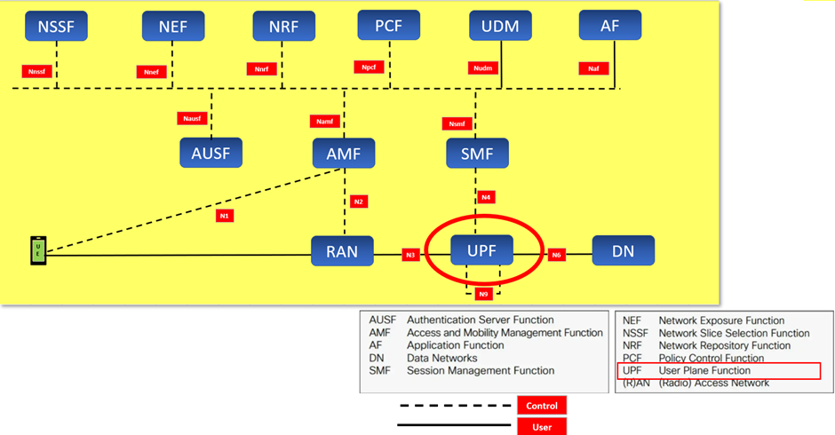

# Understanding Cellular Technology

- [Understanding Cellular Technology](#understanding-cellular-technology)
  - [RAN](#ran)
    - [RAN的關鍵組成部分](#ran的關鍵組成部分)
    - [RAN的主要功能](#ran的主要功能)
    - [在5G中的RAN](#在5g中的ran)
    - [RAN的位置和接口](#ran的位置和接口)
    - [gNodeB (next generation NodeB - 下一代基站)](#gnodeb-next-generation-nodeb---下一代基站)
  - [AMF](#amf)
    - [功能](#功能)
    - [AMF的借口](#amf的借口)
  - [AMF和RAN怎么沟通](#amf和ran怎么沟通)
  - [Next Generation Application Protocol (下一代應用協議)](#next-generation-application-protocol-下一代應用協議)
    - [NGAP的主要功能](#ngap的主要功能)
    - [NGAP的主要消息類型](#ngap的主要消息類型)
    - [NGAP在5G網絡中的作用](#ngap在5g網絡中的作用)
    - [圖示](#圖示)
    - [總結](#總結)
  - [5G核心網絡（5G Core Network）](#5g核心網絡5g-core-network)
    - [1. AMF（Access and Mobility Management Function）](#1-amfaccess-and-mobility-management-function)
    - [2. SMF（Session Management Function）](#2-smfsession-management-function)
    - [3. UPF（User Plane Function）](#3-upfuser-plane-function)
    - [4. UDM（Unified Data Management）](#4-udmunified-data-management)
    - [5. AUSF（Authentication Server Function）](#5-ausfauthentication-server-function)
    - [6. NRF（Network Repository Function）](#6-nrfnetwork-repository-function)
    - [7. NSSF（Network Slice Selection Function）](#7-nssfnetwork-slice-selection-function)
    - [8. PCF（Policy Control Function）](#8-pcfpolicy-control-function)
    - [9. NEF（Network Exposure Function）](#9-nefnetwork-exposure-function)
    - [圖示](#圖示-1)
    - [總結](#總結-1)
  - [中文定义](#中文定义)
  - [有用的鏈接](#有用的鏈接)




1. **UE (User Equipment)**：用戶設備，例如智慧手機或其他連接設備。
2. **RAN (Radio Access Network)**：無線接入網絡，連接用戶設備和核心網。
3. **AMF (Access and Mobility Management Function)**：接入和移動管理功能，負責用戶的註冊、連接管理和移動性管理。
4. **SMF (Session Management Function)**：會話管理功能，負責會話管理和IP地址分配。
   1. 會話=session
5. **UPF (User Plane Function)**：用戶面功能，處理數據轉發，連接RAN和數據網絡。
6. **DN (Data Networks)**：數據網絡，例如互聯網或專用數據網絡。
7. **AUSF (Authentication Server Function)**：認證伺服器功能，負責用戶認證。
8. **NSSF (Network Slice Selection Function)**：網絡切片選擇功能，管理網絡切片。
9.  **NEF (Network Exposure Function)**：網絡暴露功能，提供網絡功能的暴露接口。
10. **NRF (Network Repository Function)**：網絡存儲庫功能，存儲和管理網絡功能的註冊信息。
11. **PCF (Policy Control Function)**：策略控制功能，管理策略和計費控制。
12. **UDM (Unified Data Management)**：統一數據管理，管理用戶數據。
13. **AF (Application Function)**：應用功能，提供應用層的服務。

圖中還展示了這些功能模組之間的接口，如N1, N2, N3, N4, N6, N8, N9等，這些接口用於模組之間的通信。

## RAN

RAN（Radio Access Network，無線接入網絡）是移動通信系統的一部分，負責連接用戶設備（UE）和核心網絡。RAN的主要功能是通過無線電信號在用戶設備和網絡之間傳輸數據和控制信令。以下是RAN的關鍵組成部分和功能：

### RAN的關鍵組成部分

1. **基站**：
   - **宏基站（Macrocell Base Station）**：覆蓋較大區域，提供廣域無線服務。
   - **微基站（Microcell Base Station）**：覆蓋中等區域，用於增強特定區域的網絡容量和覆蓋。
   - **小基站（Small Cell Base Station）**：覆蓋較小區域，通常用於高密度城市區域或室內環境。
2. **天線和射頻設備**：負責發射和接收無線信號。
3. **無線電控制器**：
   - 在早期的2G和3G系統中，RAN包括一個無線電網絡控制器（RNC），它負責管理基站和核心網絡之間的通信。
   - 在4G和5G系統中，基站（如eNodeB和gNodeB）本身包含了大部分的控制功能。

### RAN的主要功能

1. **無線信號傳輸**：在用戶設備和基站之間通過無線電波傳輸數據和信令。
2. **連接管理**：處理用戶設備的連接請求，維持活動連接，並管理連接的切換（handover）以確保移動過程中的連續性。
3. **資源分配**：管理無線電頻譜資源，分配頻道和帶寬以滿足用戶的數據需求。
4. **數據處理**：進行基本的數據處理和封裝，將數據轉發到核心網絡進一步處理。
5. **信令處理**：處理控制信令，以支持用戶設備的註冊、認證、位置更新等操作。

### 在5G中的RAN

在5G網絡中，RAN有了進一步的演進：
- **gNodeB（gNB）**：5G基站，提供更高的數據速率和更低的延遲。
- **分佈式單元（DU）和集中式單元（CU）**：5G RAN架構中，RAN功能被劃分為分佈式單元和集中式單元，以實現更靈活和高效的網絡部署。

### RAN的位置和接口

- **位置**：位於用戶設備和核心網絡之間。
- **接口**：
  - **Uu接口**：用戶設備和基站之間的無線接口。
  - **N2接口**：基站（gNodeB）和AMF之間的接口，用於信令和控制信息的傳輸。
  - **N3接口**：基站（gNodeB）和UPF（User Plane Function）之間的接口，用於用戶數據的傳輸。

### gNodeB (next generation NodeB - 下一代基站)

- 是RAN的一部分
- 它在RAN中起到橋樑作用，連接用戶設備和5G核心網絡。

[用戶設備 (UE)]
       |
       | (無線通信)
       |
[gNodeB - 基站] <-- 這是RAN的一部分
       |
       | (N2/N3接口)
       |
[5G核心網絡 (Core Network)]

## AMF

### 功能

- 接入管理：處理用戶設備的註冊、認證和連接建立。
- 移動性管理：管理用戶設備在不同基站之間的切換，維護位置信息。
- 安全管理：進行用戶設備的認證，管理加密密鑰。
- 信令路由：與其他核心網絡模組（如SMF、AUSF等）通信，協同提供網絡服務。

### AMF的借口

- **位置**：位於5G核心網絡中，處理核心網絡層面的接入和移動管理。
- **接口**：
  - **N1接口**：AMF與用戶設備之間的接口，用於傳輸控制信令。
  - **N2接口**：AMF與基站（gNodeB）之間的接口，用於協調接入和移動性管理。
  - **N11接口**：AMF與SMF之間的接口，用於協同會話管理。
  - **N12接口**：AMF與AUSF之間的接口，用於用戶認證。
  - **N8接口**：AMF與UDM之間的接口，用於獲取用戶數據。

## AMF和RAN怎么沟通

UE ---- (Uu接口) ----> gNodeB ---- (N2接口) ----> AMF

## Next Generation Application Protocol (下一代應用協議)

NGAP（Next Generation Application Protocol，下一代應用協議）是5G網絡中用於接入和移動管理功能（AMF）與無線接入網絡（RAN）之間的信令協議。NGAP在N2接口上運行，負責管理用戶設備（UE）的接入、連接建立、移動性、切換以及其他控制信令的傳輸。以下是NGAP的主要功能和特性：

### NGAP的主要功能

1. **註冊和註銷**：
   - 管理用戶設備的網絡註冊和註銷過程，確保UE能夠成功接入和離開網絡。
2. **連接建立和釋放**：
   - 處理UE的連接請求，管理連接的建立、維護和釋放，確保數據會話的正常進行。
3. **切換管理**：
   - 管理UE在不同基站（gNodeB）之間的切換過程，確保UE在移動過程中連接的連續性和穩定性。
4. **上下文管理**：
   - 處理UE的上下文信息，包括UE狀態、會話信息和配置數據，以確保網絡服務的連續性。
5. **資源分配和管理**：
   - 管理無線資源的分配和優化，確保UE能夠獲得必要的網絡資源來支持其服務需求。
6. **安全管理**：
   - 協助AMF進行UE的認證和密鑰管理，確保通信的安全性和完整性。

### NGAP的主要消息類型

NGAP定義了一組信令消息，用於在AMF和RAN（gNodeB）之間傳輸控制信息。主要的消息類型包括：

- **NGAP-InitialUEMessage**：用於傳送UE的初始接入消息。
- **NGAP-InitialContextSetupRequest**：AMF向gNodeB請求建立UE的上下文。
- **NGAP-InitialContextSetupResponse**：gNodeB對AMF的上下文建立請求做出回應。
- **NGAP-UEContextReleaseRequest**：AMF請求釋放UE的上下文。
- **NGAP-UEContextReleaseCommand**：AMF命令gNodeB釋放UE的上下文。
- **NGAP-HandoverRequest**：AMF請求進行UE的切換。
- **NGAP-HandoverCommand**：AMF指示gNodeB進行切換。

### NGAP在5G網絡中的作用

NGAP協議在5G網絡中扮演著關鍵角色，通過N2接口實現AMF與RAN之間的信令通信。這些信令消息和過程確保了用戶設備能夠高效地接入網絡、建立和維持連接，並在移動過程中進行無縫切換。

### 圖示

以下是一個簡化的圖示，說明NGAP在5G網絡中的作用：

```
UE ---- (Uu接口) ----> gNodeB ---- (N2接口: NGAP) ----> AMF
```

- **UE**：用戶設備
- **gNodeB**：5G基站
- **AMF**：接入和移動管理功能
- **Uu接口**：UE和gNodeB之間的無線接口
- **N2接口**：gNodeB和AMF之間的信令接口，使用NGAP協議

### 總結

NGAP是5G網絡中的關鍵信令協議，負責AMF和RAN之間的通信和控制信令的傳輸。通過NGAP協議，5G網絡能夠有效管理用戶設備的接入、連接和移動性，確保網絡的穩定性和高效運行。

## 5G核心網絡（5G Core Network）

5G核心網絡（5G Core Network）由多個功能模組組成，這些模組協同工作，以支持5G網絡的各種服務和功能。以下是5G核心網絡的主要組成部分及其功能：

### 1. AMF（Access and Mobility Management Function）
- **功能**：管理用戶設備（UE）的接入和移動性，包括註冊、認證、連接建立和釋放，並支持UE在不同基站之間的切換。
- **接口**：
  - N1接口：與UE通信。
  - N2接口：與gNodeB（基站）通信。
  - N11接口：與SMF通信。

### 2. SMF（Session Management Function）
- **功能**：管理數據會話，包括會話的建立、修改和釋放，以及IP地址分配和策略控制。
- **接口**：
  - N4接口：與UPF通信。
  - N11接口：與AMF通信。

### 3. UPF（User Plane Function）
- **功能**：處理用戶數據的轉發，負責數據平面的數據包路由和轉發，連接RAN和數據網絡。
- **接口**：
  - N3接口：與gNodeB通信。
  - N6接口：與數據網絡（如互聯網）通信。
  - N4接口：與SMF通信。

### 4. UDM（Unified Data Management）
- **功能**：提供用戶數據的管理，包括用戶的訂閱信息和配置數據。
- **接口**：
  - N8接口：與AMF通信。
  - N10接口：與SMF通信。

### 5. AUSF（Authentication Server Function）
- **功能**：負責用戶認證，確保UE的合法性和安全性。
- **接口**：
  - N12接口：與AMF通信。

### 6. NRF（Network Repository Function）
- **功能**：存儲和管理5G核心網絡中所有網絡功能模組的註冊信息，提供服務發現和功能查找。
- **接口**：
  - Nnrf接口：與所有網絡功能模組通信。

### 7. NSSF（Network Slice Selection Function）
- **功能**：負責網絡切片的選擇和管理，確保UE可以使用合適的網絡切片來滿足特定服務需求。
- **接口**：
  - Nnssf接口：與AMF和其他網絡功能模組通信。

### 8. PCF（Policy Control Function）
- **功能**：管理策略和計費控制，確保網絡資源的有效利用和服務質量。
- **接口**：
  - N7接口：與SMF通信。
  - N5接口：與AF（Application Function）通信。

### 9. NEF（Network Exposure Function）
- **功能**：提供網絡功能的暴露接口，允許外部應用程序訪問和使用網絡功能。
- **接口**：
  - Nnef接口：與外部應用程序和其他網絡功能模組通信。

### 圖示

以下是一個簡化的圖示，展示了5G核心網絡的主要功能模組及其接口：

```
[UE] ----> [gNodeB (RAN)]
             |
             v
         [AMF] <--> [SMF] <--> [UPF]
             |        |         |
            \|/      \|/       \|/
         [UDM]     [PCF]      [DN]
             |
            [AUSF]
             |
            [NRF]
             |
            [NSSF]
             |
            [NEF]
```

- **UE**：用戶設備
- **gNodeB**：5G基站，RAN的一部分
- **AMF**：接入和移動管理功能
- **SMF**：會話管理功能
- **UPF**：用戶面功能
- **UDM**：統一數據管理
- **AUSF**：認證伺服器功能
- **NRF**：網絡存儲庫功能
- **NSSF**：網絡切片選擇功能
- **PCF**：策略控制功能
- **NEF**：網絡暴露功能
- **DN**：數據網絡（如互聯網）

### 總結

5G核心網絡由多個功能模組組成，每個模組都有特定的職責和功能。這些模組通過標準化的接口進行通信，協同工作以支持5G網絡的各種服務和功能。這種模塊化和虛擬化的設計使得5G網絡具有高度的靈活性、可擴展性和效率。

## 中文定义

- 接入 - access

## 有用的鏈接

- [VNF and CNF, what’s the difference?](https://www.redhat.com/en/topics/cloud-native-apps/vnf-and-cnf-whats-the-difference)