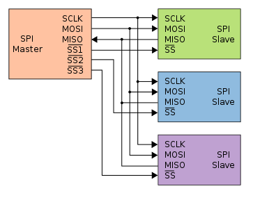
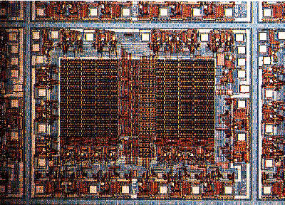

# Understanding Memory

NOTE: Probably best to just read the Reddit post at the bottom.

- [Understanding Memory](#understanding-memory)
  - [What is a RAM channel?](#what-is-a-ram-channel)
    - [Analogy](#analogy)
  - [What is a DIMM (beyond the obvious)?](#what-is-a-dimm-beyond-the-obvious)
  - [What is a memory rank?](#what-is-a-memory-rank)
    - [What is DRAM?](#what-is-dram)
    - [What is a chip select?](#what-is-a-chip-select)
    - [Back to Memory Ranks](#back-to-memory-ranks)
    - [Performance of multiple rank modules](#performance-of-multiple-rank-modules)
  - [What is ECC Memory?](#what-is-ecc-memory)
  - [What is Registered Memory?](#what-is-registered-memory)
    - [Why does the buffer allow for more total addressable memory?](#why-does-the-buffer-allow-for-more-total-addressable-memory)
      - [R-DIMMs](#r-dimms)
      - [LR-DIMMs](#lr-dimms)
        - [What is a data line?](#what-is-a-data-line)
        - [Why does the data buffer matter?](#why-does-the-data-buffer-matter)
  - [RAM and it's relation to CPU Speed](#ram-and-its-relation-to-cpu-speed)
  - [More on Channels](#more-on-channels)
  - [Best Memory for Different Circumstances](#best-memory-for-different-circumstances)
  - [DRAM Channel vs Rank vs Bank](#dram-channel-vs-rank-vs-bank)

## What is a RAM channel?

From [RAM Channels Guide: The What, and The How](http://blog.logicalincrements.com/2019/09/ram-channels-explanation-guide/)

To be clear, these memory channels are actual wires that exist on/in the motherboard. Though RAM kits may call their arrangements "channels," the actual number of channels and the number of RAM sticks are independent of each other; any mention of channel count on a RAM kit’s product/specification page is just an informal, technically-incorrect way of referring to how many sticks of RAM there are in the kit. In addition, the number of RAM slots on a motherboard is independent of the number of memory channels. A channel needs only one stick to be used, and any more than that doesn’t necessarily stop things from working.

In addition, CPUs also support a certain maximum amount of memory channels. You don’t really need to worry about this, as every CPU will handle the amount of memory channels available on their supporting motherboards. There are only two notable exceptions: Intel’s i5-7640X and i7-7740X, which are both LGA 2066 CPUs, and very odd purchases anyway.

### Analogy

Imagine a manufacturer of products:

Let’s say this manufacturer (your CPU), with potentially many factories (cores) in need of materials, makes orders for materials from only one supplier (memory channel). Even if the supplier has a whole lot of materials (capacity / stored data), and may run multiple warehouses (RAM sticks) of their own, it has a limited capacity for making shipments, and so can’t handle multiple shipments to the manufacturer at once. There may be multiple shipments ready to go, but they can’t actually start shipping until the current shipment is done.

A single-channel supplier warehouse attempting to serve a quad-factory manufacturer with one truck

The problem is, this manufacturer can often use materials faster than their supplier can ship them, and the delay from waiting on the supplier’s logistics system for consecutive orders can slow things down. Especially when this manufacturer’s factories are being heavily loaded with orders of their own from vendors and customers (your other components) while relying on materials orders, the supplier can pose a problem.

So, the manufacturer contracts with a second supplier in addition to the first. Now, the manufacturer does something efficient: They alternate orders between the two suppliers. This way, the manufacturer can have two simultaneous shipments coming their way, and they suddenly find that waiting on consecutive orders to be shipped is now significantly less of an issue, since their effective capacity for getting shipments has been doubled. This same idea can extend even further across more suppliers.

Really, how much the number of suppliers the manufacturer uses actually matters all depends on: how quickly materials are being used, how many factories they have (since each might come in need of materials at any given moment), how busy the manufacturer or specific factories are, and how quickly the suppliers themselves can send shipments to the manufacturer. Most of the time, this isn’t a big deal, but when things line up well or poorly, the number of suppliers (i.e. memory channels) can make a notable difference.

## What is a DIMM (beyond the obvious)?

From [What is LR-DIMM , LRDIMM Memory ? ( Load-Reduce DIMM)](https://www.simmtester.com/News/PublicationArticle/167)

DIMM stands for Dual Inline Memory Module. It is the RAM memory we found in our desktop computer. It consists of a few black chips (IC) on a small PCB. It stores our file and data temporally when we turn on our computer. "Dual Inline" refers to pins on both side of the module. We generally call them "gold fingers".

## What is a memory rank?

### What is DRAM?

From [Dynamic random-access memory](https://en.wikipedia.org/wiki/Dynamic_random-access_memory) and [MOSFET](https://en.wikipedia.org/wiki/MOSFET)

Dynamic random-access memory (DRAM) is a type of random access semiconductor memory that stores each bit of data in a memory cell consisting of a tiny capacitor and a transistor, both typically based on metal-oxide-semiconductor (MOS) technology.

After this I Googled metal–oxide–semiconductor field-effect transistor and basically the gist of what I read is that it's just the type of transistor used to store the data. The way they fabricate them is by oxidizing silicon. Beyond that I hit the "I believe button".

### What is a chip select?

From [Chip select](https://en.wikipedia.org/wiki/Chip_select)

Chip select (CS) or slave select (SS) is the name of a control line in digital electronics used to select one (or a set) of integrated circuits (commonly called "chips") out of several connected to the same computer bus, usually utilizing the three-state logic.

When an engineer needs to connect several devices to the same set of input wires (e.g., a computer bus), but retain the ability to send and receive data or commands to each device independently of the others on the bus, they can use a chip select. The chip select is a command pin on many integrated circuits which connects the I/O pins on the device to the internal circuitry of that device.

### Back to Memory Ranks

From [Memory rank](https://en.wikipedia.org/wiki/Memory_rank)

A memory rank is a set of DRAM chips connected to the same chip select, which are therefore accessed simultaneously. In practice all DRAM chips share all of the other command and control signals, and only the chip select pins for each rank are separate (the data pins are shared across ranks).

On a DDR, DDR2, or DDR3 memory module, each rank has a 64-bit-wide data bus (72 bits wide on DIMMs that support ECC). The number of physical DRAMs depends on their individual widths. For example, a rank of ×8 (8-bit wide) DRAMs would consist of eight physical chips (nine if ECC is supported), but a rank of ×4 (4-bit wide) DRAMs would consist of 16 physical chips (18, if ECC is supported). Multiple ranks can coexist on a single DIMM, and modern DIMMs can consist of one rank (single rank), two ranks (dual rank), four ranks (quad rank), or eight ranks (octal rank).

Increasing the number of ranks per DIMM is mainly intended to increase the memory density per channel. Too many ranks in the channel can cause excessive loading and decrease the speed of the channel. Also some memory controllers have a maximum supported number of ranks. DRAM load on the command/address (CA) bus can be reduced by using registered memory.

### Performance of multiple rank modules

From [Memory rank](https://en.wikipedia.org/wiki/Memory_rank)

There are several effects to consider regarding memory performance in multi-rank configurations:

- Multi-rank modules allow several open DRAM pages (row) in each rank (typically eight pages per rank). This increases the possibility of getting a hit on an already open row address. The performance gain that can be achieved is highly dependent on the application and the memory controller's ability to take advantage of open pages.
- Multi-rank modules have higher loading on the data bus (and on unbuffered DIMMs the CA bus as well). Therefore if more than dual rank DIMMS are connected in one channel, the speed might be reduced.
- Subject to some limitations, ranks can be accessed independently, although not simultaneously as the data lines are still shared between ranks on a channel. For example, the controller can send write data to one rank while it awaits read data previously selected from another rank. While the write data is consumed from the data bus, the other rank could perform read-related operations such as the activation of a row or internal transfer of the data to the output drivers. Once the CA bus is free from noise from the previous read, the DRAM can drive out the read data. Controlling interleaved accesses like so is done by the memory controller.
- There is a small performance reduction for multi-rank systems as they require some pipeline stalls between accessing different ranks. For two ranks on a single DIMM it might not even be required, but this parameter is often programmed independently of the rank location in the system (if on the same DIMM or different DIMMs). Nevertheless, this pipeline stall is negligible compared to the aforementioned effects.
  - **Grant Note**: A pipeline still is when execution stops because some hazard has to be resolved. A hazard in computer architecture is when there would be a conflict due to concurrent execution for whatever reason. Basically you're waiting in limbo for something else to complete before it is safe for you to continue.

## What is ECC Memory?

From [Computer Memory Issues](https://de.ifixit.com/Wiki/Computer_Memory_Issues)

Standard memory, also called non-parity memory, uses 8 bits to store an 8-bit byte. ECC memory (Error Correcting Code memory), sometimes called parity memory, uses 9 bits to store an 8-bit byte. The extra bit provided by ECC memory is used to store error detection and correction information.

A non-parity memory module can neither detect nor correct errors. An ECC memory module can detect all multi-bit errors, correct all single-bit errors, and correct some multi-bit errors. Memory errors are so rare that most desktop systems use non-parity memory, which is less expensive and faster than ECC memory. In fact, most desktop chipsets do not support ECC memory. If you install ECC memory in such a system, it may not recognize the memory at all, but more likely it will simply treat the ECC memory as non-parity memory, ignoring the extra bit.

ECC memory is occasionally used in desktop systems, but is much more common in servers and other large, critical systems. Because ECC modules contain additional memory chips, in the ratio of 9:8, they typically cost 10% to 15% more than similar non-parity modules. Also, because the circuitry on ECC modules that calculates and stores ECC values imposes some overhead, ECC modules are marginally slower than similar non-parity modules.

## What is Registered Memory?

From [Computer Memory Issues](https://de.ifixit.com/Wiki/Computer_Memory_Issues)

Unbuffered memory modules allow the memory controller to interact directly with the memory chips on the module. Registered memory (also called buffered memory) modules place an additional layer of circuitry between the memory controller and the memory chips.

Registered memory is necessary in some environments, because all memory controllers have limitations on how many devices (individual memory chips) they can control, which in turn limits the maximum capacity of the memory modules they can use. When a memory controller interacts with an unbuffered memory module, it controls every memory chip directly. When a memory controller interacts with a registered memory module, it works only with the buffer circuitry; the actual memory chips are invisible to it.

The sole advantage of registered memory is that it permits a system to use higher-capacity memory modules. (The highest capacity modules at any given time are often available only in registered form.) The disadvantages of registered memory are that it is considerably more expensive than unbuffered memory and noticeably slower because of the additional overhead incurred from using a buffer.

### Why does the buffer allow for more total addressable memory?

From [Registered Memory](https://en.wikipedia.org/wiki/Registered_memory#Buffered_memory)

Before this can make sense you have to read from [Parasitic capacitance](https://en.wikipedia.org/wiki/Parasitic_capacitance)

> Parasitic capacitance, or stray capacitance is an unavoidable and usually unwanted capacitance that exists between the parts of an electronic component or circuit simply because of their proximity to each other. When two electrical conductors at different voltages are close together, the electric field between them causes electric charge to be stored on them; this effect is parasitic capacitance. All actual circuit elements such as inductors, diodes, and transistors have internal capacitance, which can cause their behavior to depart from that of 'ideal' circuit elements. Additionally, there is always non-zero capacitance between any two conductors; this can be significant at higher frequencies with closely spaced conductors, such as wires or printed circuit board traces. Parasitic capacitance is a significant problem in high frequency circuits and is often the factor limiting the operating frequency and bandwidth of electronic components and circuits.

More on [Parasitic capacitance](https://www.simmtester.com/News/PublicationArticle/167)

> Wait a minute! You just cannot keep adding memory into your computer without any penalty. At 1333Mhz (1.3GHz), noise gets involved. It generally is something called the signal integrity or signal reflection issue. At a point, the accumulated noise in the system would render the system not operable. At high frequency, there is also something called "loading factor". Each memory chip (IC) has input capacitance that tends to suppress the high frequency signal. Generally, each chip has about 3 to 5 pf of input capacitance. The more chips on the module, the more accumulated capacitance will weaken the signal to an in-operable state.

#### R-DIMMs

Registered (Buffered) DIMMs (R-DIMMs) insert a buffer between the command/address bus pins on the DIMM and the memory chips proper. A high-density DIMM might have 36 memory chips (assuming four ranks and ECC), each of which must receive the memory address, and their combined input capacitance limits the speed at which the memory bus can operate. By amplifying the signal on the DIMM, this allows more chips to be connected to the memory bus. The cost is one additional clock cycle of memory latency required for the address to traverse the additional buffer. Early registered RAM modules were physically incompatible with unregistered RAM modules, but SDRAM DIMMs are interchangeable, and some motherboards support both types.

#### LR-DIMMs

Load Reduced DIMMs (LR-DIMMs) modules are similar, but add a buffer to the data lines as well. As a result, LRDIMM memory provides large overall maximum memory capacities, while avoiding the performance and power consumption problems of FB-DIMM memory.

##### What is a data line?

From [How Memory Works](https://www.i-programmer.info/babbages-bag/359-memory-2.html?start=2)

The processor specifies which memory cell it wants to use by giving a binary address. Some simple Boolean logic, address decoding, then converts the address into a row and column select and the memory still works and its efficient.

Notice that at the moment we are looking at a single memory chip and this arrangement can only store a single bit. If you want to store a byte you need eight such chips, one for each bit, and eight data input and eight data output lines.

The eight data lines are grouped together into a data input bus and a data output "bus" – a bus is just a group of wires. Early computers really did have separate buses for input and output but today’s machines have a single unified data bus that can be used for either input or output.

If you want more storage than a bank of eight chips can provide then you have to add another bank of eight chips and some additional address decoding logic to select the correct bank. The address lines that come from the processor are generally referred to as an address bus and now we have the fundamental architecture of a simple but modern computer.

##### Why does the data buffer matter?

From [What is LR-DIMM, LRDIMM Memory? (Load-Reduce DIMM)](https://www.simmtester.com/News/PublicationArticle/167) and [Basics of LRDIMM](https://www.edn.com/basics-of-lrdimm/)

You just cannot keep adding memory into your computer without any penalty. At 1333Mhz (1.3GHz), noise gets involved. It generally is something called the signal integrity or signal reflection issue. At a point, the accumulated noise in the system would render the system not operable.

**Figure 1: LRDIMM conceptual drawing featuring one memory buffer on the front side of the memory module and multiple ranks of DRAM mounted on both front and back sides of the memory module.**

The memory buffer re-drives all of the data, command, address and clock signals from the host memory controller and provides them to the multiple ranks of DRAM. The memory buffer isolates the DRAM from the host, reducing the electrical load on all interfaces. Reducing the electrical loading in this manner allows a system to operate at a higher speed for a given memory capacity, or to support a higher memory capacity at a given speed.

On existing RDIMM technology, the data bus connects directly to the multiple ranks of DRAM, increasing electrical load and limiting system speed as the desired server capacity increases. Figure 2 shows the system-level block diagram for RDIMM and LRDIMM.

To maximize module and system-level memory capacity and overcome limitations on the number of chip selects per channel, the LRDIMM supports Rank Multiplication, where multiple physical DRAM ranks appear to the host controller as a single logical rank of a larger size. This is done by utilizing additional row address bits during the Activate command as sub-rank select bits.

One of the primary advantages of the LRDIMM is the ability to dramatically increase total system memory capacity without sacrificing speed. By electrically isolating the DRAM from the data bus, additional ranks of DRAM can be added to each DIMM while maintaining signal integrity, and additional DIMMs can be installed on each system memory channel. LRDIMM capacities up to 32GB are possible today with 4Rx4 modules using 4 Gb, DDP (dual-die package) DRAM. Since each LRDIMM presents a single electrical load to the host, more DIMMs can be installed per channel as well.

## RAM and it's relation to CPU Speed

From [Understanding CPU Limitations with Memory](https://www.crucial.com/support/articles-faq-memory/understanding-cpu-limitations-with-memory)

There are more in the weeds details, but it really is as simple as the clock speed of the CPU's memory controller has to be as good as or better than the target RAM or the RAM will downclock to meet the CPU's speed.

## More on Channels

See [this Reddit thread](https://www.reddit.com/r/hardware/comments/1q8d9v/can_someone_please_explain_ram_channels_to_me/)

Ever since SDRAM first hit the shelves, main memory inside PC's has been a 64 bit wide interface. That means that 64 bits are sent in each transaction. DDR just meant that two lots of 64 bit transactions are sent in one clock.

Obviously you see that DDR would increase the available memory bandwidth (speed), because twice as much data is being sent per clock.

Well there is another way to send more data per clock, that is to send more than 64 bits in one go. You could either, widen the memory bus, to say 128 bits (GPU's use 384/512bit interfaces, but it's more complicated than that in truth) or you could add another interface.

So when we go from single 'channel' to dual channel, what we are doing is adding another 64 bit wide interface (and another 2 when going from dual to quad).

Now, usually you have 4 slots on your mobo for RAM. So you either have 4 independent slots connected to their own memory channel, or you have 2 pairs of slots, each pair connected to it's own memory channel.

Lets take one pair.

This pair has 240 pins (in desktop DDR3) coming off the CPU, connecting to one slot, then the next. This memory bus has the signalling to talk to either slot, a read request is sent out and each chip on that bus determines if it is indeed the chip that contains the requested data (to put it simply) and once it has found it, sends the data back. It can take a little while to do all this so many read and write requests can end up queued and/or in the pipeline.

You add your second channel and you interleave your data across it, so bit one is the first bit on channel 1, bit 2 is the first bit on channel 2, bit 3 the second on channel 1 etc (likely to be done in chunks larger than single bits though) In the exact same way that RAID can give you much faster hard disk access (but certain access patterns not so much) adding extra memory channels allows you to read extra data. Double your memory channels, double the data you can read per second. Of course in reality nothing ever scales perfectly but you get the idea.

The flip side of having these extra memory channels is that you need to populate them all, or you're wasting them. So a quad channel system will need 4 memory modules, if it has any less than that it is only using a number of memory channels equal to the number of modules you're using.

This was a pretty good explanation, until you got to the part about bit interleaving. That is definitely not how it works. I know you corrected yourself and said that it probably works at a chunkier granularity, but I only noticed that after I'd already written all of this, so sorry. I'm going to get a little technical, so ignore this unless you want lots of details.

DRAM systems are logically organized into (going from largest to smallest sub-division): channels, ranks, banks, rows, and columns. A channel is the physical connection between the memory controller (which is on the CPU die these days), and the DIMMs (the boards with DRAM chips on them). It's the wires, the aforementioned 64-bit data interface, plus all the control signals. A channel may have one or more DIMMs on it (for DDR3 at least, but DDR4 will require only a single DIMM per channel), and when there is a memory request (be it read or write) all of the data for that request comes from a single channel. There is no bit-interleaving across channels. All of the CPUs you and I deal with on a daily basis use 64 byte cache lines, so DRAM is accessed at the granularity of 64 byte blocks. So when there is a DRAM read, all 64 bytes come from a single channel.

Furthermore, all 64 bytes come from a single rank within that channel. A rank is a collection of DRAM chips on a DIMM that work together to service a DRAM transaction. In the desktop systems we interact with every day, a rank is typically comprised of 8 DRAM chips. A DIMM may have more than 1 rank on it (the DIMMs you are familiar with probably have 8 DRAM chips on each side, so 2 ranks). This means that when your CPU sends a DRAM read request along a channel, 8 DRAM chips on the DIMM work together to fulfill that request. Remember that the data bus width is 64 bits, so each of these 8 DRAM chips is only responsible for transmitting 8 bits each per transfer. They transmit at the exact same time, in lock step with each other, and so from the CPU's perspective it seems like a single 64-bit data bus. After one DRAM transaction is completed on that channel, the next transaction might come from a different rank on the same channel (perhaps the other set of 8 DRAM chips on the same DIMM, or a rank on another DIMM on the same channel), or it could be the same rank again.

Here is the important part: separate channels can work 100% independently, because they have absolutely 0 resources they have to manage and share between them, but separate ranks on the same channel must serialize their actions, because they all share the same data and control buses, and they must take turns using these resources. Depending on the access pattern you expect to be most common, you can layout data across your DRAM channels/ranks/banks/rows in various ways. One high performance strategy is to layout consecutive cache lines across channels (so address A is in channel 1, and address A+64 is in channel 2). This lets you fetch A+64 while you're still working on A. There are other data layout strategies for other expected access patterns. What I'm saying is that it is common for cache lines to be striped (interleaved) across channels, but not individual bits.

If anyone wants, I can go into more detail about how banks, rows, and columns work, but I think channels and ranks are all that is needed to answer the OP's question.

One last thing, about GPU memory buses. In graphics card specs, they always say that the GPU has a "384-bit bus", but this is misleading. It does have 384 total bits of GDDR5 data bus, but it is not logically organized as a single bus (like the 8 DRAM chips of a rank work together to logically form a 64-bit bus in DDR3). Instead, a GPU with a "384-bit bus" will actually have 12 independent 32-bit GDDR5 data buses that all act independently from one another.

Source: Ph.D. computer architecture student who's studied DRAM organization for the last 4 years.

## Best Memory for Different Circumstances

https://www.microway.com/hpc-tech-tips/ddr4-rdimm-lrdimm-performance-comparison/

## DRAM Channel vs Rank vs Bank

https://electronics.stackexchange.com/a/454717/279031