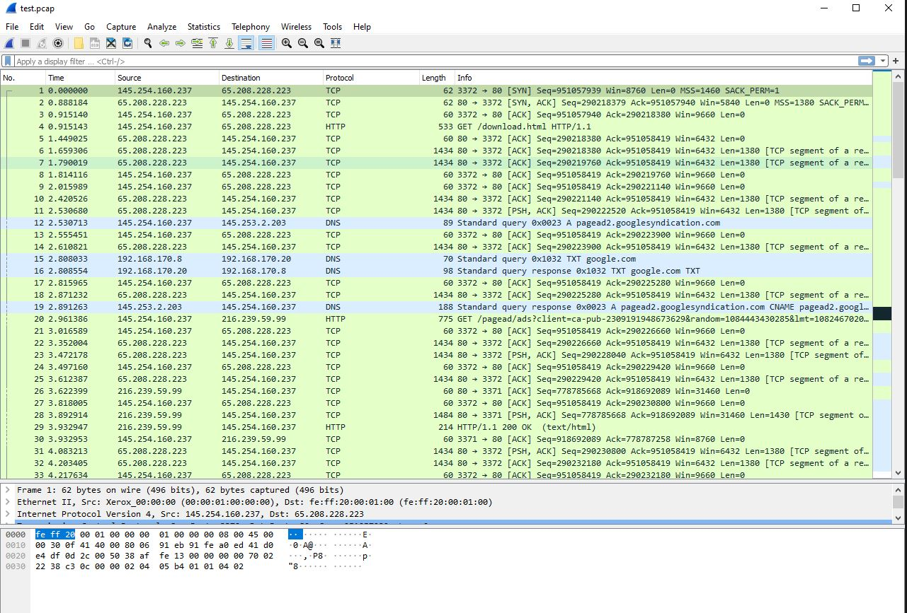

# Use OS10 as Aggregator

In this test case the goal is to create a simple load balancer using a reverse
LAG port. The idea is to have one input port which is then mirrored to a logical
LAG port and at the other end of the LAG port is a number of security sensors.

# Helpful Links

[ONIE Network Install Process Overview](https://opencomputeproject.github.io/onie/user-guide/index.html#installing-over-the-network)

# My Configuration

## OS 10 Version

    OS10(config)# do show version
    Dell EMC Networking OS10 Enterprise
    Copyright (c) 1999-2020 by Dell Inc. All Rights Reserved.
    OS Version: 10.5.1.0
    Build Version: 10.5.1.0.124
    Build Time: 2020-02-12T09:05:20+0000
    System Type: S4112F-ON
    Architecture: x86_64
    Up Time: 00:05:09

# Configure Device for LAG

## Physical Configuration

2 10Gb/s fiber SFPs one each connected to two separate VMs. These will serve as
our traffic generators. A third 10Gb/s SFP is plugged into a third VM and this
will serve as our receiver.

## Configuration

[Configuration](./configuration)

# Test Scenario

I played a PCAP made up entirely of HTTP from port 1 and PCAP made entirely of DNS
from port 2 and then listened on the VM attached to port 3. Confirmed, all traffic
showed up on port 3 as expected.

