# Using Dell Repository Manager to Create Bootable ISO

## Instructions

- Download DRM from [Dell's website](https://www.dell.com/support/kbdoc/en-us/000177083/support-for-dell-emc-repository-manager-drm)
- I'm setting this up on Rocky Linux so I downloaded the Linux .bin file
- Copy and past the following into your command line:

```bash
# 1. Install required GTK libraries for GUI support (optional but recommended)
sudo dnf install -y gtk2 gtk2-devel

# 2. Make the installer executable
chmod +x DRMInstaller_3.4.7.970.bin

# 3. Run the installer in CLI/console mode
sudo ./DRMInstaller_3.4.7.970.bin -i console
```

- Launch DRM with `/opt/dell/dellrepositorymanager/drm.sh`
- Click Add Repository
  - Name the repository
  - Under select systems, click custom, select the systems applicable to your environment
  - Click all operating systems in the base catalog
  - If you only want certain components, click custom, select the applicable components
    - For example, if you only want drives, iDRAC, network, and BIOS, you would click:
      - BOSS
      - Network
      - BIOS
      - SAS Drive
      - Express Flash PCIe SSD
      - SAS RAID (if applicable)

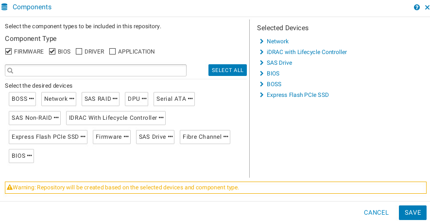

- Finally, click Add to create the repository. The repository will appear in the main UI.

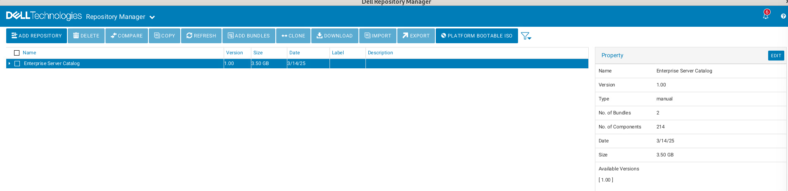

- Select the repository and click download. This will pull the firmware/BIOS from the Dell catalog
  - I usually download to `/home/drmuser`

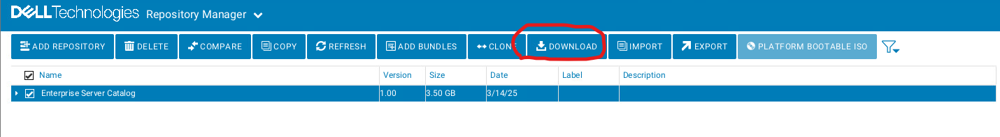

- Under Repository Manager - Jobs, you can see the Download progress

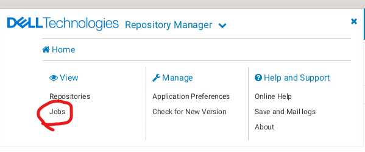

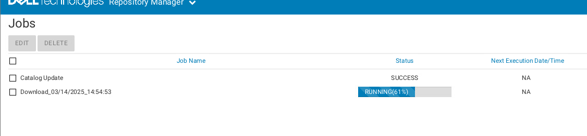

- When the job is complete you can export a bootable ISO or repository. Select the repository and click export:

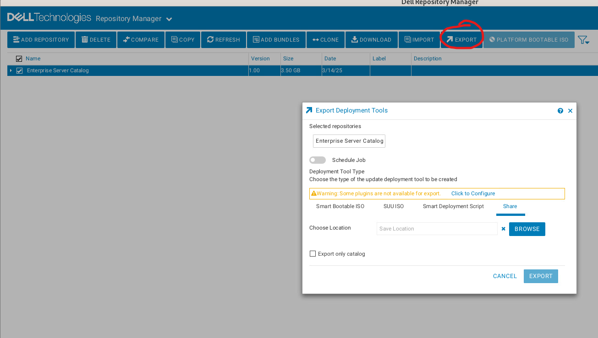

- Select Click to Configure:

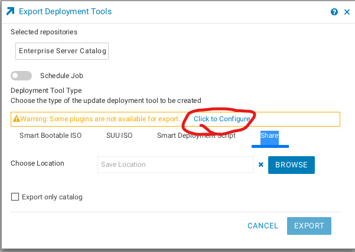

- Select Dell Bootable ISO Plug-in and click UPDATE. It will say

> Plug-in update job submitted- Dell Bootable ISO Plug-In

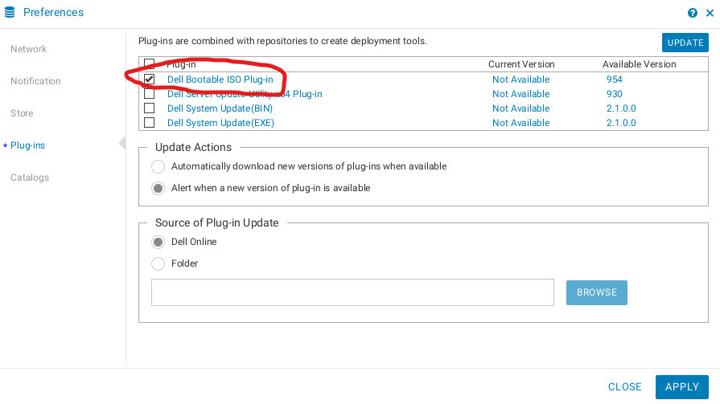

- You can track the job for the plugin install in the jobs page.

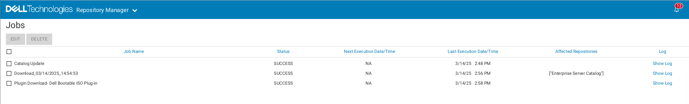

- Go back to export and you can now click smart bootable ISO. Click reboot system automatically.

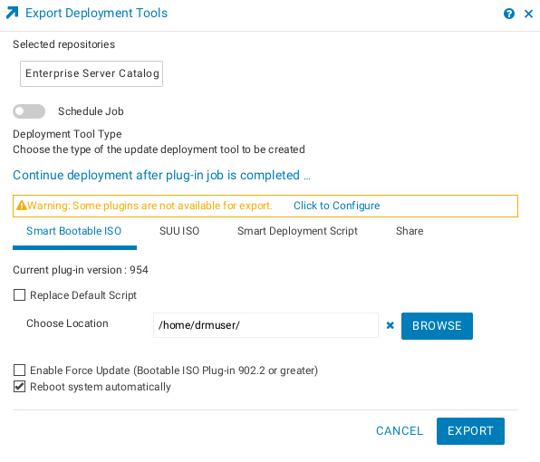

- When you have configured the job click export. You can then track the job as usual in the jobs page. It should only take a few seconds if you have a single system with only a few components

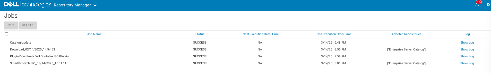

- In my case, for just the R7625, with drives, networking, iDRAC, and BIOS, the ISO is 2.11GB.

```bash
[root@patches SmartBootableISO_03_14_2025_150111]# ls -al
total 2061140
drwxr-xr-x. 2 drmuser drmuser         26 Mar 14 15:01 .
drwx------. 4 drmuser drmuser      24576 Mar 14 15:01 ..
-rwxrwxrwx. 1 drmuser drmuser 2110578688 Mar 14 15:01 linuxISO.iso
```

- Now, mount the ISO in iDRAC via virtual media, and boot from it

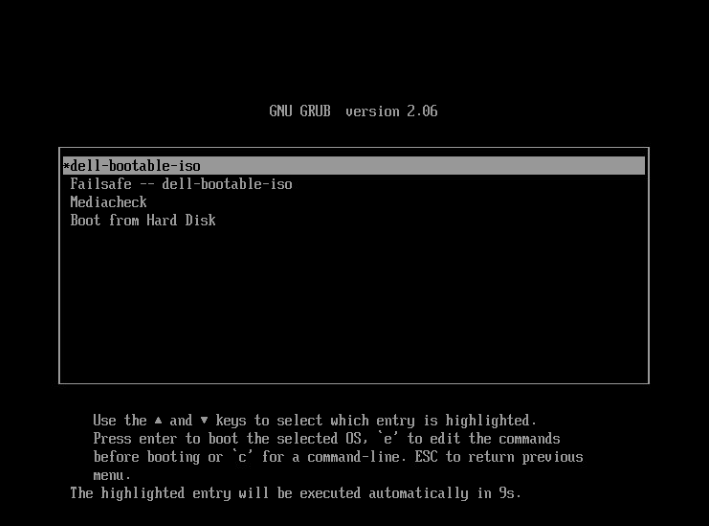

- After it boots, you will eventually see the SUSE splash screen, and after that the updates will kick off:

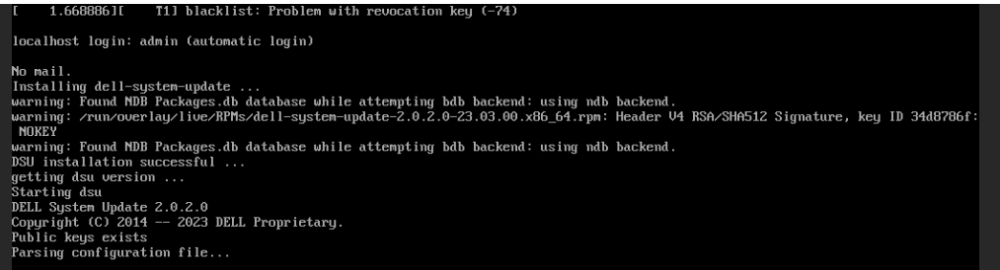
