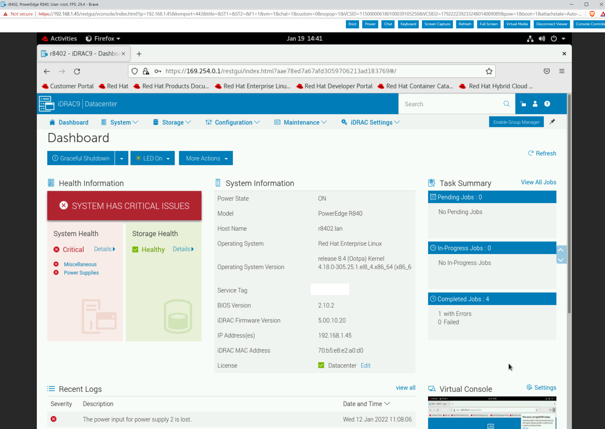

# Using the iDRAC Service Module

## Objective

Establish direct, inter-chassis, communication between a host operating system and the iDRAC.

## My Setup

### Hardware

Dell R840
**Note**: This will work with any Dell server with iDRAC support.

### Operating System

```
NAME="Red Hat Enterprise Linux"
VERSION="8.4 (Ootpa)"
ID="rhel"
ID_LIKE="fedora"
VERSION_ID="8.4"
PLATFORM_ID="platform:el8"
PRETTY_NAME="Red Hat Enterprise Linux 8.4 (Ootpa)"
ANSI_COLOR="0;31"
CPE_NAME="cpe:/o:redhat:enterprise_linux:8.4:GA"
HOME_URL="https://www.redhat.com/"
DOCUMENTATION_URL="https://access.redhat.com/documentation/red_hat_enterprise_linux/8/"
BUG_REPORT_URL="https://bugzilla.redhat.com/"

REDHAT_BUGZILLA_PRODUCT="Red Hat Enterprise Linux 8"
REDHAT_BUGZILLA_PRODUCT_VERSION=8.4
REDHAT_SUPPORT_PRODUCT="Red Hat Enterprise Linux"
REDHAT_SUPPORT_PRODUCT_VERSION="8.4"
Red Hat Enterprise Linux release 8.4 (Ootpa)
Red Hat Enterprise Linux release 8.4 (Ootpa)
```

## Installation

1. Go to your server's support page. In my case this is for the [R840](https://www.dell.com/support/home/en-us/product-support/product/poweredge-r840/drivers) and select the appropriate operating system.
2. Click "Show All" on the driver list to see all the different drivers
3. Look for the entry which says "iDRAC Service Module" and download it. The Linux entry [is here](https://dl.dell.com/FOLDER07508129M/1/OM-iSM-Dell-Web-LX-4100-2410_A00.tar.gz)
4. Move the file to your server, extract, and run `setup.sh`

## Establishing Direct Communication

The way the iDRAC service module works is that it adds a driver which then adds a virtual NIC called iDRAC:

```bash
[root@r8402 OM-SrvAdmin-Dell-Web-LX-10.1.0.0-4561.RHEL8.x86_64_A00]# ip a s
1: lo: <LOOPBACK,UP,LOWER_UP> mtu 65536 qdisc noqueue state UNKNOWN group default qlen 1000
    link/loopback 00:00:00:00:00:00 brd 00:00:00:00:00:00
    inet 127.0.0.1/8 scope host lo
       valid_lft forever preferred_lft forever
    inet6 ::1/128 scope host
       valid_lft forever preferred_lft forever
2: eno145: <NO-CARRIER,BROADCAST,MULTICAST,UP> mtu 1500 qdisc mq state DOWN group default qlen 1000
    link/ether e4:43:4b:9f:44:00 brd ff:ff:ff:ff:ff:ff
3: eno99: <BROADCAST,MULTICAST,UP,LOWER_UP> mtu 1500 qdisc mq state UP group default qlen 1000
    link/ether e4:43:4b:9f:44:20 brd ff:ff:ff:ff:ff:ff
    inet 192.168.1.89/24 brd 192.168.1.255 scope global noprefixroute eno99
       valid_lft forever preferred_lft forever
    inet6 fe80::e643:4bff:fe9f:4420/64 scope link noprefixroute
       valid_lft forever preferred_lft forever
4: eno146: <NO-CARRIER,BROADCAST,MULTICAST,UP> mtu 1500 qdisc mq state DOWN group default qlen 1000
    link/ether e4:43:4b:9f:44:02 brd ff:ff:ff:ff:ff:ff
5: eno100: <NO-CARRIER,BROADCAST,MULTICAST,UP> mtu 1500 qdisc mq state DOWN group default qlen 1000
    link/ether e4:43:4b:9f:44:21 brd ff:ff:ff:ff:ff:ff
6: idrac: <BROADCAST,MULTICAST,UP,LOWER_UP> mtu 1500 qdisc fq_codel state UNKNOWN group default qlen 1000
    link/ether 70:b5:e8:e2:a0:d3 brd ff:ff:ff:ff:ff:ff
    inet 169.254.0.2/16 brd 169.254.255.255 scope global idrac
       valid_lft forever preferred_lft forever
7: virbr0: <NO-CARRIER,BROADCAST,MULTICAST,UP> mtu 1500 qdisc noqueue state DOWN group default qlen 1000
    link/ether 52:54:00:b5:c5:1b brd ff:ff:ff:ff:ff:ff
    inet 192.168.122.1/24 brd 192.168.122.255 scope global virbr0
       valid_lft forever preferred_lft forever
8: virbr0-nic: <BROADCAST,MULTICAST> mtu 1500 qdisc fq_codel master virbr0 state DOWN group default qlen 1000
    link/ether 52:54:00:b5:c5:1b brd ff:ff:ff:ff:ff:ff
```

The inter-chassis network uses the IPv4 link local subnet 169.254.0.0/16. In general, the server should be 169.254.0.2 and the iDRAC itself is 169.254.0.1. You can connect to 169.254.0.1 as you would any iDRAC address:

