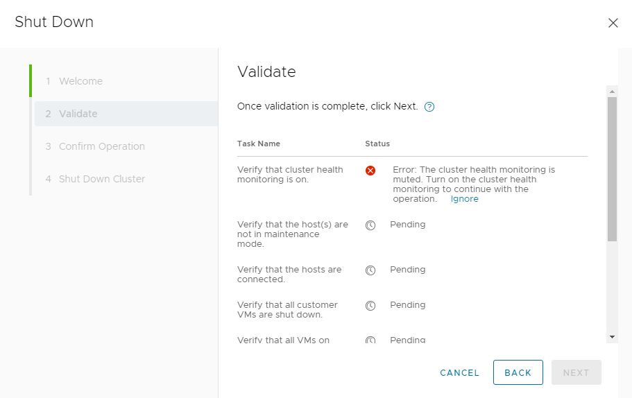
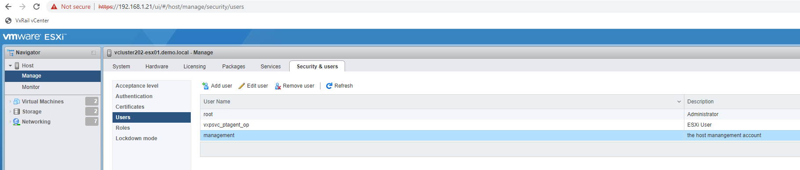

# Change User on VxRail Plugin

## Background

The VxRail Manager VM must have the user credentials for both vCenter and the various ESXi nodes stored in its credential database, a container called lockbox, in order to work properly. These service accounts exist on vCenter and the local ESXi nodes so that VxRail manager can communicate with their APIs. The management account for vCenter is set during setup and for the ESXi nodes defaults to `management_account_esxi_<serial_number>`.

## Problem

If the credentials vCenter uses for its VxRail Manager account do not match the account on the VxRail manager itself or the account the ESXi instances have do not match what is on VxRail manager all API calls from the VxRail plugin in vCenter will fail. You will see the following in the VxRail manager `/var/log/mystic/web.log`

        2022-08-31T16:58:37.056+0000 ERROR [myScheduler-5] com.emc.mystic.manager.commons.vmware.service.VMwareServiceImpl VMwareServiceImpl.getVimOperator:60 - Invalid login to VMware
        com.vmware.vim25.InvalidLoginFaultMsg: Cannot complete login due to an incorrect user name or password.
                at jdk.internal.reflect.NativeConstructorAccessorImpl.newInstance0(Native Method) ~[?:?]
                at jdk.internal.reflect.NativeConstructorAccessorImpl.newInstance(NativeConstructorAccessorImpl.java:62) ~[?:?]
                at jdk.internal.reflect.DelegatingConstructorAccessorImpl.newInstance(DelegatingConstructorAccessorImpl.java:45) ~[?:?]
                at java.lang.reflect.Constructor.newInstance(Constructor.java:490) ~[?:?]
                at com.sun.xml.ws.fault.SOAPFaultBuilder.createException(SOAPFaultBuilder.java:117) ~[jaxws-rt-2.3.3-b01.jar:2.3.3-b01]
                at com.sun.xml.ws.client.sei.StubHandler.readResponse(StubHandler.java:223) ~[jaxws-rt-2.3.3-b01.jar:2.3.3-b01]
                at com.sun.xml.ws.db.DatabindingImpl.deserializeResponse(DatabindingImpl.java:176) ~[jaxws-rt-2.3.3-b01.jar:2.3.3-b01]
                at com.sun.xml.ws.db.DatabindingImpl.deserializeResponse(DatabindingImpl.java:263) ~[jaxws-rt-2.3.3-b01.jar:2.3.3-b01]
                at com.sun.xml.ws.client.sei.SyncMethodHandler.invoke(SyncMethodHandler.java:89) ~[jaxws-rt-2.3.3-b01.jar:2.3.3-b01]
                at com.sun.xml.ws.client.sei.SyncMethodHandler.invoke(SyncMethodHandler.java:62) ~[jaxws-rt-2.3.3-b01.jar:2.3.3-b01]
                at com.sun.xml.ws.client.sei.SEIStub.invoke(SEIStub.java:131) ~[jaxws-rt-2.3.3-b01.jar:2.3.3-b01]
                at com.sun.proxy.$Proxy580.login(Unknown Source) ~[?:?]
                at com.emc.mystic.manager.commons.vmware.ServiceConnection.connect(ServiceConnection.java:140) ~[mystic.manager.commons.vmware-7.0.320.jar:?]
                at com.emc.mystic.manager.commons.vmware.ServiceUtil.clientConnect(ServiceUtil.java:82) ~[mystic.manager.commons.vmware-7.0.320.jar:?]
                at com.emc.mystic.manager.commons.vmware.VimServiceFactory.getServiceUtil(VimServiceFactory.java:51) ~[mystic.manager.commons.vmware-7.0.320.jar:?]
                at com.emc.mystic.manager.commons.vmware.VMwareClient.<init>(VMwareClient.java:108) ~[mystic.manager.commons.vmware-7.0.320.jar:?]
                at com.emc.mystic.manager.commons.vmware.service.VMwareServiceImpl.init(VMwareServiceImpl.java:174) ~[mystic.manager.commons.vmware-7.0.320.jar:?]
                at com.emc.mystic.manager.commons.vmware.service.VMwareServiceImpl.getNormalOperator(VMwareServiceImpl.java:79) ~[mystic.manager.commons.vmware-7.0.320.jar:?]
                at com.emc.mystic.manager.commons.vmware.service.VMwareServiceImpl.getVimOperator(VMwareServiceImpl.java:56) [mystic.manager.commons.vmware-7.0.320.jar:?]
                at com.emc.mystic.manager.commons.vmware.service.VMwareServiceImpl.getOperator(VMwareServiceImpl.java:46) [mystic.manager.commons.vmware-7.0.320.jar:?]
                at jdk.internal.reflect.NativeMethodAccessorImpl.invoke0(Native Method) ~[?:?]
                at jdk.internal.reflect.NativeMethodAccessorImpl.invoke(NativeMethodAccessorImpl.java:62) ~[?:?]
                at jdk.internal.reflect.DelegatingMethodAccessorImpl.invoke(DelegatingMethodAccessorImpl.java:43) ~[?:?]
                at java.lang.reflect.Method.invoke(Method.java:566) ~[?:?]
                at org.springframework.aop.support.AopUtils.invokeJoinpointUsingReflection(AopUtils.java:344) [spring-aop-5.2.4.RELEASE.jar:5.2.4.RELEASE]
                at org.springframework.aop.framework.ReflectiveMethodInvocation.invokeJoinpoint(ReflectiveMethodInvocation.java:198) [spring-aop-5.2.4.RELEASE.jar:5.2.4.RELEASE]
                at org.springframework.aop.framework.ReflectiveMethodInvocation.proceed(ReflectiveMethodInvocation.java:163) [spring-aop-5.2.4.RELEASE.jar:5.2.4.RELEASE]
                at org.springframework.aop.aspectj.MethodInvocationProceedingJoinPoint.proceed(MethodInvocationProceedingJoinPoint.java:88) [spring-aop-5.2.4.RELEASE.jar:5.2.4.RELEASE]
                at com.emc.mystic.manager.commons.emc.aspect.VMwareConnectAspect.checkVCPasswordAround(VMwareConnectAspect.java:68) [mystic.manager.commons.emc-7.0.320.jar:?]
                at jdk.internal.reflect.NativeMethodAccessorImpl.invoke0(Native Method) ~[?:?]
                at jdk.internal.reflect.NativeMethodAccessorImpl.invoke(NativeMethodAccessorImpl.java:62) ~[?:?]
                at jdk.internal.reflect.DelegatingMethodAccessorImpl.invoke(DelegatingMethodAccessorImpl.java:43) ~[?:?]
                at java.lang.reflect.Method.invoke(Method.java:566) ~[?:?]
                at org.springframework.aop.aspectj.AbstractAspectJAdvice.invokeAdviceMethodWithGivenArgs(AbstractAspectJAdvice.java:644) [spring-aop-5.2.4.RELEASE.jar:5.2.4.RELEASE]
                at org.springframework.aop.aspectj.AbstractAspectJAdvice.invokeAdviceMethod(AbstractAspectJAdvice.java:633) [spring-aop-5.2.4.RELEASE.jar:5.2.4.RELEASE]
                at org.springframework.aop.aspectj.AspectJAroundAdvice.invoke(AspectJAroundAdvice.java:70) [spring-aop-5.2.4.RELEASE.jar:5.2.4.RELEASE]
                at org.springframework.aop.framework.ReflectiveMethodInvocation.proceed(ReflectiveMethodInvocation.java:186) [spring-aop-5.2.4.RELEASE.jar:5.2.4.RELEASE]
                at org.springframework.aop.interceptor.ExposeInvocationInterceptor.invoke(ExposeInvocationInterceptor.java:95) [spring-aop-5.2.4.RELEASE.jar:5.2.4.RELEASE]
                at org.springframework.aop.framework.ReflectiveMethodInvocation.proceed(ReflectiveMethodInvocation.java:186) [spring-aop-5.2.4.RELEASE.jar:5.2.4.RELEASE]
                at org.springframework.aop.framework.JdkDynamicAopProxy.invoke(JdkDynamicAopProxy.java:212) [spring-aop-5.2.4.RELEASE.jar:5.2.4.RELEASE]
                at com.sun.proxy.$Proxy112.getOperator(Unknown Source) [?:?]
                at com.emc.mystic.manager.web.service.AuthorizationServiceImpl.keepVcConnectionAlive(AuthorizationServiceImpl.java:226) [classes/:?]
                at jdk.internal.reflect.NativeMethodAccessorImpl.invoke0(Native Method) ~[?:?]
                at jdk.internal.reflect.NativeMethodAccessorImpl.invoke(NativeMethodAccessorImpl.java:62) ~[?:?]
                at jdk.internal.reflect.DelegatingMethodAccessorImpl.invoke(DelegatingMethodAccessorImpl.java:43) ~[?:?]
                at java.lang.reflect.Method.invoke(Method.java:566) ~[?:?]
                at org.springframework.scheduling.support.ScheduledMethodRunnable.run(ScheduledMethodRunnable.java:84) [spring-context-5.2.4.RELEASE.jar:5.2.4.RELEASE]
                at org.springframework.scheduling.support.DelegatingErrorHandlingRunnable.run(DelegatingErrorHandlingRunnable.java:54) [spring-context-5.2.4.RELEASE.jar:5.2.4.RELEASE]
                at java.util.concurrent.Executors$RunnableAdapter.c

You will also see irratic behavior in the VxRail Manager plugin - most notably a number of Internal 500 errors. For example, this is what it looks like when trying to shut down a system with mismatched user accounts.

## Technical Details

### Lockbox

VxRail manager uses a container called lockbox to store its credentials. You can see this container on the VxRail Manager with the following:

        vcluster202-vxm:~ # docker ps -a | grep -i lockbox | grep -v Exited
        36d4e40e348b   microservice/lockbox:1.8.10                 "/bin/bash entrypoin…"   29 minutes ago   Up 29 minutes (healthy)       5000/tcp                                func_lockbox.1.pyeqo9oy4tvurnj1lackegz3y

When VxRail Manager wants to retrieve credentials it uses the Python program `lockbox_app/model/lockbox.py` in lockbox and calls the following functions:

        def get_credentials(self, credential_names, show_password):
            return self.get_credentials_operation(credential_names, show_password)

        def get_credentials_operation(self, credential_names, show_password):
            res = self.check_lockbox_c_instance()
            if not res:
                raise Exception('No lockbox_c_instance in the memory')
            credential_name_arr = credential_names.split(',')
            credentials = list()
            for name in credential_name_arr:
                one_result = dict()
                one_result['credential_name'] = name
                item_value = LockboxCInterface.retrieve_item(self._lockbox_c_instance, name)
                if not item_value:
                    msg = 'Error occurs when getting credential for {}'.format(name)
                    logger.error(msg)
                    raise Exception(msg)
                # To be compatible with python2 and python3
                if isinstance(item_value, bytes):
                    item_value = item_value.decode()
                if item_value == NON_EXIST:
                    logger.info("credential for {} doesn't exist in the lockbox.".format(name))
                    is_found = False
                else:
                    is_found = True
                    value_json = json.loads(item_value)
                    if not show_password:
                        value_json.pop('password', None)
                    one_result.update(value_json)
                one_result['is_found'] = is_found
                credentials.append(one_result)
            return credentials

### Nginx

To get to the lockbox app, the request must traverse Nginx. All API requests going to the VxRail manager first go through Nginx which acts as a load balancer. You can see these requests by following the Nginx container log. For example, here are the log entries associated with the shutdown shown above coming from the vCenter to VxRail:

        192.168.1.20 - - 2022-08-31T17:20:40+00:00 "HEAD /rest/vxm/v1/plugin HTTP/1.1" 200 0 "https://vcluster202-vcsa.demo.local/ui/vxrail/cluster/shutdown?locale=en_US" "Mozilla/5.0 (Windows NT 10.0; Win64; x64) AppleWebKit/537.36 (KHTML, like Gecko) Chrome/104.0.5112.102 Safari/537.36" "192.168.1.2"
        192.168.1.20 - - 2022-08-31T17:20:40+00:00 "GET index.html HTTP/1.1" 200 416 "https://vcluster202-vcsa.demo.local/ui/vxrail/cluster/shutdown?locale=en_US" "Mozilla/5.0 (Windows NT 10.0; Win64; x64) AppleWebKit/537.36 (KHTML, like Gecko) Chrome/104.0.5112.102 Safari/537.36" "192.168.1.2"
        192.168.1.20 - - 2022-08-31T17:20:41+00:00 "GET physical-view-app/runtime.7317203350b8216532b5.js HTTP/1.1" 200 2863 "https://vcluster202-vcsa.demo.local/ui/vxrail/remote/~192.168.1.19~443/cluster/shutdown?locale=en_US&__vxrail_epi=true&__vxrail_rdt=micro-apps" "Mozilla/5.0 (Windows NT 10.0; Win64; x64) AppleWebKit/537.36 (KHTML, like Gecko) Chrome/104.0.5112.102 Safari/537.36" "192.168.1.2"
        192.168.1.20 - - 2022-08-31T17:20:41+00:00 "GET physical-view-app/styles.357deb6e147990d87b3d.css HTTP/1.1" 200 3933 "https://vcluster202-vcsa.demo.local/ui/vxrail/remote/~192.168.1.19~443/cluster/shutdown?locale=en_US&__vxrail_epi=true&__vxrail_rdt=micro-apps" "Mozilla/5.0 (Windows NT 10.0; Win64; x64) AppleWebKit/537.36 (KHTML, like Gecko) Chrome/104.0.5112.102 Safari/537.36" "192.168.1.2"
        192.168.1.20 - - 2022-08-31T17:20:41+00:00 "GET physical-view-app/polyfills.8983567f117ff1baceed.js HTTP/1.1" 200 219470 "https://vcluster202-vcsa.demo.local/ui/vxrail/remote/~192.168.1.19~443/cluster/shutdown?locale=en_US&__vxrail_epi=true&__vxrail_rdt=micro-apps" "Mozilla/5.0 (Windows NT 10.0; Win64; x64) AppleWebKit/537.36 (KHTML, like Gecko) Chrome/104.0.5112.102 Safari/537.36" "192.168.1.2"
        192.168.1.20 - - 2022-08-31T17:20:41+00:00 "GET physical-view-app/main.eb370d8d3ec93e2b77cf.js HTTP/1.1" 200 862664 "https://vcluster202-vcsa.demo.local/ui/vxrail/remote/~192.168.1.19~443/cluster/shutdown?locale=en_US&__vxrail_epi=true&__vxrail_rdt=micro-apps" "Mozilla/5.0 (Windows NT 10.0; Win64; x64) AppleWebKit/537.36 (KHTML, like Gecko) Chrome/104.0.5112.102 Safari/537.36" "192.168.1.2"
        192.168.1.20 - - 2022-08-31T17:20:41+00:00 "GET physical-view-app/i18n-en-US-json.08405cc615e1a50f9a94.js HTTP/1.1" 200 29884 "https://vcluster202-vcsa.demo.local/ui/vxrail/remote/~192.168.1.19~443/cluster/shutdown?locale=en_US&__vxrail_epi=true&__vxrail_rdt=micro-apps" "Mozilla/5.0 (Windows NT 10.0; Win64; x64) AppleWebKit/537.36 (KHTML, like Gecko) Chrome/104.0.5112.102 Safari/537.36" "192.168.1.2"
        192.168.1.20 - - 2022-08-31T17:20:41+00:00 "GET physical-view-app/17.0060c2f2429a52f4d47c.js HTTP/1.1" 200 30805 "https://vcluster202-vcsa.demo.local/ui/vxrail/remote/~192.168.1.19~443/cluster/shutdown?locale=en_US&__vxrail_epi=true&__vxrail_rdt=micro-apps" "Mozilla/5.0 (Windows NT 10.0; Win64; x64) AppleWebKit/537.36 (KHTML, like Gecko) Chrome/104.0.5112.102 Safari/537.36" "192.168.1.2"
        192.168.1.20 - - 2022-08-31T17:20:41+00:00 "GET physical-view-app/theme-light.css HTTP/1.1" 200 541510 "https://vcluster202-vcsa.demo.local/ui/vxrail/remote/~192.168.1.19~443/cluster/shutdown?locale=en_US&__vxrail_epi=true&__vxrail_rdt=micro-apps" "Mozilla/5.0 (Windows NT 10.0; Win64; x64) AppleWebKit/537.36 (KHTML, like Gecko) Chrome/104.0.5112.102 Safari/537.36" "192.168.1.2"
        192.168.1.20 - - 2022-08-31T17:20:41+00:00 "GET physical-view-app/1.b79e49bbc243cdf5c8e9.js HTTP/1.1" 200 2822273 "https://vcluster202-vcsa.demo.local/ui/vxrail/remote/~192.168.1.19~443/cluster/shutdown?locale=en_US&__vxrail_epi=true&__vxrail_rdt=micro-apps" "Mozilla/5.0 (Windows NT 10.0; Win64; x64) AppleWebKit/537.36 (KHTML, like Gecko) Chrome/104.0.5112.102 Safari/537.36" "192.168.1.2"
        192.168.1.20 - - 2022-08-31T17:20:52+00:00 "POST /rest/vxm/v1/cluster/shutdown HTTP/1.1" 202 95 "https://vcluster202-vcsa.demo.local/ui/vxrail/remote/~192.168.1.19~443/cluster/shutdown?locale=en_US&__vxrail_epi=true&__vxrail_rdt=micro-apps" "Mozilla/5.0 (Windows NT 10.0; Win64; x64) AppleWebKit/537.36 (KHTML, like Gecko) Chrome/104.0.5112.102 Safari/537.36" "192.168.1.2"
        192.168.1.20 - - 2022-08-31T17:20:59+00:00 "GET /rest/vxm/v1/requests/1cb807b9-749e-4a77-942f-67370c76a230 HTTP/1.1" 200 511 "https://vcluster202-vcsa.demo.local/ui/vxrail/remote/~192.168.1.19~443/cluster/shutdown?locale=en_US&__vxrail_epi=true&__vxrail_rdt=micro-apps" "Mozilla/5.0 (Windows NT 10.0; Win64; x64) AppleWebKit/537.36 (KHTML, like Gecko) Chrome/104.0.5112.102 Safari/537.36" "192.168.1.2"
        192.168.1.20 - - 2022-08-31T17:21:22+00:00 "GET /rest/vxm/v1/requests/1cb807b9-749e-4a77-942f-67370c76a230 HTTP/1.1" 200 535 "https://vcluster202-vcsa.demo.local/ui/vxrail/remote/~192.168.1.19~443/cluster/shutdown?locale=en_US&__vxrail_epi=true&__vxrail_rdt=micro-apps" "Mozilla/5.0 (Windows NT 10.0; Win64; x64) AppleWebKit/537.36 (KHTML, like Gecko) Chrome/104.0.5112.102 Safari/537.36" "192.168.1.2"
        192.168.1.20 - - 2022-08-31T17:21:27+00:00 "GET /rest/vxm/v1/requests/1cb807b9-749e-4a77-942f-67370c76a230 HTTP/1.1" 200 538 "https://vcluster202-vcsa.demo.local/ui/vxrail/remote/~192.168.1.19~443/cluster/shutdown?locale=en_US&__vxrail_epi=true&__vxrail_rdt=micro-apps" "Mozilla/5.0 (Windows NT 10.0; Win64; x64) AppleWebKit/537.36 (KHTML, like Gecko) Chrome/104.0.5112.102 Safari/537.36" "192.168.1.2"
        192.168.1.20 - - 2022-08-31T17:21:37+00:00 "POST /rest/vxm/v1/cluster/shutdown HTTP/1.1" 202 90 "https://vcluster202-vcsa.demo.local/ui/vxrail/remote/~192.168.1.19~443/cluster/shutdown?locale=en_US&__vxrail_epi=true&__vxrail_rdt=micro-apps" "Mozilla/5.0 (Windows NT 10.0; Win64; x64) AppleWebKit/537.36 (KHTML, like Gecko) Chrome/104.0.5112.102 Safari/537.36" "192.168.1.2"
        192.168.1.20 - - 2022-08-31T17:21:41+00:00 "POST /rest/vxm/v1/cluster/shutdown HTTP/1.1" 202 94 "https://vcluster202-vcsa.demo.local/ui/vxrail/remote/~192.168.1.19~443/cluster/shutdown?locale=en_US&__vxrail_epi=true&__vxrail_rdt=micro-apps" "Mozilla/5.0 (Windows NT 10.0; Win64; x64) AppleWebKit/537.36 (KHTML, like Gecko) Chrome/104.0.5112.102 Safari/537.36" "192.168.1.2"
        192.168.1.20 - - 2022-08-31T17:21:47+00:00 "GET /rest/vxm/v1/requests/a1ee234c-bb54-408e-bbf3-8d5b038bf138 HTTP/1.1" 200 512 "https://vcluster202-vcsa.demo.local/ui/vxrail/remote/~192.168.1.19~443/cluster/shutdown?locale=en_US&__vxrail_epi=true&__vxrail_rdt=micro-apps" "Mozilla/5.0 (Windows NT 10.0; Win64; x64) AppleWebKit/537.36 (KHTML, like Gecko) Chrome/104.0.5112.102 Safari/537.36" "192.168.1.2"
        192.168.1.20 - - 2022-08-31T17:21:51+00:00 "GET /rest/vxm/v1/requests/1cb807b9-749e-4a77-942f-67370c76a230 HTTP/1.1" 200 535 "https://vcluster202-vcsa.demo.local/ui/vxrail/remote/~192.168.1.19~443/cluster/shutdown?locale=en_US&__vxrail_epi=true&__vxrail_rdt=micro-apps" "Mozilla/5.0 (Windows NT 10.0; Win64; x64) AppleWebKit/537.36 (KHTML, like Gecko) Chrome/104.0.5112.102 Safari/537.36" "192.168.1.2"
        192.168.1.20 - - 2022-08-31T17:22:00+00:00 "GET /rest/vxm/v1/requests/1cb807b9-749e-4a77-942f-67370c76a230 HTTP/1.1" 200 538 "https://vcluster202-vcsa.demo.local/ui/vxrail/remote/~192.168.1.19~443/cluster/shutdown?locale=en_US&__vxrail_epi=true&__vxrail_rdt=micro-apps" "Mozilla/5.0 (Windows NT 10.0; Win64; x64) AppleWebKit/537.36 (KHTML, like Gecko) Chrome/104.0.5112.102 Safari/537.36" "192.168.1.2"
        192.168.1.20 - - 2022-08-31T17:22:09+00:00 "GET /rest/vxm/v1/requests/1cb807b9-749e-4a77-942f-67370c76a230 HTTP/1.1" 200 516 "https://vcluster202-vcsa.demo.local/ui/vxrail/remote/~192.168.1.19~443/cluster/shutdown?locale=en_US&__vxrail_epi=true&__vxrail_rdt=micro-apps" "Mozilla/5.0 (Windows NT 10.0; Win64; x64) AppleWebKit/537.36 (KHTML, like Gecko) Chrome/104.0.5112.102 Safari/537.36" "192.168.1.2"
        192.168.1.20 - - 2022-08-31T17:22:13+00:00 "GET /rest/vxm/v1/requests/a1ee234c-bb54-408e-bbf3-8d5b038bf138 HTTP/1.1" 200 512 "https://vcluster202-vcsa.demo.local/ui/vxrail/remote/~192.168.1.19~443/cluster/shutdown?locale=en_US&__vxrail_epi=true&__vxrail_rdt=micro-apps" "Mozilla/5.0 (Windows NT 10.0; Win64; x64) AppleWebKit/537.36 (KHTML, like Gecko) Chrome/104.0.5112.102 Safari/537.36" "192.168.1.2"
        192.168.1.20 - - 2022-08-31T17:22:18+00:00 "POST /rest/vxm/v1/cluster/shutdown HTTP/1.1" 202 95 "https://vcluster202-vcsa.demo.local/ui/vxrail/remote/~192.168.1.19~443/cluster/shutdown?locale=en_US&__vxrail_epi=true&__vxrail_rdt=micro-apps" "Mozilla/5.0 (Windows NT 10.0; Win64; x64) AppleWebKit/537.36 (KHTML, like Gecko) Chrome/104.0.5112.102 Safari/537.36" "192.168.1.2"
        192.168.1.20 - - 2022-08-31T17:22:25+00:00 "GET /rest/vxm/v1/requests/c0691b5d-3ada-4000-a603-73229580e6d9 HTTP/1.1" 200 513 "https://vcluster202-vcsa.demo.local/ui/vxrail/remote/~192.168.1.19~443/cluster/shutdown?locale=en_US&__vxrail_epi=true&__vxrail_rdt=micro-apps" "Mozilla/5.0 (Windows NT 10.0; Win64; x64) AppleWebKit/537.36 (KHTML, like Gecko) Chrome/104.0.5112.102 Safari/537.36" "192.168.1.2"
        192.168.1.20 - - 2022-08-31T17:22:57+00:00 "GET /rest/vxm/v1/requests/c0691b5d-3ada-4000-a603-73229580e6d9 HTTP/1.1" 200 536 "https://vcluster202-vcsa.demo.local/ui/vxrail/remote/~192.168.1.19~443/cluster/shutdown?locale=en_US&__vxrail_epi=true&__vxrail_rdt=micro-apps" "Mozilla/5.0 (Windows NT 10.0; Win64; x64) AppleWebKit/537.36 (KHTML, like Gecko) Chrome/104.0.5112.102 Safari/537.36" "192.168.1.2"
        192.168.1.20 - - 2022-08-31T17:23:08+00:00 "GET /rest/vxm/v1/requests/a1ee234c-bb54-408e-bbf3-8d5b038bf138 HTTP/1.1" 200 534 "https://vcluster202-vcsa.demo.local/ui/vxrail/remote/~192.168.1.19~443/cluster/shutdown?locale=en_US&__vxrail_epi=true&__vxrail_rdt=micro-apps" "Mozilla/5.0 (Windows NT 10.0; Win64; x64) AppleWebKit/537.36 (KHTML, like Gecko) Chrome/104.0.5112.102 Safari/537.36" "192.168.1.2"
        192.168.1.20 - - 2022-08-31T17:23:19+00:00 "GET /rest/vxm/v1/requests/a1ee234c-bb54-408e-bbf3-8d5b038bf138 HTTP/1.1" 200 539 "https://vcluster202-vcsa.demo.local/ui/vxrail/remote/~192.168.1.19~443/cluster/shutdown?locale=en_US&__vxrail_epi=true&__vxrail_rdt=micro-apps" "Mozilla/5.0 (Windows NT 10.0; Win64; x64) AppleWebKit/537.36 (KHTML, like Gecko) Chrome/104.0.5112.102 Safari/537.36" "192.168.1.2"
        192.168.1.20 - - 2022-08-31T17:23:27+00:00 "GET /rest/vxm/v1/requests/a1ee234c-bb54-408e-bbf3-8d5b038bf138 HTTP/1.1" 200 544 "https://vcluster202-vcsa.demo.local/ui/vxrail/remote/~192.168.1.19~443/cluster/shutdown?locale=en_US&__vxrail_epi=true&__vxrail_rdt=micro-apps" "Mozilla/5.0 (Windows NT 10.0; Win64; x64) AppleWebKit/537.36 (KHTML, like Gecko) Chrome/104.0.5112.102 Safari/537.36" "192.168.1.2"
        192.168.1.20 - - 2022-08-31T17:23:30+00:00 "GET /rest/vxm/v1/requests/c0691b5d-3ada-4000-a603-73229580e6d9 HTTP/1.1" 200 541 "https://vcluster202-vcsa.demo.local/ui/vxrail/remote/~192.168.1.19~443/cluster/shutdown?locale=en_US&__vxrail_epi=true&__vxrail_rdt=micro-apps" "Mozilla/5.0 (Windows NT 10.0; Win64; x64) AppleWebKit/537.36 (KHTML, like Gecko) Chrome/104.0.5112.102 Safari/537.36" "192.168.1.2"
        192.168.1.20 - - 2022-08-31T17:23:39+00:00 "GET /rest/vxm/v1/requests/c0691b5d-3ada-4000-a603-73229580e6d9 HTTP/1.1" 200 541 "https://vcluster202-vcsa.demo.local/ui/vxrail/remote/~192.168.1.19~443/cluster/shutdown?locale=en_US&__vxrail_epi=true&__vxrail_rdt=micro-apps" "Mozilla/5.0 (Windows NT 10.0; Win64; x64) AppleWebKit/537.36 (KHTML, like Gecko) Chrome/104.0.5112.102 Safari/537.36" "192.168.1.2"
        192.168.1.20 - - 2022-08-31T17:23:50+00:00 "GET /rest/vxm/v1/requests/c0691b5d-3ada-4000-a603-73229580e6d9 HTTP/1.1" 200 541 "https://vcluster202-vcsa.demo.local/ui/vxrail/remote/~192.168.1.19~443/cluster/shutdown?locale=en_US&__vxrail_epi=true&__vxrail_rdt=micro-apps" "Mozilla/5.0 (Windows NT 10.0; Win64; x64) AppleWebKit/537.36 (KHTML, like Gecko) Chrome/104.0.5112.102 Safari/537.36" "192.168.1.2"
        192.168.1.20 - - 2022-08-31T17:23:53+00:00 "GET /rest/vxm/v1/requests/a1ee234c-bb54-408e-bbf3-8d5b038bf138 HTTP/1.1" 200 535 "https://vcluster202-vcsa.demo.local/ui/vxrail/remote/~192.168.1.19~443/cluster/shutdown?locale=en_US&__vxrail_epi=true&__vxrail_rdt=micro-apps" "Mozilla/5.0 (Windows NT 10.0; Win64; x64) AppleWebKit/537.36 (KHTML, like Gecko) Chrome/104.0.5112.102 Safari/537.36" "192.168.1.2"
        192.168.1.20 - - 2022-08-31T17:24:00+00:00 "POST /rest/vxm/v1/cluster/shutdown HTTP/1.1" 202 90 "https://vcluster202-vcsa.demo.local/ui/vxrail/remote/~192.168.1.19~443/cluster/shutdown?locale=en_US&__vxrail_epi=true&__vxrail_rdt=micro-apps" "Mozilla/5.0 (Windows NT 10.0; Win64; x64) AppleWebKit/537.36 (KHTML, like Gecko) Chrome/104.0.5112.102 Safari/537.36" "192.168.1.2"
        192.168.1.20 - - 2022-08-31T17:24:08+00:00 "GET /rest/vxm/v1/requests/c0691b5d-3ada-4000-a603-73229580e6d9 HTTP/1.1" 200 539 "https://vcluster202-vcsa.demo.local/ui/vxrail/remote/~192.168.1.19~443/cluster/shutdown?locale=en_US&__vxrail_epi=true&__vxrail_rdt=micro-apps" "Mozilla/5.0 (Windows NT 10.0; Win64; x64) AppleWebKit/537.36 (KHTML, like Gecko) Chrome/104.0.5112.102 Safari/537.36" "192.168.1.2"
        192.168.1.20 - - 2022-08-31T17:24:12+00:00 "GET /rest/vxm/v1/requests/a1ee234c-bb54-408e-bbf3-8d5b038bf138 HTTP/1.1" 200 535 "https://vcluster202-vcsa.demo.local/ui/vxrail/remote/~192.168.1.19~443/cluster/shutdown?locale=en_US&__vxrail_epi=true&__vxrail_rdt=micro-apps" "Mozilla/5.0 (Windows NT 10.0; Win64; x64) AppleWebKit/537.36 (KHTML, like Gecko) Chrome/104.0.5112.102 Safari/537.36" "192.168.1.2"
        192.168.1.20 - - 2022-08-31T17:24:22+00:00 "POST /rest/vxm/v1/cluster/shutdown HTTP/1.1" 202 95 "https://vcluster202-vcsa.demo.local/ui/vxrail/remote/~192.168.1.19~443/cluster/shutdown?locale=en_US&__vxrail_epi=true&__vxrail_rdt=micro-apps" "Mozilla/5.0 (Windows NT 10.0; Win64; x64) AppleWebKit/537.36 (KHTML, like Gecko) Chrome/104.0.5112.102 Safari/537.36" "192.168.1.2"
        192.168.1.20 - - 2022-08-31T17:24:29+00:00 "GET /rest/vxm/v1/requests/3c17bfe3-19ae-494f-b2e5-62f4ff2b347c HTTP/1.1" 200 516 "https://vcluster202-vcsa.demo.local/ui/vxrail/remote/~192.168.1.19~443/cluster/shutdown?locale=en_US&__vxrail_epi=true&__vxrail_rdt=micro-apps" "Mozilla/5.0 (Windows NT 10.0; Win64; x64) AppleWebKit/537.36 (KHTML, like Gecko) Chrome/104.0.5112.102 Safari/537.36" "192.168.1.2"
        192.168.1.20 - - 2022-08-31T17:24:38+00:00 "GET /rest/vxm/v1/requests/3c17bfe3-19ae-494f-b2e5-62f4ff2b347c HTTP/1.1" 200 511 "https://vcluster202-vcsa.demo.local/ui/vxrail/remote/~192.168.1.19~443/cluster/shutdown?locale=en_US&__vxrail_epi=true&__vxrail_rdt=micro-apps" "Mozilla/5.0 (Windows NT 10.0; Win64; x64) AppleWebKit/537.36 (KHTML, like Gecko) Chrome/104.0.5112.102 Safari/537.36" "192.168.1.2"
        192.168.1.20 - - 2022-08-31T17:24:42+00:00 "GET /rest/vxm/v1/requests/3c17bfe3-19ae-494f-b2e5-62f4ff2b347c HTTP/1.1" 200 516 "https://vcluster202-vcsa.demo.local/ui/vxrail/remote/~192.168.1.19~443/cluster/shutdown?locale=en_US&__vxrail_epi=true&__vxrail_rdt=micro-apps" "Mozilla/5.0 (Windows NT 10.0; Win64; x64) AppleWebKit/537.36 (KHTML, like Gecko) Chrome/104.0.5112.102 Safari/537.36" "192.168.1.2"
        192.168.1.20 - - 2022-08-31T17:24:55+00:00 "GET /rest/vxm/v1/requests/3c17bfe3-19ae-494f-b2e5-62f4ff2b347c HTTP/1.1" 200 533 "https://vcluster202-vcsa.demo.local/ui/vxrail/remote/~192.168.1.19~443/cluster/shutdown?locale=en_US&__vxrail_epi=true&__vxrail_rdt=micro-apps" "Mozilla/5.0 (Windows NT 10.0; Win64; x64) AppleWebKit/537.36 (KHTML, like Gecko) Chrome/104.0.5112.102 Safari/537.36" "192.168.1.2"
        192.168.1.20 - - 2022-08-31T17:25:07+00:00 "GET /rest/vxm/v1/requests/3c17bfe3-19ae-494f-b2e5-62f4ff2b347c HTTP/1.1" 200 541 "https://vcluster202-vcsa.demo.local/ui/vxrail/remote/~192.168.1.19~443/cluster/shutdown?locale=en_US&__vxrail_epi=true&__vxrail_rdt=micro-apps" "Mozilla/5.0 (Windows NT 10.0; Win64; x64) AppleWebKit/537.36 (KHTML, like Gecko) Chrome/104.0.5112.102 Safari/537.36" "192.168.1.2"
        192.168.1.20 - - 2022-08-31T17:25:09+00:00 "GET /rest/vxm/v1/requests/c0691b5d-3ada-4000-a603-73229580e6d9 HTTP/1.1" 200 517 "https://vcluster202-vcsa.demo.local/ui/vxrail/remote/~192.168.1.19~443/cluster/shutdown?locale=en_US&__vxrail_epi=true&__vxrail_rdt=micro-apps" "Mozilla/5.0 (Windows NT 10.0; Win64; x64) AppleWebKit/537.36 (KHTML, like Gecko) Chrome/104.0.5112.102 Safari/537.36" "192.168.1.2"
        192.168.1.20 - - 2022-08-31T17:25:12+00:00 "GET /rest/vxm/v1/requests/a1ee234c-bb54-408e-bbf3-8d5b038bf138 HTTP/1.1" 200 516 "https://vcluster202-vcsa.demo.local/ui/vxrail/remote/~192.168.1.19~443/cluster/shutdown?locale=en_US&__vxrail_epi=true&__vxrail_rdt=micro-apps" "Mozilla/5.0 (Windows NT 10.0; Win64; x64) AppleWebKit/537.36 (KHTML, like Gecko) Chrome/104.0.5112.102 Safari/537.36" "192.168.1.2"
        192.168.1.20 - - 2022-08-31T17:25:23+00:00 "GET /rest/vxm/v1/requests/3c17bfe3-19ae-494f-b2e5-62f4ff2b347c HTTP/1.1" 200 540 "https://vcluster202-vcsa.demo.local/ui/vxrail/remote/~192.168.1.19~443/cluster/shutdown?locale=en_US&__vxrail_epi=true&__vxrail_rdt=micro-apps" "Mozilla/5.0 (Windows NT 10.0; Win64; x64) AppleWebKit/537.36 (KHTML, like Gecko) Chrome/104.0.5112.102 Safari/537.36" "192.168.1.2"
        192.168.1.20 - - 2022-08-31T17:25:32+00:00 "GET /rest/vxm/v1/requests/3c17bfe3-19ae-494f-b2e5-62f4ff2b347c HTTP/1.1" 200 532 "https://vcluster202-vcsa.demo.local/ui/vxrail/remote/~192.168.1.19~443/cluster/shutdown?locale=en_US&__vxrail_epi=true&__vxrail_rdt=micro-apps" "Mozilla/5.0 (Windows NT 10.0; Win64; x64) AppleWebKit/537.36 (KHTML, like Gecko) Chrome/104.0.5112.102 Safari/537.36" "192.168.1.2"
        192.168.1.20 - - 2022-08-31T17:25:55+00:00 "GET /rest/vxm/v1/requests/3c17bfe3-19ae-494f-b2e5-62f4ff2b347c HTTP/1.1" 200 511 "https://vcluster202-vcsa.demo.local/ui/vxrail/remote/~192.168.1.19~443/cluster/shutdown?locale=en_US&__vxrail_epi=true&__vxrail_rdt=micro-apps" "Mozilla/5.0 (Windows NT 10.0; Win64; x64) AppleWebKit/537.36 (KHTML, like Gecko) Chrome/104.0.5112.102 Safari/537.36" "192.168.1.2"

## Resolution

You must make sure that the accounts match.

### vCenter Account for VxRail Manager

#### Checking What Credentials are in Use

The below will pull the credentials from the VxRail Manager keystore. You run this command on the command line in VxRail Manager.

`curl --unix-socket /var/lib/vxrail/nginx/socket/nginx.sock -X GET 'http://localhost/rest/vxm/internal/lockbox/v1/credentials?lockbox_name=SYSTEM&credential_names=management_account_vc'|jq`

        vcluster202-vxm:~ # curl --unix-socket /var/lib/vxrail/nginx/socket/nginx.sock -X GET 'http://localhost/rest/vxm/internal/lockbox/v1/credentials?lockbox_name=SYSTEM&credential_names=management_account_vc'|jq
        % Total    % Received % Xferd  Average Speed   Time    Time     Time  Current
                                        Dload  Upload   Total   Spent    Left  Speed
        100   162  100   162    0     0   8526      0 --:--:-- --:--:-- --:--:--  8526
        {
        "items": [
            {
            "connection_type": "INVALID", // Note: This is here because I deliberately broke the system.
            "credential_name": "management_account_vc",
            "is_found": true,
            "password": "UEBzc3cwcmQxMjM0",
            "username": "management@localos"
            }
        ]
        }

Notice in the above that the password is base 64 encoded. You have to decode it with the following:

        vcluster202-vxm:~ # echo -n "UEBzc3cwcmQxMjM0" | base64 -d
        P@ssw0rd1234

In the above JSON output, `credential_name` refers to the name of the credential *inside of the VxRail Manager lockbox program*. The field `username` refers to the local account on vCenter. You will be able to see this account on vCenter by running `cat /etc/passwd` which shows all local users on the system. **Note**: Only accounts in the localos domain will show in `/etc/passwd`. 

#### Changing the Credentials

To change the credentials in the VxRail Manager lockbox program use the following code on the VxRail Manager

        curl -X PUT --unix-socket /var/lib/vxrail/nginx/socket/nginx.sock -H "accept: application/json" -H "Content-Type: application/json" -d '{"lockbox_name":"SYSTEM","credentials":[{"credential_name":"management_account_vc","username":"VC_management_account_user_name","password":"encoded_password"}]}' 'http://localhost/rest/vxm/internal/lockbox/v1/credentials'

In the above where it says `VC_management_account_user_name` you will replace that with whatever is in `username` in your JSON output. In my case that is `management@localos` and you must replace `encoded_password` with YOUR base64 encoded password. In my case, I changed the password on vCenter to *This.is.a.great.password1* which is why the system isn't currently working. So we have to base64 encode that and update in lockbox.

        vcluster202-vxm:~ # echo -n "This.is.a.great.password1" | base64
        VGhpcy5pcy5hLmdyZWF0LnBhc3N3b3JkMQ==

Next we have to update it with:

        curl -X PUT --unix-socket /var/lib/vxrail/nginx/socket/nginx.sock -H "accept: application/json" -H "Content-Type: application/json" -d '{"lockbox_name":"SYSTEM","credentials":[{"credential_name":"management_account_vc","username":"management@localos","password":"VGhpcy5pcy5hLmdyZWF0LnBhc3N3b3JkMQ=="}]}' 'http://localhost/rest/vxm/internal/lockbox/v1/credentials'

Now we need to restart the lockbox service. You can do this by rebooting the VxRail Manager or you can simply restart the lockbox container with `docker service scale func_lockbox=0 && docker service scale func_lockbox=1`. 

#### Setting the Credentials on vCenter

On the vCenter side, use `passwd <vCenter account name>` to reset the password on vCenter. After you change it, restart vCenter to force the change.

### ESXi Credentials

The same problem exists with the VxRail Manager and the individual ESXi hosts. Repeat the same process as above for the management account for each ESXi host. For example:

        curl --unix-socket /var/lib/vxrail/nginx/socket/nginx.sock -X GET 'http://localhost/rest/vxm/internal/lockbox/v1/credentials?lockbox_name=SYSTEM&credential_names=management_account_esxi__<host-SN>'| jq

where `host-SN` is the service tag for the server. This will return an output like:

        {
            "items": [
                {
                    "credential_name": "management_account_esxi__V015001",
                    "is_found": true,
                    "password": "BASE64_ENCODED_PASSWORD",
                    "username": "management"
                }   
            ]
        }

As before you will have to update the password with:

        curl -X PUT --unix-socket /var/lib/vxrail/nginx/socket/nginx.sock -H "accept: application/json" -H "Content-Type: application/json" -d '{"lockbox_name":"SYSTEM","credentials":[{"credential_name":"management_account_esxi__<host-SN>","username":"ESXi_management_account_user_name","password":"encoded_password"}]}'  'http://localhost/rest/vxm/internal/lockbox/v1/credentials'

where `<host-sn>` is your service tag, `ESXi_management_account_user_name` is the name of your ESXi management account from above, and `encoded password` is your password base64 encoded with `echo -n "PASSWORD" | base64`.

Ensure that the password on ESXi matches by browsing to Manage->Security & Users->Users on the ESXi management interface:

Click *Edit User* and then change the password to match whatever you used above.

