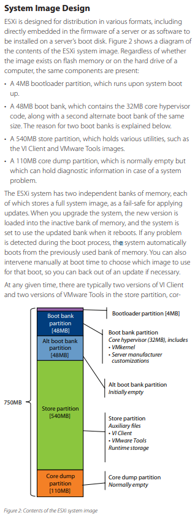

# VMWare Architecture Notes

## My Image Profile

[A copy of my image profile](my_image_profile.xml)

## Example VIB Definition

[Example VIB definition](example_vib_definition.xml)

## What is the altbookbank Partition

https://serverfault.com/questions/278895/how-is-the-altbootbank-partition-used-in-esxi

## VMWare Architecture Document

https://www.vmware.com/content/dam/digitalmarketing/vmware/en/pdf/techpaper/ESXi_architecture.pdf

## What is dcism 

Appears to be the iDRAC service module

## ESXi Log File Locations

https://docs.vmware.com/en/VMware-vSphere/7.0/com.vmware.vsphere.security.doc/GUID-832A2618-6B11-4A28-9672-93296DA931D0.html

I suspect anything related to updates should be found in the hostd.log file on the ESXi server itself.
