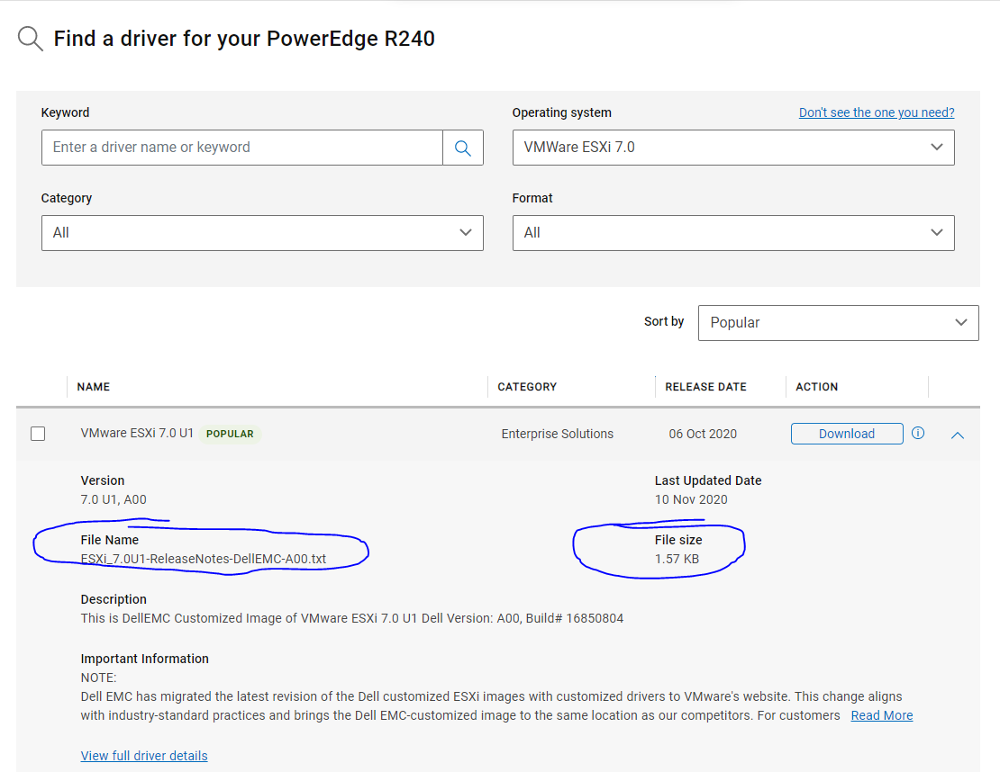
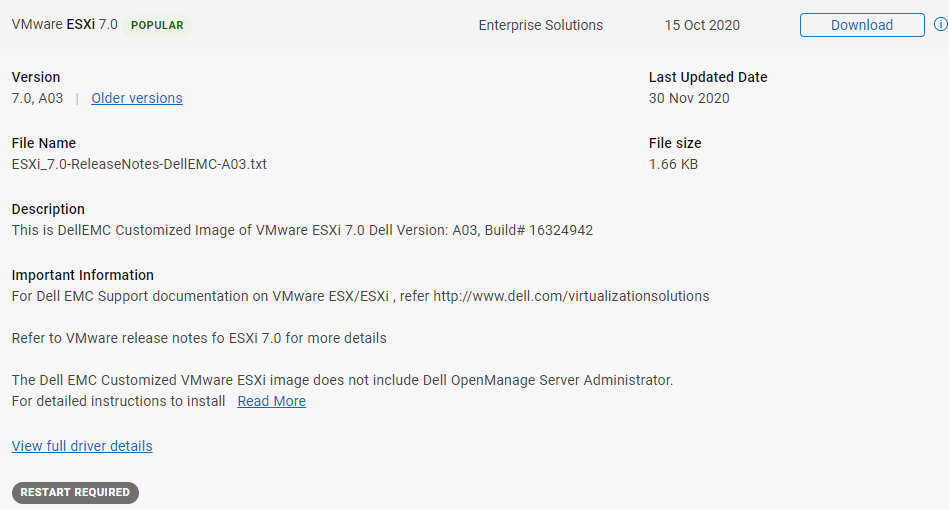
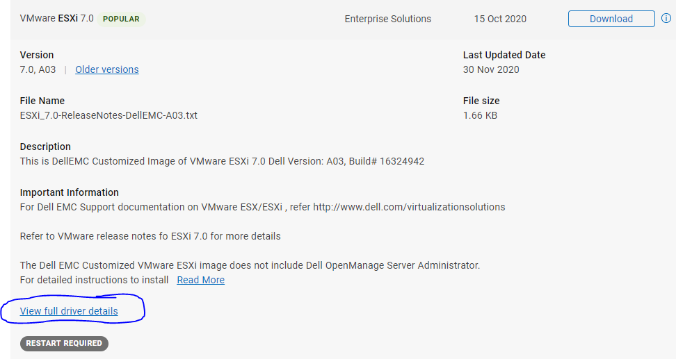
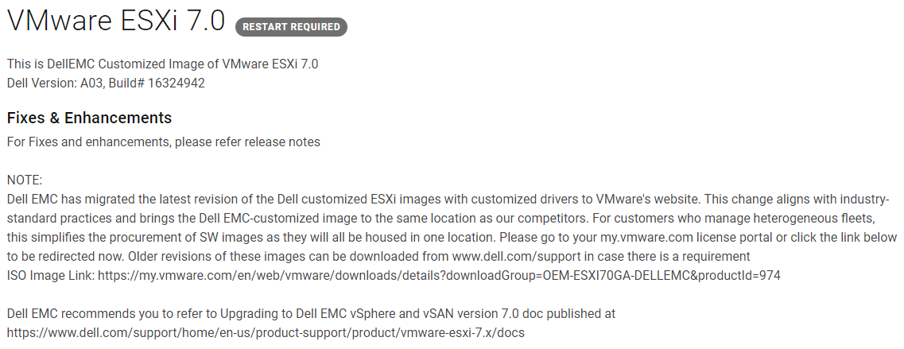
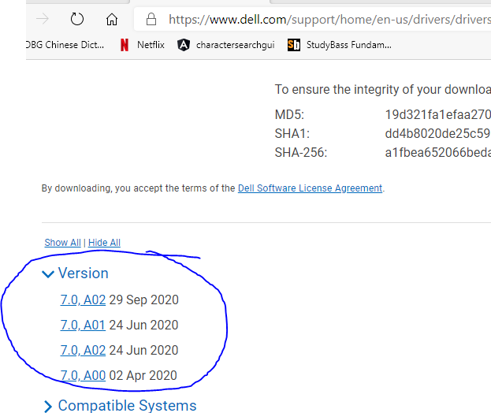
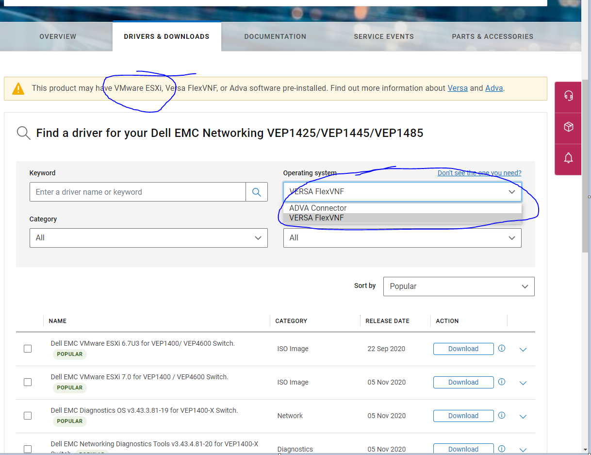

# ESXi Downloads Missing

## ESXi 7 General Problems

I tested this on the R240.

Clicking the link for ESXi 7 on the R240 incorrectly takes you to a release notes download instead of the ISO. You have to click "View full driver details" to find it:

This then takes you to this page:

The link does work, but what's more confusing is some customers are scrolling to the bottom of the page and finding this:

Some of those links have downloads for ESXi and some of them do not in addition to having confusing versioning in the link names.

## VEP Specific Problems

The VEP runs ESXi, but our site is missing it from the operating system dropdown.

It also has the same problem as the above where it incorrectly takes you to release notes.

## Resolution

Dell support didn't know how to resolve the issue and it took some time before someone discovered that you have to hit "View full driver details" and then read through the text to find a non-highlighted URL directing you to VMWare.

This was further complicated by the presence of links with incorrect versioning present on the Dell website.

Suggest we prominantly display the new link in the release notes redirecting customers and eliminate improperly versioned downloads from the Dell site if the goal is to consolidate on VMWare's site.