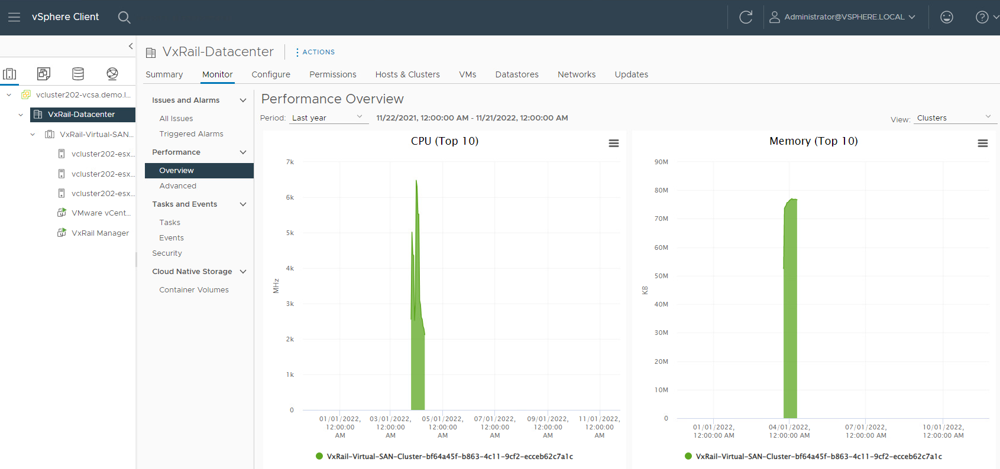
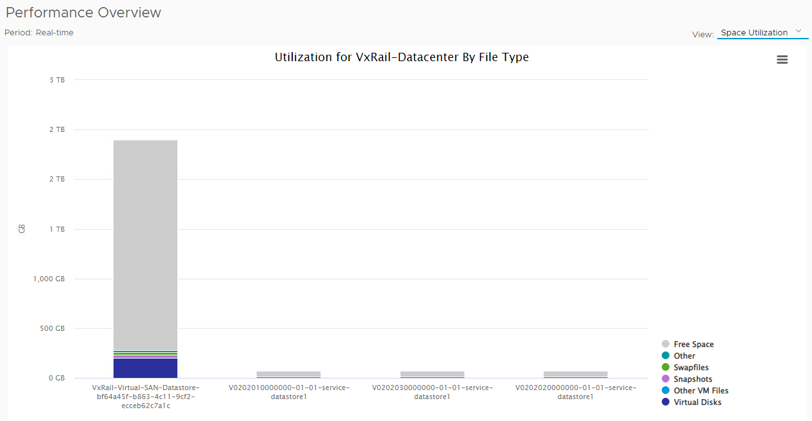
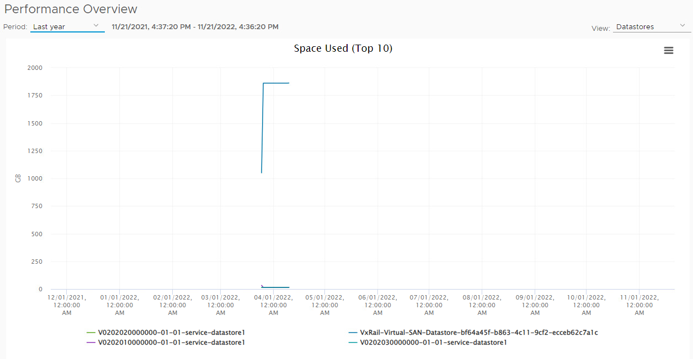
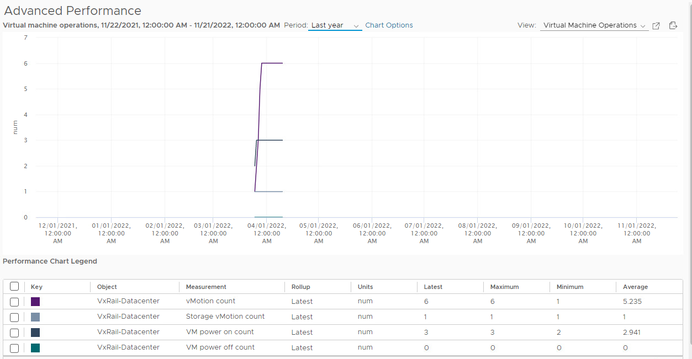

# How to Pull Usage Metrics

- Log into vCenter
- Select your datacenter -> Click the monitor tab -> Under Performance, click Overview

- Change period to "Last year", create a screenshot
- On "View" take screenshots of Space Utilization and Datastores (make sure to select last year)

- Under Performance on the left, go to Advanced, change the Period to Last year, and take a screenshot.

