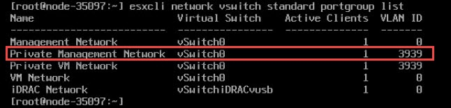
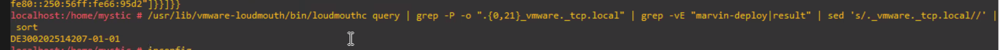
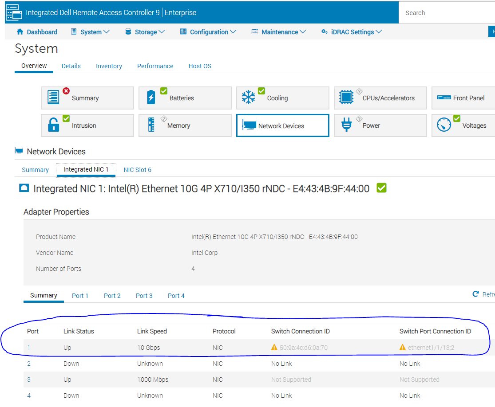

# VxRail Setup

- [VxRail Setup](#vxrail-setup)
  - [License Keys](#license-keys)
  - [Networking](#networking)
    - [What does MLD Querying Do and Why Can it Break VxRail Discovery](#what-does-mld-querying-do-and-why-can-it-break-vxrail-discovery)
  - [RASR Process](#rasr-process)
  - [Deploy Witness](#deploy-witness)
    - [After deploying the Witness:](#after-deploying-the-witness)
  - [Set Up vCenter](#set-up-vcenter)
  - [Set up the Manager for Discovery](#set-up-the-manager-for-discovery)
  - [Install](#install)
  - [Advanced Troubleshooting](#advanced-troubleshooting)
    - [Check for ESXi Logs](#check-for-esxi-logs)
    - [Marvin Logs](#marvin-logs)
    - [Digging Through VxRail's Guts](#digging-through-vxrails-guts)
  - [Helpful Commands](#helpful-commands)
    - [Check if VxRail is Running](#check-if-vxrail-is-running)
    - [Get a List of VMs](#get-a-list-of-vms)
    - [Check if VM is On](#check-if-vm-is-on)
    - [Check Networking](#check-networking)
    - [Set the VLAN for a Switch](#set-the-vlan-for-a-switch)
    - [Get Interface IPs](#get-interface-ips)
    - [Get Interface List](#get-interface-list)

## License Keys

In case you have to upgrade or downgrade license keys see [this KB article](https://kb.vmware.com/s/article/81665)

## Networking

I followed [the VxRail Network Planning Guide](https://www.delltechnologies.com/it-it/collaterals/unauth/technical-guides-support-information/products/converged-infrastructure/h15300-vxrail-network-guide.pdf) to set up the network.

**WARNING**: The discovery process for VxRail uses IPv6 multicast to discover itself. Dell switches come with MLD snooping globally enabled, but **do not** have the MLD querier enabled! This will cause the nodes to flap! Servers will discover themselves and then disappear. You must enable MLD snooping **and** the mld querier on the correct vlans with `interface vlan #` and then `ipv6 mld snooping querier`.

### What does MLD Querying Do and Why Can it Break VxRail Discovery

By default, switches are not multicast aware so they will broadcast any multicast traffic on all ports assigned to a VLAN.

For bandwidth optimization the switch will block any multicast messages to a segment it thinks does not have a device which wants those multicast messages. It discovers if there is an interested host by using MLD general queries or group specific queries. Enabling the querier will allow the switch to use these messages to discover interested hosts and subsequently ensure those hosts receive the appropriate IPv6 messages.

## RASR Process

There is an IDSDM module on the box with the factor image on the box. To perform the RASR process you'll boot from that and it will copy over all necessary files to the internal BOSS drive. Just follow the prompts.

**WARNING** RASRing a node blows away absolutely everything on all drives! **DO NOT RUN ON A PRODUCTION CLUSTER**

## Deploy Witness

*Note* For the two node setup, you will need a third site with vCenter deployed in a cluster separate from VxRail.

**WARNING** If someone tells you that 1 proc, 16GB R240 is sufficient for running the Witness and vCenter in a 2 node setup... that is strictly speaking true. Do not plan on putting anything else on that box.

Download the witness appliance from [the VMWare site](https://my.vmware.com/web/vmware/downloads/details?downloadGroup=WITNESS-OVA-67&productId=742). **Make sure you pull the witness appliance for your setup!** On VxRail 4.7 which is what I'm installing the correct version of Witness is 6.7.

Follow the instructions [here](https://docs.vmware.com/en/VMware-vSphere/6.7/com.vmware.vsphere.vsan-planning.doc/GUID-05C1737A-5FBA-4AEE-BDB8-3BF5DE569E0A.html) for setup. The only thing that could be confusing depending on what you've previously read is that the second NIC for the Witness goes on its own special VLAN separate from VSAN. This VLAN will be used only for Witness traffic.

**Point of Curiosity** The Witness host looks exactly like an instance of ESXi because it is. It's only purpose is to pretend to be a third ESXi host and avoid split brain on vSAN.

### After deploying the Witness:

1. Give vmk0 an IP on your management network and vmk1 an IP address on the vSAN network. You can use the `esxcli network ip interface ipv4 set -i vmk0 --type static -I 192.168.5.130 -N 255.255.255.0 -g 192.168.5.1` command to IP an interface
2. Go into vCenter and add the Witness
3. Make sure vmk0 of the Witness has the same MAC address of vmk0 on the host OR set the security settings of the management portgroup you are using to promiscuous


## Set Up vCenter

1. Make sure your DNS server can resolve all the VxRail ESXi IPs first before continuing.
2. On vCenter double check that DNS and NTP are setup correctly. You can do this from the network menu by going to Home->Administration->System Configuration->Click on vCenter->Login. This should bring up the appliance management screen. Check Time and Networking.
3. vCenter has to be able to resolve all ESXi names itself. **This is not checked by VxRail's validator**! To double check name resolution, go to vCenter's console, hit alt+F1, use nslookup to check all the ESXi node names.

## Set up the Manager for Discovery

- [David Ring's Install Notes](https://davidring.ie/2019/06/10/vxrail-4-7-install-notes/) are helpful
- [David Ring's notes](https://davidring.ie/2019/11/13/vxrail-4-7-ipv6-node-discovery-test/) on how host discovery works are also helpful

        Loudmouth requires IPv6 multicast in order for VxRail Manager to perform a successful VxRail node discovery. IPv6 multicast is required only on the ‘Private Management Network’, this is an isolated management network solely for auto-discovery of the VxRail nodes during install or expansion. The default VLAN ID for the private network is 3939, which is configured on each VxRail node from the factory, this VLAN needs to be configured on the TOR switches and remains isolated on the TORs. If you wish to deviate from the default of VLAN 3939 then each node will need to be modified onsite otherwise node discovery will fail.
- The VxRail Manager comes defaulted to 192.168.10.200 however, it does not accept SSH connections

1. Turn on the VxRail manager. `vxrail-primary --setup --vxrail-address 192.168.2.100  --vxrail-netmask 255.255.255.0 --vxrail-gateway 192.168.2.1`. The IP you assign is **not** used for discovery. It is for reaching the VxRail appliance. Give it an IP on whatever network/vlan you plan on using for management. Details below in step 3.
      1.Make sure vmk0 of all ESXi hosts is on VLAN 3939 or whatever VLAN you're using for discovery.
      2.On each ESXi host make sure *Private Management Network* and *Private VM Network* are both on VLAN 3939. (Picture from David Ring's guide)

    

      3.The VxRail manager has two virtual NICs - eth0 and eth1. Eth1 is the NIC used for discovery. Make sure eth1 of the VxRail manager is on VLAN 3939. The first NIC (eth0) should be on whatever VLAN you are using for management. You will get to the VxRail manager webgui through eth0.
2. At this point you should have full IPv6 connectivity between vmk0 on all ESXi instances and the VxRail appliance. You can test this with the following:
      1.Go to the ESXi console, press ALT+F1 and Pull the IPv6 address for vmk0 on ESXi with: `esxcfg-vmknic -l | grep vmk0`
      2.On the ESXi host with the VxRail appliance, give another (not vmk0) VM kernel NIC you have access to an IP address with the `esxcli network ip interface ipv4 set -i vmk0 --type static -I 192.168.5.130 -N 255.255.255.0 -g 192.168.5.1` command. For dhcp use the `--type dhcp` option. See [Helpful Commands](#helpful-commands) for how to list out the different portgroups and VMs
      3.Once you know all the IPv6 addresses for the various vmk0 nics, get on the VxRail appliance and use `ping6 -l eth1 <ipv6 address>` to test your IPv6 ping. This should work against all devices. If it doesn't you probably have a networking problem.
      4.You can also test the full server discovery process manually from the command line with:

      

      5.On the switch side you can use `show lldp discovery` to see what interfaces it has discovered and it will list the interfaces.
      6.On idrac it will show you what ports each nic is connected to under network devices. (My example is down - yours should not have a warning)

    

      7.For further troubleshooting check the Marvin log
3. Assuming you've already checked DNS, the last thing you need to do is make sure NTP is up. I'm using chrony and checked like this on my NTP server:

        [root@services ~]# chronyc tracking
        Reference ID    : D8EF230C (time4.google.com)
        Stratum         : 2
        Ref time (UTC)  : Thu Dec 17 16:21:48 2020
        System time     : 0.000059723 seconds fast of NTP time
        Last offset     : +0.000004093 seconds
        RMS offset      : 0.000036436 seconds
        Frequency       : 0.283 ppm fast
        Residual freq   : -0.000 ppm
        Skew            : 0.006 ppm
        Root delay      : 0.023636952 seconds
        Root dispersion : 0.001011974 seconds
        Update interval : 1037.1 seconds
        Leap status     : Normal


## Install

Before running I strongly recommend you make sure NTP is up and running on any customer owned ESXi instances, customer vCenters, and the idracs. Mismatched time causes problems.

All you have to do is browse to your VxRail Manager's address on follow the prompts. The only **big** gotcha I ran into is when it asks for vCenter Server Management Username what it wants is **not** administrator@vphere.whatever. It wants vCenter's root/password combo.
## Advanced Troubleshooting

### Check for ESXi Logs

In my case I hit a failure where a node wouldn't add. A lot of times VxRail will have finished the ESXi deployment and you can actually go log into the ESXi instance in question. If you have a customer owned vCenter you can also go check its logs. A lot of the time failures during deployment can be found in one of those locations.

### Marvin Logs

Another good place to look is to log into the VxRail appliance and check the Marvin logs at `/var/log/vmware/marvin/tomcat`

### Digging Through VxRail's Guts

If you have problems during install you can pull VxRail's logs from the VxRail container by doing the below:

Run `docker ps -a` and find the vxrail-system container.

```
e8da567768e4        infra/openfaas/gateway:1.1.4               "./gateway"              2 days ago          Up 2 days (healthy)     8080/tcp, 8082/tcp    func_gateway.1.h5hmx70g8545d3apbwfxtfatr
2b71bfd81e90        infra/openfaas/queue-worker:1.1.4          "./app"                  2 days ago          Up 2 days (healthy)     8080/tcp              func_queue-worker.1.897j8f0tbhas1989o0ygl5ez4
ba2f65a96664        infra/workflow_engine:1.1.6                "./docker-entrypoint…"   2 days ago          Up 2 days (healthy)     5000/tcp              func_wfservice.1.wau7b1omhg3igjzzyvd865r6e
d07929b37e2d        infra/openfaas/gateway:1.1.4               "./gateway"              2 days ago          Exited (1) 2 days ago                         func_gateway.1.stdin4eg1dysl3fajgpds5rwj
e6f3ec734f8a        infra/openfaas/queue-worker:1.1.4          "./app"                  2 days ago          Exited (2) 2 days ago                         func_queue-worker.1.uqy8d482650v4yquz98fnp9tq
bc402e3b676c        microservice/vxm-agent:1.1.6               "/bin/bash entrypoin…"   2 days ago          Up 2 days (healthy)     5000/tcp              vxm-agent_vxm-agent_1
23e0ac7d3f92        microservice/nano-service:1.1.29           "python -u index.py"     2 days ago          Up 2 days (healthy)     5000/tcp              func_nano-service.1.dqo23zdkgmwbqf9ru6yn0t99r
54df5cb0af13        microservice/ms-day1-bringup:1.1.29        "/bin/bash entrypoin…"   2 days ago          Up 2 days (healthy)     5000/tcp              func_ms-day1-bringup.1.xfe0xndtvsqbo17kapogyd7ke
87e26e7d27b2        infra/infra-lock-service:1.1.8             "/bin/bash entrypoin…"   2 days ago          Up 2 days (healthy)     5000/tcp              func_lockservice.1.g2g7hg5viyph8r4ptcljeran9
4382600d0094        microservice/lockbox:1.1.11                "/bin/bash entrypoin…"   2 days ago          Up 2 days (healthy)     5000/tcp              func_lockbox.1.q9hqbfuid54r5gelsazasksh2
f7964475a933        microservice/kgs-service:1.1.10            "./boot.sh"              2 days ago          Up 2 days (healthy)     5000/tcp              func_kgs-service.1.wpqm7hytpf5l9wo7ch3sc1wz7
75178ef078ea        do-main/do-vxrail-system:1.1.35            "/bin/bash entrypoin…"   2 days ago          Up 2 days (healthy)     5000/tcp              func_do-vxrail-system.1.e67dbhktpe88gw0wtmymmpthg
7abeddce2bb8        do-main/do-vm:1.1.35                       "/bin/bash entrypoin…"   2 days ago          Up 2 days (healthy)     5000/tcp              func_do-vm.1.g2fwikfzimyhv6di3zdalt1j3
3b557989c07e        do-main/do-storage:1.1.35                  "/bin/bash entrypoin…"   2 days ago          Up 2 days (healthy)     5000/tcp              func_do-storage.1.w2nv1rfpidrv7g418xmknywso
d0b15759e7f5        do-main/do-serviceability:1.1.35           "/bin/bash entrypoin…"   2 days ago          Up 2 days (healthy)                           func_do-serviceability.1.t5xkwt1eu2ypqvn0511i1gfy3
5e349b22f36a        do-main/do-network:1.1.39                  "/bin/bash entrypoin…"   2 days ago          Up 2 days (healthy)     5000/tcp              func_do-network.1.vogoz7jtyrxf83h9jd0615r28
ae31c7cd94bd        do-main/do-kgs:1.1.35                      "./boot.sh"              2 days ago          Up 2 days (healthy)     5000/tcp              func_do-kgs.1.esudf6d39uy7e96dnvxoabaue
978447c9f6f8        do-main/do-host:1.1.39                     "/bin/bash entrypoin…"   2 days ago          Up 2 days (healthy)     5000/tcp              func_do-host.1.ravl83nt962k48up0v33qoviy
862926a58073        do-main/do-ecosystem:1.1.35                "/bin/bash entrypoin…"   2 days ago          Up 2 days (healthy)                           func_do-ecosystem.1.8k6cljhvo5p00632gt11f79uv
63dde78fc922        do-main/do-eservices:1.1.35                "/bin/bash entrypoin…"   2 days ago          Up 2 days (healthy)                           func_do-eservices.1.pnpnr1pofm0dvwv36trufl6g9
f1fb1d35457d        do-main/do-cluster:1.1.35                  "/bin/bash entrypoin…"   2 days ago          Up 2 days (healthy)     5000/tcp              func_do-cluster.1.y4vs2diiyy5eau3ojuxdx12wx
2fc837e0726e        infra/infra-config-service:1.1.9           "/bin/bash entrypoin…"   2 days ago          Up 2 days (healthy)     5000/tcp              func_configservice.1.byjhptdpdxa3d04y7mr5lfp5z
685d833e0155        infra/openfaas/gateway:1.1.4               "./gateway"              2 days ago          Exited (1) 2 days ago                         func_gateway.1.ztar1zozhfuh3skopwvlandwq
9af0891d5455        infra/openfaas/queue-worker:1.1.4          "./app"                  2 days ago          Exited (2) 2 days ago                         func_queue-worker.1.jmk9q8bkc6a2vlz3fg1e60y5f
0cb6d7948db9        infra/tracing:1.1.6                        "/go/bin/jaeger-all-…"   2 days ago          Up 2 days (healthy)                           func_tracing.1.ymsjr3ba7ih2x21291xri4mz8
5e70fa63df88        infra/openfaas/faas-swarm:1.1.4            "./faas-swarm"           2 days ago          Up 2 days (healthy)     8080/tcp              func_faas-swarm.1.nfz0dm48hhx7vh9sh04mbagtz
620cce221e65        infra/nats-streaming:1.1.4                 "/nats-streaming-ser…"   2 days ago          Up 2 days (healthy)     4222/tcp, 8222/tcp    func_nats.1.l42vx07v08vhhtkv1lwxg1ipb
dd16298b3e4c        infra/nginx_gateway_vxrail:1.1.7           "/bin/sh -c 'sudo /u…"   2 days ago          Up 2 days (healthy)                           func_api-gateway.1.do9gzerxmmlti4rn8k3ab2gs4
4a8b6c976103        infra/gcr.io/etcd-development/etcd:1.1.4   "/usr/local/bin/etcd…"   2 days ago          Up 2 days (healthy)     2379-2380/tcp         func_serviceregistry.1.u2gtw5wnsldulqgd1r47wkte5
acf803b61b04        infra/redis:1.1.4                          "docker-entrypoint.s…"   2 days ago          Up 2 days (healthy)     6379/tcp              func_cacheservice.1.subywzigvenobaskavjs6xyqc
3dac923f9bff        infra/logging:1.1.4                        "tini -- /bin/entryp…"   2 days ago          Up 2 days (healthy)     5140/tcp, 24224/tcp   func_logging.1.kv7738umixulwryqpl38qvxvr
bdd88fadc236        infra/prom/alertmanager:1.1.4              "/bin/alertmanager -…"   2 days ago          Up 2 days (healthy)     9093/tcp              func_alertmanager.1.8uks430a7p10keeh8uqv625bv
7ec04254fee1        infra/prom/prometheus:1.1.4                "/bin/prometheus --c…"   2 days ago          Up 2 days (healthy)     9090/tcp              func_prometheus.1.ti36b3wsder4w01v8nentdirx

```

Find the log location with `docker inspect --format='{{.LogPath}}' 75178ef078ea`. They are in JSON format. For example, this is what my error looked like:

This got me the reason for my failure:

```json
{\\\"error\\\": {\\\"result\\\": {\\\"error\\\": {\\\"code\\\": \\\"E3100_Cluster_22\\\", \\\"message\\\": \\\"failed to add host into cluster\\\", \\\"params\\\": [\\\"vxrail1-esxi.lan\\\"]}}}, \\\"id\\\": \\\"host_add_into_inventory\\\", \\\"internal_family\\\": \\\"node_one_bootstrap_with_cns_ready.primary_node_computer.host_add_into_inventory\\\", \\\"internal_id\\\": \\\"node_one_bootstrap_with_cns_ready.primary_node_computer.host_add_into_inventory_False____99ee8388_1147_4e_9d65c98cb2\\\", ",
  "stream": "stderr",
  "time": "2020-12-18T13:24:42.028798775Z"
}

{"log":"\\\"params\\\": {\\\"cluster_name\\\": \\\"vxrail-cluster\\\", \\\"datacenter_name\\\": \\\"Datacenter\\\", \\\"host_conn_info\\\": {\\\"host\\\": \\\"192.168.2.31\\\", \\\"port\\\": 443, \\\"username\\\": \\\"root\\\"}, \\\"hostname\\\": \\\"vxrail1-esxi.lan\\\", \\\"ssl_thumbprint\\\": \\\"STUFF\\\", \\\"vc_conn_info\\\": {\\\"host\\\": \\\"vcenter.lan\\\", \\\"port\\\": 443, \\\"username\\\": \\\"administrator@vsphere.lan\\\"}, \\\"vm_folder_name\\\": \\\"VMware HCIA Folder vxrail-cluster\\\", \\\"vsan_name\\\": \\\"VxRail-Virtual-SAN-Datastore-22658cd0-5b17-428d-a23c-0d7e5a877bb7\\\"}, \\\"stage\\\": \\\"primary_node_computer\\\", \\\"startTime\\\": 1608297822107, \\\"status\\\": \\\"FAILED\\\"}
```

## Helpful Commands

### Check if VxRail is Running

`esxcli vm process list`

### Get a List of VMs

`vim-cmd vmsvc/getallvms`

### Check if VM is On

`vim-cmd vmsvc/power.getstate 1`

### Check Networking

`esxcli network vswitch standard portgroup list`

### Set the VLAN for a Switch

`esxcli network vswitch standard portgroup set -p "VM Network" -v 120`

### Get Interface IPs

`esxcli network ip interface ipv4 get`

### Get Interface List

`esxcli network ip interface list`
