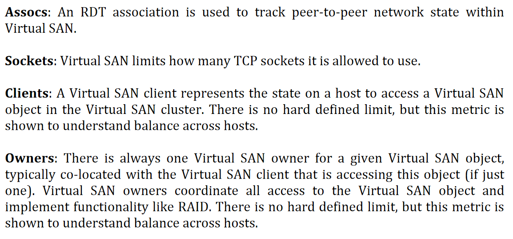
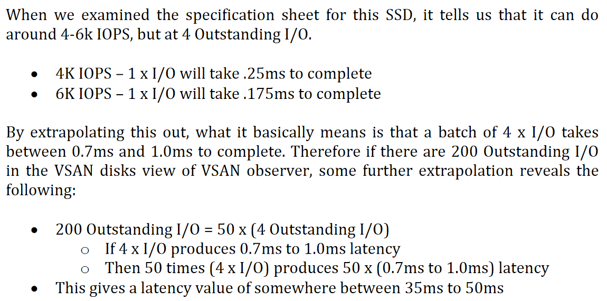
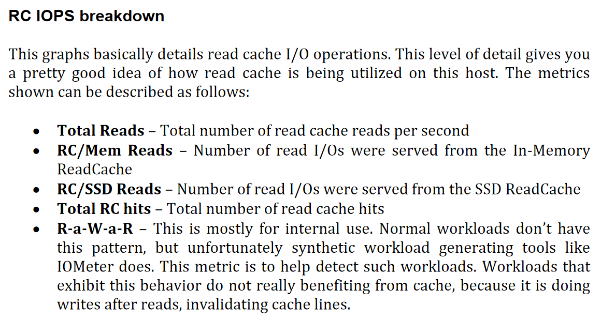
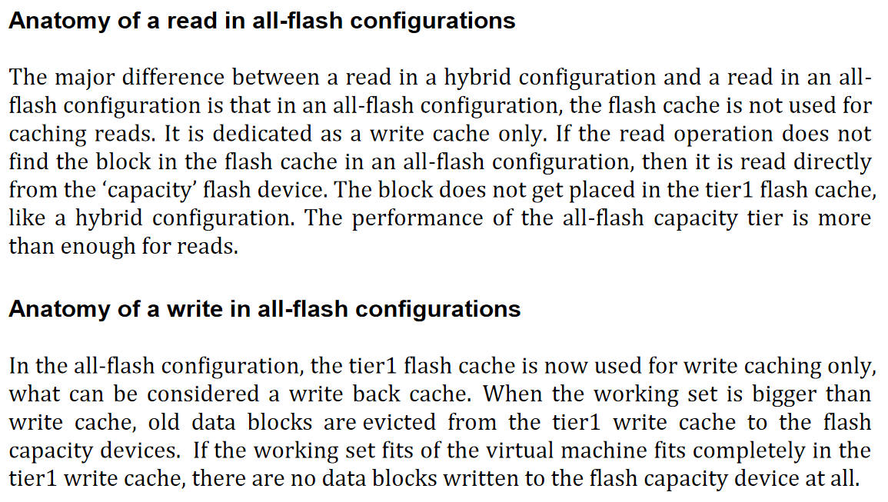
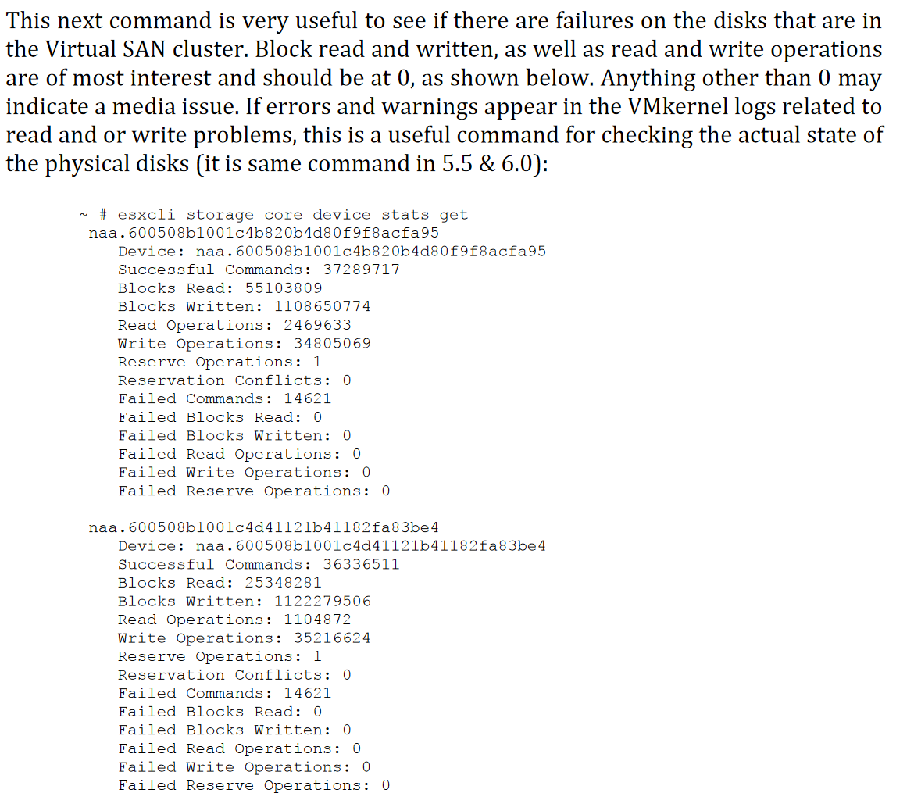
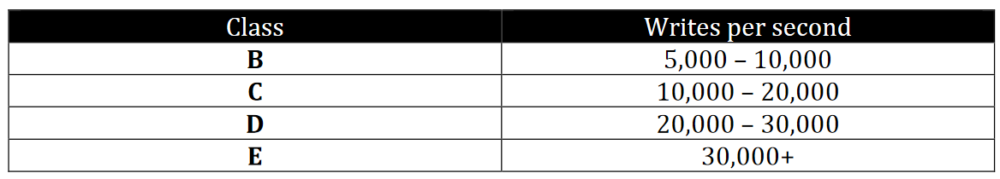
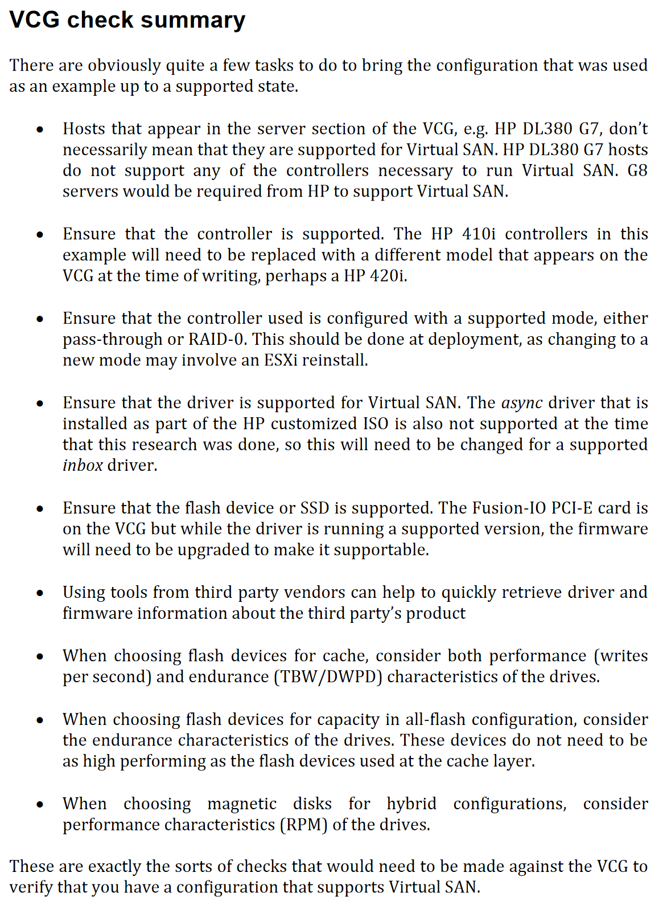

# Troubleshooting vSAN

- [Troubleshooting vSAN](#troubleshooting-vsan)
  - [Helpful Resources](#helpful-resources)
  - [vSAN Support Insight](#vsan-support-insight)
  - [Overall Approach](#overall-approach)
  - [Technical Approach](#technical-approach)
    - [Identify](#identify)
  - [Using vSAN Observer](#using-vsan-observer)
    - [Running from a remote machine](#running-from-a-remote-machine)
    - [Running vSAN Observer without Internet Access](#running-vsan-observer-without-internet-access)
    - [vSAN Observer Case Studies](#vsan-observer-case-studies)
  - [Anatomy of a Write/Read Operation in Hybrid Config](#anatomy-of-a-writeread-operation-in-hybrid-config)
  - [Helpful Commands](#helpful-commands)
    - [Networking](#networking)
    - [Determine Disk Group Assignmnts](#determine-disk-group-assignmnts)
    - [Check Failed Disks](#check-failed-disks)
    - [Determine what drives are attached to which storage adapters](#determine-what-drives-are-attached-to-which-storage-adapters)
      - [Get Detailed Version](#get-detailed-version)
      - [Simple List](#simple-list)
      - [Interpreting the Output](#interpreting-the-output)
    - [List SCSI devices and their sizes](#list-scsi-devices-and-their-sizes)
    - [Get a list of all PCI devices (allows you to check for rebranding)](#get-a-list-of-all-pci-devices-allows-you-to-check-for-rebranding)
      - [Determine Adapter Driver and Version](#determine-adapter-driver-and-version)
        - [Determine Driver Parameters](#determine-driver-parameters)
    - [Get a list of VIBs](#get-a-list-of-vibs)
    - [Check failures to tolerate and stripe](#check-failures-to-tolerate-and-stripe)
    - [Check what the fault domains are](#check-what-the-fault-domains-are)
    - [Inspect a Specific Object (VM) in vSAN](#inspect-a-specific-object-vm-in-vsan)
  - [Understanding Drive Types](#understanding-drive-types)
  - [VCG Check Summary](#vcg-check-summary)
  - [Absent vs Degraded Failure](#absent-vs-degraded-failure)
  - [Object Compliance Status: Compliant vs Non Compliant](#object-compliance-status-compliant-vs-non-compliant)
  - [Object Operational State: Healthy vs Unhealthy](#object-operational-state-healthy-vs-unhealthy)
  - [VM Accessibility: Inaccessible vs Orphaned](#vm-accessibility-inaccessible-vs-orphaned)
  - [TODO](#todo)

## Helpful Resources

[Virtual SAN Diagnostics and Troubleshooting Reference Manual](./virtual-san-diagnostics-troubleshooting-reference-manual.pdf) - Outside of what I have recorded here, chapter 7 - Understanding expected failure behavior may be useful. It covers what you'll see in the logs, UI, etc when different types of failure occur. It also describes things like what happens when you plug in a new disk in both the capacity and cache tiers. **If you don't know how to handle a problem** this is the place to look. I have a lot of the highlights below but there are a lot of scenarios they cover that I don't.

[VMware Ruby vSphere Console Command Reference for Virtual SAN](./vmware-ruby-vsphere-console-command-reference-for-virtual-san.pdf)

[Troubleshooting vSAN Performance](https://core.vmware.com/resource/troubleshooting-vsan-performance)

[Monitoring with vSAN Observer](Monitoring-with-VSAN-Observer-v1.2.pdf) - Covers interpreting and understanding all the functionality of vSAN observer.

[My Notes on vSAN](../Notes%20on%20vSAN/README.md) - I documented how a number of vSAN features function and the variosu highlights.
## vSAN Support Insight


## Overall Approach

vSAN observer
vSAN health test
Time/resource permitting vSAN HCI benchmark
I'll also do a general network survey to make sure I understand the physical and logical layout paying particular attention to the various VLANs

https://core.vmware.com/resource/troubleshooting-vsan-performance

1. Identify and quantify. This step helps to clearly define the issue. Clarifying questions can help properly qualify the problem statement, which will allow for a more targeted approach to addressing. This process helps sort out real versus perceived issues, and focuses on the end result and supporting symptoms, without implying the cause of the issue.
2. Discovery/Review - Environment. This step takes a review of the current configuration. This will help eliminate previously unnoticed basic configuration or topology issues that might be plaguing the environment.
3. Discovery/Review - Workload. This step will help the reader review the applications and workflows. This will help a virtualization administrator better understand what the application is attempting to perform, and why. 
4. Performance Metrics - Insight. This step will review some of the key performance metrics to view, and how to interpret some of the findings the reader may see when observing their workloads. It clarifies what the performance metrics means, and how they relate to each other..
5. Mitigation - Options in potential software and hardware changes. This step will help the reader step through the potential actions for mitigation.
 

## Technical Approach

Potential Bottlenecks: https://core.vmware.com/blog/understanding-performance-bottlenecks

### Identify

1. Check VxRail version
2. Perform a network survey and understand what switches and devices are in between each of the hosts
3. Verify everything is licensed
      1. Hosts that are participating in the vSAN cluster but not providing storage still require a license
4. Check that the flash cache to capacity ratio is 1:10
5. Check cluster health with `esxcli vsan health cluster list`
      1. Cross reference in RVC with `vsan.cluster_info <target>`. This is good for getting a big picture view of what is going on.
      2. Check the overall state of the cluster in RVC with `vsan.check_state <target>`. This will check for inaccessible vSAN objects, invalid/inaccessible VMs, VMs for which VC/hostd/vmx are out of sync.
            1. **Inaccessible vSAN Objects**: Inaccessible Virtual SAN objects are an indication that there is probably a failure  somewhere in the cluster, but that Virtual SAN is still able to track the virtual  machine. An invalid or inaccessible object is when the VM has objects that have lost  the majority of its components or votes, again due to hardware failures.   Note that  for a VM’s object to be accessible, it must have a full, intact mirror and greater than  50% of its components/votes available.
            2. **Invalid/inaccessible VMs**: The next check is for invalid or inaccessible VMs. These are VMs that, most likely  due to the fact that the failure(s) that have occurred in the cluster, have been  impacted so much that it is no longer accessible by the vCenter server or the ESXi  hosts. This is likely be due to the fact that the VM Home Namespace, where the .vmx  file resides, is no longer online. Common causes are clusters that have had multiple  failures, but the virtual machines have been configured to tolerate only one failure,  or network outages.
            3. **Check that vCenter and hosts are in sync**: The final check just makes sure vCenter Server (VC) and hosts agree on the state of the cluster.
      3. Use RVC to check that the cluster is operating within limits with `vsan.check_limits` 
            1. From a network perspective the most important things to check are associations (Assocs) and the the socket count. Associations track peer-to-peer network state within the vSAN and you should not run out (max 45k). Sockts are used for various things. The max is 10,000.
      4. Check that the cluster has enough resources to tolerate a failure with RVC command `vsan.whatif_host_failures`
            1. RC reservations means Read Cache reservations and is only used in hybrid configurations. You can dedicate a certain amount of read cache to a specific VM.
            2. HDD capacity only refers to the capacity tier.
6. Check host connectivity
      1. Note it may be helpful if you need to identify where a host is plugged in to use LLDP with the RVC command `vsan.lldpnetmap localhost/datacenter/computers/vSAN\ Cluster/`
      2. Check cluster ping with `vmkping -I <vmk_interface> <target_ip>`
      3. Check to make sure all hosts are on the same network segment with `esxcli network ip neighbor list`
      4.  Check round trip time with `esxcli network diag ping`
      5.  Check to make sure multicast is working and a host is receiving heartbeats with `tcpdump-uw –i <your_vmk> udp port 23451 –v -s0`
      6.  Each ESXi node in the vSAN cluster will send out IGMP membership reports (aka joins) every 90-300 seconds. Check for receipt with `tcpdump-uw -i <yourvmk> igmp`
      7.  Make sure the following ports are accessible through any firewalls: 
7.  Use iperf to get a baseline idea of the network bandwidth available. This will cause degredation of performance! Most useful for initial setup. See [this KB article](https://kb.vmware.com/s/article/2001003#Network)
8.  You can also use RVC's `vsan.vm_perf_stats` command to get a feel for the performance. Ex `vsan.vm_perf_stats ~/vms/W2k12-SQL2k12 --interval 10 --show-objects`. IOPS = (MBps Throughput / KB per IO) * 1024. MBps = (IOPS * KB per IO) / 1024
9.  **NOTE**: [Virtual SAN Diagnostics and Troubleshooting Reference Manual](./virtual-san-diagnostics-troubleshooting-reference-manual.pdf) covers a lot of other scenarios I didn't here.
10. Consider 
11. Kick off vSAN Observer. See [Using vSAN Observer](#using-vsan-observer). Details on using vSAN observer available in [this PDF](./Monitoring-with-VSAN-Observer-v1.2.pdf). It is also covered starting on page 197 in [Virtual SAN Diagnostics and Troubleshooting Reference Manual](./virtual-san-diagnostics-troubleshooting-reference-manual.pdf)
      1. Check the latency as seen by a guest VM running the application of interest (check on the VMs tab)
         1. VM Home - This is where the VM's configuration file, log files, and other VM related small files are stored. The RAID tree subsection shows the different component owners for VM Home.
         2. Virtual Disk - This shows the different virtual disks attached to the VM. Each disk displas stats specific to that disk. You can drill down to individual virtual disks. The VSCSI layer shows the aggregate latency, IOPS and throughput numbers for a particular virtual disk of a VM.
      2. **NOTE**: On the various full graphs you may see *RecovWrite* - these are the number of writes that are being used for component rebuilds. Note that this metric will be 0 for vSAN clients because they do not have visibility into rebuild I/O - DOM does that. You will also see *Write LE* - this refers to write log entry. For every write there are actually two I/Os: the actual data and a log entry.
      3. Check for high outstanding IOPs (vSAN client tab and vSAN disks). On the vSAN disks tab make sure that outstanding IO is well balanced across the hosts. A high outstanding IO may be something like 200. 
      4. On the vSAN disks tab look for a high number of evictions. These occur when vSAN has to evict data blocks from the write buffer to make room for new data blocks. In an optimized system, the working data for an application should mostly reside in write cache. We should not see too many evictions. Maybe this workload is not suitable?
      5. Check for high latencies (time it takes to complete on I/O operation from application viewpoint). (vSAN client tab and vSAN disk tab). Consier that if the latency in the vSAN client tab is much higher than the disk tab than it is more likely the network is the problem.
        1.  Make sure that what we see on the vSAN client tab correspondings to what is on the vSAN disk tabs
        2.  Common causes of high latency:
             1. Large average I/O sizes, which leads to increased latencies
             2. Large number of writes
             3. Large number of I/Os
             4. Slow SSD that isn't keeping up
             5.  Too many random reads causing cache misses in the SSD.
      6.  Latency formula: outstanding IOs / drive max write or I/O = x ms
      7.  If we kick off a lot of read ops on something we generally expect there to a spike in latency followed by a drop as things are cached (assuming the same thing is being read)
      8.  The standard deviation graph is telling you the frequency you are outside a single standard deviation
      9. Check bandwidth utilization
           1.  Lots of small I/Os could cause you to hit I/O ceiling before bandwidth
           2.  Large I/Os may exhaust bandwidth
      10. Check buffer utilization. You can see this on the client and disk tabs. On the deep dive tab you can check RC hit rate for the various hosts. If we are seeing a lot of misse on the read cache this may indicate the cache isn't large enough and we expect to see a spike in hits against our capacity drives. 
      11. Check PCPU utilization. It isn't uncommon to see 30-50% utilization when under I/O load. Sustained high CPU utilization could indicate a problem.
         1. If you have problems but don't expect them, make sure that if the server has a power management setting that it isn't set to a lower performance setting
      12. Check memory consumption paying specific attention to congestion. 
           1. The vmkernel log will commonly display this error in the event of a memory shortage:
           2. Or this error when trying to add a disk group: 
           3. An error will also be displayed in the GUI: 
      13. Check distribution of [components](../Notes%20on%20vSAN/README.md#components). The line should be uniform indicating roughly equal distribution of components
12. Check that the storage controller is supported and running normaly with `esxcli storage core device list`. Compare to VCG. You can cross reference this with `esxcli core storage adapter list` and `esxcfg-scsidevs -a`
    1.  You may see the word *degraded* - this occurs when there is only a single path to teh device. If there are multiple paths this will not show. This is not an issue for local disk configurations.
    2.  If you see *Logical Volume* in the model field it implies there is a RAID volume configuration on the disk - probably RAID0. Certain storage controllers can pass disk devices directly to the ESXi host; this is called pass-through mode. You may also see it called JBOD or HBA mode. Other storage controllers require each disk device be configured as a RAID0 volume before ESXi can recognize it. You can check the VCG to determine whether something supports pass through or not: 
     1. Double check the VCG! If a controller is supported in RAID0 mode only, it may still work in pass-through mode but the disks will frequently error. 
13. Make sure the storage adapter is supported and the driver is up to date. See [Get a list of all PCI devices](#get-a-list-of-all-pci-devices-allows-you-to-check-for-rebranding)
14. Review [the VCG check summary](#vcg-check-summary) and make sure everything is good to go
15. If you are having general performace issues with vSAN you can go to a host seeing the issues and check the controller queue depth with `esxtop`. You can use the D option to see the queue stats. Hit enter to return to the general view and then you can check AQLEN. ESXi requires a depth greater than 256. You can also check it with the command `esxcfg-info –s | grep “==+SCSI Interface” –A 1`
16. Disable controller caching. This is the VMWare recommended setting. If you can't disable it try setting the cache to 100% read.
17. Make sure all disks that are meant to be claimed by vSAN are with the command `esxcli vsan storage list`. Make sure in the output that CMMDS is set to true. This implies that the cluster membership and directory services know about the disk in question and that the capacity of the disk is contributing to the capactiy of the vSAN datastore.


## Using vSAN Observer

SSH to vCenter and then run `rvc administrator@vsphere.lan@localhost`
`vsan.observer /localhost/datacenter/computers/vSAN\ Cluster/ --run-webserver --force`
Go to https://vcenter.lan:8010/ (it must be https)

You can also write the output to a JSON file. If you only have the JSON output you can produce static HTML with the `vsan.observer_process_statsfile <stats_file> <output_folder>`

### Running from a remote machine

Install Ruby: https://rubyinstaller.org/downloads/
Install Ruby vSphere Console: https://rubydoc.info/gems/rvc/1.6.0 `gem install rvc`

### Running vSAN Observer without Internet Access

See page 198 of [Virtual SAN Diagnostics and Troubleshooting Reference Manual](./virtual-san-diagnostics-troubleshooting-reference-manual.pdf)

### vSAN Observer Case Studies

Starts on page 262 of [Virtual SAN Diagnostics and Troubleshooting Reference Manual](./virtual-san-diagnostics-troubleshooting-reference-manual.pdf)

## Anatomy of a Write/Read Operation in Hybrid Config



For more details see page 245 of [Virtual SAN Diagnostics and Troubleshooting Reference Manual](./virtual-san-diagnostics-troubleshooting-reference-manual.pdf)
## Helpful Commands

### Networking

```bash
esxcli network ip interface list
esxcli network ip interface ipv4 get
esxcli network ip neighbor list # view ARP table
esxcli vsan network list # Determine which vmk interface is used for vSAN
esxcli network nic list # List the physical interfaces

# This can be run at the cluster level and also gives vmk interface for vSAN
vsan.cluster_info <vSAN cluster> 

# Use LLDP to obtain upstream switch info
vsan.lldpnetmap localhost/datacenter/computers/vSAN\ Cluster/
```

### Determine Disk Group Assignmnts


### Check Failed Disks

`esxcli storage core device stats get`



### Determine what drives are attached to which storage adapters

#### Get Detailed Version

`esxcli storage core path list`

#### Simple List

`esxcfg-scsidevs –A`

#### Interpreting the Output

NAA stands for Network Addressing Authority identifier. EUI stands for Extended  Unique Identifier. The number is guaranteed to be unique to that LUN. The NAA or  EUI identifier is the preferred method of identifying LUNs and the storage device  generates the number. Since the NAA or EUI is unique to the LUN, if the LUN is  presented the same way across all ESXi hosts, the NAA or EUI identifier remains the  same. Some devices do not provide the NAA number described above. In these  circumstances, an MPX Identifier is generated by ESXi to represent the LUN or disk.  The identifier takes the form similar to that of the canonical name of previous  versions of ESXi with the “mpx.” prefix. This identifier can be used in the exact same  way as the NAA Identifier described above.” Refer to [VMware KB article 1014953](http://kb.vmware.com/kb/1014953)  for further information. 

### List SCSI devices and their sizes

`esxcfg-scsidevs –c`

### Get a list of all PCI devices (allows you to check for rebranding)

You an use a combination of the vendor IDs, device IDs, sub-vendor IDs, and sub-device IDs, to verify an adapter is on the VCG. Some vendors rebrand devices to reflect their own range of products however, the vendor and device ids remain the same. It is not uncommon to find that one vendor's controller is not listed under the vendor name in the VCG but is actually listed under another vendor.

`esxcli hardware pci list`

#### Determine Adapter Driver and Version

*Module Name* indicates the driver that is currently in use. You can use the `vmkload_mod -s <driver name>` or `esxcli system module get -m` command to determine the driver version. Check that against the VCG; as bugs arise the supported drivers can change. You can also check the adapters with `vsan.disks_info localhost/datacenter/computers/vSAN\ Cluster/hosts/vsan1.lan --show-adapters` in RVC. 

##### Determine Driver Parameters 
`vmkload_mod -s <driver name>`
### Get a list of VIBs

`esxcli software vib list`

If someone built using a custom ISO, it is common that they may have upgraded the driver to too high a version and that this version is unsupported.

### Check failures to tolerate and stripe


You can see this on a per object level in `vsan.object_info`

### Check what the fault domains are

`vsan.cluster_info computers/vSAN\ Cluster/`

### Inspect a Specific Object (VM) in vSAN

`vsan.vm_object_info <target>`

## Understanding Drive Types

Flash devices are placed in classes. Performance classes are measured in writes per second (not sure if this is up to date):



Endurance is measured in Terabytes Written. Drives are qualified by the number of terabytes they are capable of writing per some time period per the vendor.


## VCG Check Summary



## Absent vs Degraded Failure


## Object Compliance Status: Compliant vs Non Compliant


## Object Operational State: Healthy vs Unhealthy


## VM Accessibility: Inaccessible vs Orphaned


## TODO

- Review P141 - Verifying Virtual SAN storage operation - RVC in [Virtual SAN Diagnostics and Troubleshooting Reference Manual](./virtual-san-diagnostics-troubleshooting-reference-manual.pdf)
- Review P152 - Testing vSAN functionality - deploying VMs in [Virtual SAN Diagnostics and Troubleshooting Reference Manual](./virtual-san-diagnostics-troubleshooting-reference-manual.pdf)
- P156 of [Virtual SAN Diagnostics and Troubleshooting Reference Manual](./virtual-san-diagnostics-troubleshooting-reference-manual.pdf)