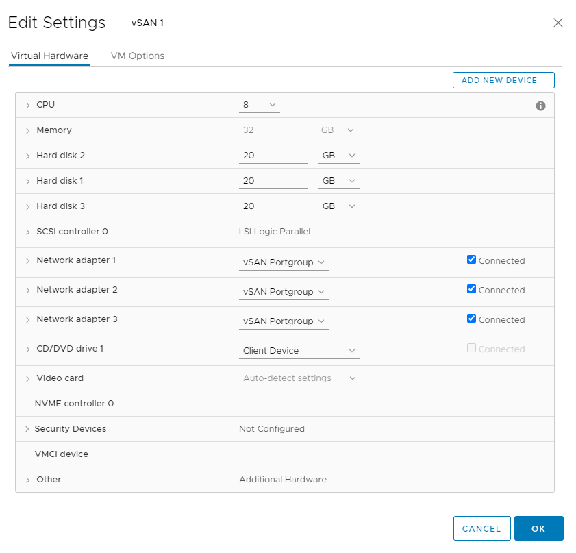
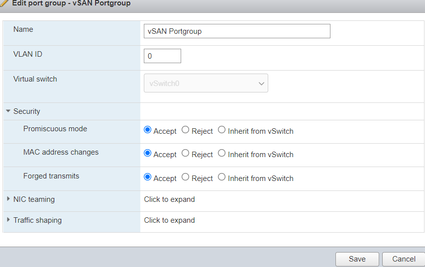
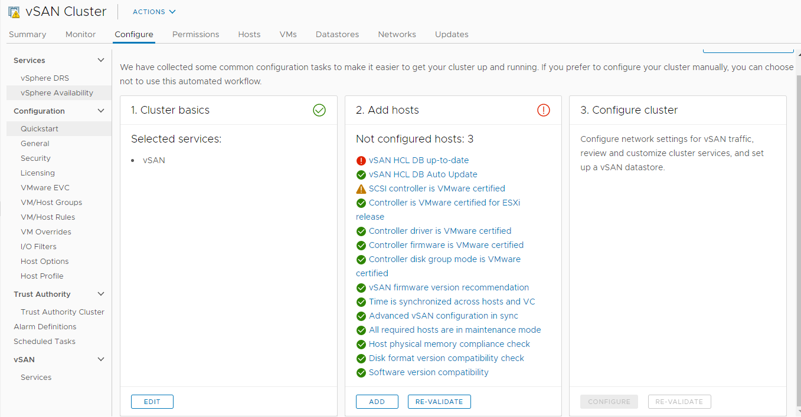
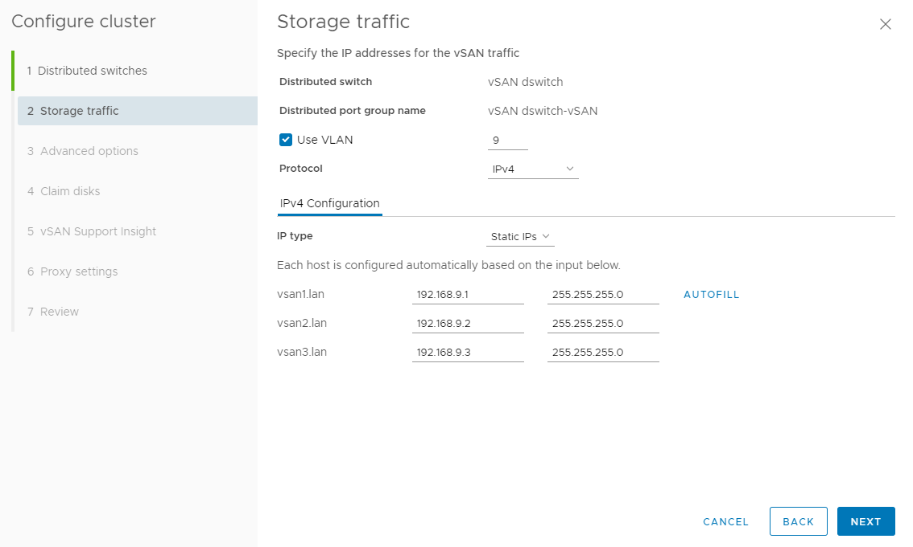

# Testing vSAN

See [notes on vSAN](../Notes%20on%20vSAN/README.md) for how vSAN works.

## VM Setup

I created three VMs with the following config:

- I had to use the VMXNET 3 adapter to get ESXi to recognize the network card.
- I used all NVMe drives
- For the networks you must use a portgroup with the security settings disabled (because under the hood ESXi is effectively "spoofing" MAC addresses - or so the security settings will think):

I then setup DNS entries for vsan1.lan, vsan2.lan, and vsan3.lan

- Configure NTP on vCenter (time must be synched before build) https://kb.vmware.com/s/article/57146
  - If your root password is expired: https://buildvirtual.net/vcenter-exception-in-invoking-authentication-handler-user-password-expired/
- Make sure time on ESXi is working https://docs.vmware.com/en/VMware-vSphere/7.0/com.vmware.vsphere.vcenterhost.doc/GUID-8756D419-A878-4AE0-9183-C6D5A91A8FB1.html

## Configure vSAN

https://docs.vmware.com/en/VMware-vSphere/7.0/com.vmware.vsphere.vsan-planning.doc/GUID-CF9767B6-B3F5-4787-9AF3-D661987AE525.html

- I had to update my lab's HCL: https://kb.vmware.com/s/article/2145116 (the button didn't work for me)

