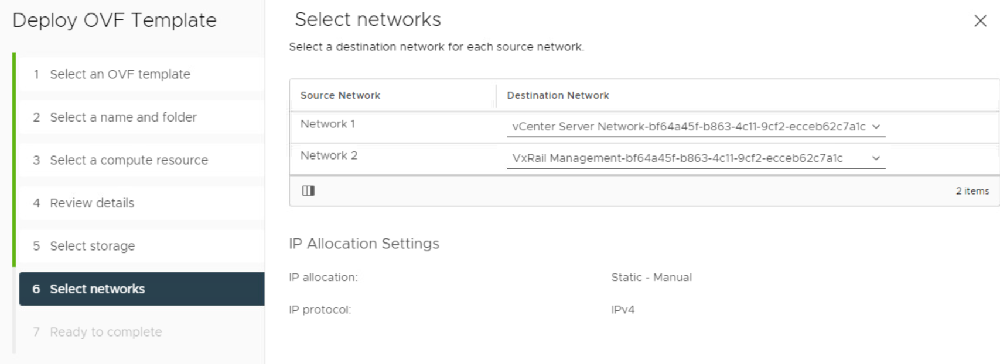

# VxRail Architecture and Troubleshooting

- [VxRail Architecture and Troubleshooting](#vxrail-architecture-and-troubleshooting)
  - [VxRail Architecture](#vxrail-architecture)
    - [vxrail-mystic-lcm-7.0.202.rpm](#vxrail-mystic-lcm-70202rpm)
    - [vxrail-system.zip](#vxrail-systemzip)
    - [VXRAIL_7.0.200-17911444.zip](#vxrail_70200-17911444zip)
  - [Inspecting VIB files](#inspecting-vib-files)
  - [Inspecting Java Class Files](#inspecting-java-class-files)
  - [Upgrades](#upgrades)
    - [How Upgrades Work](#how-upgrades-work)
    - [Failed Upgrade](#failed-upgrade)
      - [Observed Errors](#observed-errors)
      - [Fix Action](#fix-action)
    - [Understanding Upgrades in ESXi](#understanding-upgrades-in-esxi)
    - [Understanding the VxRail Update Bundle](#understanding-the-vxrail-update-bundle)
      - [Manifest File and Update Order](#manifest-file-and-update-order)
  - [Adding Nodes](#adding-nodes)
    - [Troubleshooting](#troubleshooting)
    - [How Adding Nodes Works During Cluster Construction](#how-adding-nodes-works-during-cluster-construction)
  - [Disappearing Browse Button](#disappearing-browse-button)
  - [Troubleshooting Script 15_setup_node.sh execution error](#troubleshooting-script-15_setup_nodesh-execution-error)
    - [Node 3 Password Change](#node-3-password-change)
    - [RASR process fails with "Script 15_setup_node.sh execution error"](#rasr-process-fails-with-script-15_setup_nodesh-execution-error)
    - [RASR on 192.168.0.172](#rasr-on-1921680172)
      - [Debugging error](#debugging-error)
  - [Log Info](#log-info)
  - [Fixing Half Upgrade](#fixing-half-upgrade)
  - [vCenter Logs](#vcenter-logs)
  - [Altbootbank](#altbootbank)
  - [Add nodes NIC config page](#add-nodes-nic-config-page)
  - [Add Node Error](#add-node-error)
  - [Error Node](#error-node)
  - [General Error](#general-error)
  - [Redeploying VxRail Manager](#redeploying-vxrail-manager)
  - [Logs](#logs)
    - [Generating Logs](#generating-logs)
    - [VxRail Microservice (container) Logs](#vxrail-microservice-container-logs)
    - [RASR Process](#rasr-process)
    - [Tomcat Logs](#tomcat-logs)
    - [Upgrade Logs](#upgrade-logs)
    - [API Logs](#api-logs)
  - [Helpful Commands](#helpful-commands)
  - [Helpful KB Articles](#helpful-kb-articles)
  - [VxRail API Info](#vxrail-api-info)

## VxRail Architecture

Most meaningful information on VxRail can be gleaned by reverse engineering the update package. There are three files in the update package of particular interest:

- `bundles/vxrail-mystic-lcm-7.0.202.rpm`
- `vxrail-system.zip`
- `VXRAIL_7.0.200-17911444.zip`

### vxrail-mystic-lcm-7.0.202.rpm

The mystic LCM process governs all upgrades. Any code related to the upgrade seems to be part of this process. RPMs are just archives and you can unarchive this file with 7-zip and take a look at its contents for any debugging desired.

### vxrail-system.zip

Defines all the baselines available in JSON format.

### VXRAIL_7.0.200-17911444.zip

This file contains all the files for VxRail that aren't associated with the upgrade subsystem.

## Inspecting VIB files

There's a good chance you may want to be able to look inside VIB files. VIB files use a proprietary compression technology. You can get the type by opening the file in a hex editor and inspecting the headers:


On any ESXi host you can use the `vmtar` program to open these with the command: `vmtar -x <INPUT_VMTAR_FILE> -o <OUTPUT>.tar`. The output will be a regular tar file which you can then open with `tar xvf <OUTPUT>.tar`

## Inspecting Java Class Files

Most of the Java I saw was contained in the vmware-marvin file or in the LCM Marvin RPM.

I was wrestling with the error:

    web.log: ERROR [tomcat-http--48] com.emc.mystic.manager.commons.emc.webutil.LocaleUtil LocaleUtil.getBundleMessage:198 - No en_US resource bundle for ExpansionValidation with key <SERIAL_NUMBER>

I was able to find the offending file in question at `VXRAIL_COMPOSITE-7.0.202-27047874_for_4.7.x\bundles\vxrail-mystic-lcm-7.0.202\vxrail-mystic-lcm-7.0.202-27047874.noarch\usr\lib\vmware-marvin\marvind\webapps\lcm\WEB-INF\lib\lcm-module-7.0.202\com\vce\lcm\emc` (that's post decompression of the vmware-marvin file inside the VIB).

I find that compressing the three core files for VxRail and searching them with grep for keywords from the error messages was pretty effective for locating what I wanted. In my case the following got me what I wanted for the above error:

    (base) grant@DESKTOP-2SV1E9O:/mnt/c/Users/grant/Downloads/VXRAIL_COMPOSITE-7.0.202-27047874_for_4.7.x/bundles/vxrail-mystic-lcm-7.0.202/vxrail-mystic-lcm-7.0.202-27047874.noarch$ grep -inr 'resource bundle' ./*
    Binary file ./usr/lib/vmware-marvin/marvind/webapps/lcm/WEB-INF/lib/lcm-module-7.0.202/com/vce/lcm/emc/LocaleUtil.class matches

I used the program [JD Project](https://java-decompiler.github.io/) to decompile the Java bytecode in question and it worked quite well. I was able to search the decompiled bytecode normally and find the offending function:


which then allowed me to determine that this error message was actually erronious and just a product of VxRail trying and failing to localize an error message related to disk validation.

## Upgrades

### How Upgrades Work

During the upgrade process the old VxRail manager will have its IP and hostname removed and be shutdown while the new one assumes the previous manager's hostname and IP. Upgrades are performed with the service account you configured when you built VxRail - *not root*.

### Failed Upgrade

If an upgrade fails midflight this typically leaves the cluster in a state where there are two VxRail managers.  In my team's experience trying to resume the upgrade using the new VxRail manager leads to a host of issues. 

#### Observed Errors

Specifically, we encountered the following errors:

    VxRail Update ran into a problem...
    Please refer to KB488889 article.
    Failed to upload bundle: VXRAIL_COMPOSITE-SLIM-7.0.132-26894200_for_4.7x.zip: Failure occured in executing the checker: Pre-checking the version compatibility among components. General unexpected error occurs during getting the information of firmwares.. Please refer to the KB517433 article.
    Error extracting upgrade bundle 7.0.132-26894200. Failed to upload bundle. Please refer to log for details.


This error is covered by [Dell EMC VxRail: LCM failed at Error extracting update bundle 7.0.132](https://www.dell.com/support/kbdoc/en-us/000185222/dell-emc-vxrail-lcm-failed-at-error-extracting-update-bundle-7-0-132?lang=en)

We also saw:

    Failure occurred while running an upgrade for bundle VXRAIL_COMPOSITE-SLIM-7.0.132-26894200_for_4.7.x.zip. The error message [DependencyError] VIB DEL_bootbank_dcism_3.6.0.2249-DEL.700.0.0.15843807 requires esx-version >= 7.0.0 but the requirement cannot be satisfied within the ImageProfile. Please refer to the log file for more details.

#### Fix Action

The most reliable way to fix a stuck upgrade is to revert to the old VxRail Manager and then run the upgrade again. You can do this by shutting down the new VxRail Manager, deleting it, and then logging into the previous VxRail Manager on the console, re-IPing it, give it it's previous hostname, and then restarting the upgrade.

### Understanding Upgrades in ESXi

See [What is the altbookbank Partition](../ESXi%20Architecture/README.md#what-is-the-altbookbank-partition)

### Understanding the VxRail Update Bundle

At the top level the upgrade is governed and controlled by the file `node-upgrade.py` in the root of the upgrade bundle:


The bundles directory has all the possible files that *could* be installed with the update. The exact files which are installed vary by system. More on that in the section [Manifest File and Update Order](#manifest-file-and-update-order).

#### Manifest File and Update Order

The manifest file defines which VIBs will be installed based on system parameters and in what order they will be installed in. For example: ESXi:

```xml
<Package InstallOrder="100">
        <ComponentType>ESXi</ComponentType>
        <DisplayName>ESXi</DisplayName>
        <Version>7.0.2</Version>
        <Build>17867351</Build>
	    <File>bundles/ESXi-7.0.2-ep1_17867351-34777dce-standard.zip</File>
        <Size>393239990</Size>
        <HighestFormatVersionSupported>11</HighestFormatVersionSupported>
        <UpgradeTime>5</UpgradeTime>
        <RebootFlag>True</RebootFlag>
        <Package InstallOrder="101">
            <ComponentType>ESXi_No_Tools</ComponentType>
            <DisplayName>VMware ESXi No Tools</DisplayName>
            <Version>7.0.2</Version>
            <Build>17867351</Build>
            <File>bundles/ESXi-7.0.2-ep1_17867351-34777dce-upgrade-no-tools.zip</File>
            <Size>207115430</Size>
            <HighestFormatVersionSupported>11</HighestFormatVersionSupported>
            <UpgradeTime>5</UpgradeTime>
            <RebootFlag>True</RebootFlag>
        </Package>
        <Package InstallOrder="1001">
            <ComponentType>ESXi_VIB</ComponentType>
            <DisplayName>Dell iSM for vSphere 7</DisplayName>
            <Version>3.6.0.2249</Version>
            <Build>DEL.700.0.0.15843807</Build>
            <SystemName>dcism</SystemName>
```
This is parsed by the function _parse_esxi_patch, _parse_install_vib, and _parse_update_firmware in node-upgrade.py on line 1381, 1454, and 1492:

```python
def _parse_esxi_patch(self, element):
    task = {
        'type': "esxi_patch",
        'name': "Install ESXi VMware patch",
        'async': False,
        'visible': True,
    }

    task['install_order'] = int(element.get('InstallOrder'))
    task['args'] = self._extract_args(element, [
        'ComponentType',
        'DisplayName',
        'Version',
        'Build',
        'File',
        'Size',
        'HighestFormatVersionSupported',
    ])

    return task
```
---SNIP---
```python
def _parse_install_vib(self, element):
  task = {
      'type': "install_vib",
      'async': False,
      'visible': True,
      'package_type': 'vib',
  }

  task['name'] = "Install %s" % element.find('DisplayName').text
  task['install_order'] = int(element.get('InstallOrder'))
  task['args'] = self._extract_args(element, [
      'ComponentType',
      'DisplayName',
      'Version',
      'Build',
      'SystemName',
      'File',
      'Size',
      'ReplaceTargetInfo/ReplaceTarget/SystemName',
  ])

  component_type = task['args'].get('ComponentType', '')
  display_name = task['args'].get('DisplayName', '')
  if equals_ignore_case(display_name, 'VxRail VIB') or \
          equals_ignore_case(component_type, 'VXRAIL_'):
      task['args']['SystemName'] = "vmware-marvin"

  pkg_file = task['args'].get('File', '')
  file_path = os.path.join(self._bundle_dir, pkg_file)
  vlcm_bundle_info = self._vlcm_bundle_info(file_path)

  if vlcm_bundle_info:
      task['package_type'] = 'component'
      task['component_name'] = vlcm_bundle_info[0]
      task['component_version'] = vlcm_bundle_info[1]

  return task

def _parse_update_firmware(self, element):
  task = {
      'type': "update_firmware",
      'async': True,
      'visible': True,
      'runtime_check': False,
  }

  task['name'] = "Update %s" % element.find('DisplayName').text
  task['install_order'] = int(element.get('InstallOrder'))
  task['args'] = self._extract_args(element, [
      'ComponentType',
      'DisplayName',
      'Version',
      'Build',
      'File',
      'Size',
  ])

  nic_models = self._extract_target_models(element, 'TargetNicModelInfo')
  component_models = self._extract_target_models(
      element, 'TargetComponentModelInfo')
  fw_models = nic_models + component_models
  if fw_models:
      task['args']['FirmwareModels'] = fw_models
  else:
      task['args']['FirmwareModels'] = None

  return task
```

These functions are used to create tasks which are stored in the `required_tasks` variable:


After all tasks are added to required tasks they are sorted with a lambda function on line 1898:

```python
required_tasks.sort(key=lambda t: t['install_order'])
```

Subsequently it is safe to assume a linear sort on the integer value. We can use this to diagnose any problems we encounter with install order.

## Adding Nodes

Version Compatibility Matrix: [Link](https://l.facebook.com/l.php?u=https%3A%2F%2Fdl.dell.com%2Fcontent%2Fdocu92203_VxRail-Appliance-Node-Addition-Matrix.pdf%3Flanguage%3Den_US%26fbclid%3DIwAR3j6urHXGnMESuZB-Ptw82UDigmtZ_eBK0fyrl5EZktQltBad0EOPgnw84&h=AT0viMyq6Pd30CzaVIwDwCY4faDLoX9G6d2_HN7yhG9HTdmTfB2WLwj_1kLJdCvcmSxvl2c260QgfG-bZKLkQ1pZ7oggRHzgFrypM8X5ZeA9NARg6zpIWuqk2cB4mFwXdz4)

Make sure before you try to do anything with adding nodes that you verify the versions are mutually compatible.

### Troubleshooting

We bumped into several errors while attempting to add nodes and they varied in type. One of the errors we encountered was when adding the node the interface for the VxRail plugin failed entirely. We were able to fix it with the following process:

  1. Take a snapshot of VxM
  2. `psql -U postgres vxrail -c "DELETE FROM system.operation_status WHERE state='IN_PROGRESS';"`
  3. enable advanced mode by changing it in /var/lib/vmware-marvin/lcm_advanced_mode.properties
  4. Change the contents of /var/lib/vmware-mariv to `{"state":"NONE","vc_plugin_updated":false,"deployed_for_public_api":false}`
  5. Restart Marvin with `system restart vmware-marvin`

In one instance we were able to clear all problems by restarting all nodes in the cluster, the VxRail manager, and vCenter. After a full reboot of everything, a series of general errors we had been receiving during validation cleared.

### How Adding Nodes Works During Cluster Construction

All nodes after being RASR have a fully built vSAN disk group. During the initial cluster construction VxRail will select a primary node and then add it to the cluster. On every subsequent node it will delete that node's vSAN disk group and then add it to the cluster's existing disk group.

## Disappearing Browse Button

1. Take a snapshot of VxM
2. psql -U postgres vxrail -c "DELETE FROM system.operation_status WHERE state='IN_PROGRESS';"
3. enable advanced mode by change it in /var/lib/vmware-marvin/lcm_advanced_mode.properties
4. Change the contents of /var/lib/vmware-mariv to {"state":"NONE","vc_plugin_updated":false,"deployed_for_public_api":false}
5. Result `system restart vmware-marvin`

## Troubleshooting Script 15_setup_node.sh execution error

### Node 3 Password Change

- Somehow 192.168.0.172 changed iDRAC passwords overnight. Last I left it, it was in a reboot loop

### RASR process fails with "Script 15_setup_node.sh execution error"

Both 192.168.0.171 and 192.168.0.172 are failed with "Script 15_setup_node.sh execution error". I confirmed  they both had failed to generate disk mapping.


This does not exactly match [the kb](https://www.dell.com/support/kbdoc/en-th/000050335/vxrail-rasr-process-fails-with-script-15-setup-node-sh-execution-error?c=th) but it does appear to be fatal.

### RASR on 192.168.0.172

- I ran with no DUP install


- Copying these temp files is taking hours. They're only 12 GB


- Same problem


#### Debugging error

The error looks like https://www.dell.com/support/kbdoc/en-th/000193618?lang=en

- For starters my fist.log was in /scratch instead of /mnt


- The observed 15_setup_node.sh is in:

```
[root@fedora media]# grep -Ro 15_setup* .
grep: ./release/gmywd_is.tar: binary file matches
```

See [15_setup_node.sh](images/15_setup_node.sh)

The referenced vmware-marvin seems to be a VIB


The failed post is here:


I can't tell if this error is related but in another error this function failes:


drives is none. Whatever is populating `self.getDrivesInfo(host, port)` isn't working.


Whatever this is in vxrail_primary.py (line 530) HostConnection is not returning something valid. If we know what that is we can debug manually on the box. Moreover, this function is called is_dell_non_13G_platform but this is a P470F - which IS a 13G platform.

## Log Info

lcm-web.log - Shows upgrade related info
web.log - combined web output

## Fixing Half Upgrade

Roll back to previous VxRail manager, then use it to complete the upgrade.

Uses ESXi management account for updates
Uses PSC log

## vCenter Logs

## Altbootbank

You can load the old version with shift+r

## Add nodes NIC config page

When you hit https://<host>/ui/vxrail/rest/vxm/private/system/cluster-hosts?$$objectID=urn:vmomi:ClusterComputeResource:domain<ID>&lang=en-us you should get back the existing hosts in the cluster with their hostname, model, serial_number, and vmnics

https://<HOST>/ui/vxrail/rest/vxm/private/system/available-hosts?$filter=serial_number%20in%20(SERIAL,SERIAL)&$$objectId=urn:vmomi:ClusterComputeResource:domain-<ID>&lang=en-us should get you the two hosts you are going to add

## Add Node Error

"Could not find NSX-T network information"
Http failure response for https://<address>/ui/vxrail/rest/vxm/private/cluster/network/nsxt???objectId=urn:vmomi:ClusterComputeResource:domain-ID=en-US: 404 OK

## Error Node

Validation Errors

Disk Grouping Error (JKSLH63)
Error occurs when validating disk group on host JKSLH63

web.log: ERROR [tomcat-http--48] com.emc.mystic.manager.commons.emc.webutil.LocaleUtil LocaleUtil.getBundleMessage:198 - No en_US resource bundle for ExpansionValidation with key JKSLH63

## General Error

web.log: [WARN] com.vce.commons.config.ConfigServiceImpl$NotFoundHandler ConfigServiceImpl$NotFoundHandler.handleNotFound:114 - provided key is not present: [404, {"message":"404 Not Found: bandwidth_throttling_level does not exist"}]

## Redeploying VxRail Manager

1. First download the script https://supportkb.dell.com/attachment/ka06P000000LNnoQAG/7xv6_csp_en_US_1.zip
2. Go to Edit Settings on your existing VxRail Manager and check its existing networking. There should be two networks. Make note of what they are as you will need these settings later.
3. SSH to the VxRail manager and note the IPv4 address of eth0.
4. Delete the previous VxRail Manager from disk
5. Import the new VxRail Manager. The values for the import are specific to the user *except* the networking. When selecting the networking for the new VxRail Manager there will be two networks. The first network is the network over which VxRail will connect to vCenter. This network must provide connectivitiy to vCenter's management interface. TODO - second network?



3. Power on your new VxRail Manager
   1. In the virtualized lab I used for testing vCenter complained about an unsupported operating system. If this happens, right click, edit settings, vm options, general options, change the operating system to SUSE Linux 12. After you power on this should autocorrect itself.
4. Login to the VxRail Manager in the web console with root / Passw0rd!
5. 


If VxRail Manager was previously deployed but something happened to it you can rebuild it. If you have the old VxRail manager, but the cluster has changed on ESXi, you will have to do:

- Update `/var/lib/vmware-marvin/runtime.properties` with the new cluster UUID
- Connect to the postgresql database on the manager, go to the settings table and update it with the new settings.

## Logs

### Generating Logs

If you want to get a full dump of all the logs associated with VxRail you can generate a dump by going to the VxRail plugin on vCenter, navigating to the support tab, and then clicking the generate log button.

### VxRail Microservice (container) Logs

/var/log/microservice/vxrail-manager

### RASR Process

The totality of the RASR process' output is stored in the images folder on the local datastore in fist.log.

### Tomcat Logs

/var/log/marvin/tomcat/logs
/var/log/mystic/web.log

### Upgrade Logs

The LCM process handles upgrades.

It's logs are all in /var/log/mystic/lcm*.

You can also try checking the PSC log (haven't personally done this)

### API Logs

These are on vCenter.

See [VMWARE API Logs](../VMWare%20APIs/README.md#log-locations)

## Helpful Commands

See [Helpful Commands](../Setup%20VXRail/README.md#helpful-commands)

## Helpful KB Articles

- https://www.dell.com/support/kbdoc/en-uk/000021742/dell-emc-vxrail-troubleshooting-guide-for-vxrail-micro-services-infrastructure
- https://www.dell.com/support/kbdoc/en-uk/000157667/dell-emc-vxrail-how-to-query-vxrail-cluster-configuration-data-in-7-0-010-or-higher
- https://www.dell.com/support/kbdoc/en-us/000157715/dell-emc-vxrail-troubleshooting-guide-for-upgrading-vxrail-manager-to-7-0-010-or-higher
- https://www.dell.com/support/kbdoc/en-us/000157662/dell-emc-vxrail-how-to-get-or-update-management-account-in-vxrail-7-0-010-or-higher
- https://www.dell.com/support/kbdoc/en-us/000181759/dell-emc-vxrail-upgrading-vxrail-manager-to-7-0-x-release-failed-vcenter-plugin-no-loading
- https://www.dell.com/support/kbdoc/en-us/000181712/dell-emc-vxrail-how-to-update-vxrail-manager-without-lcm

## VxRail API Info

See [VMWare APIs](../VMWare%20APIs/README.md)