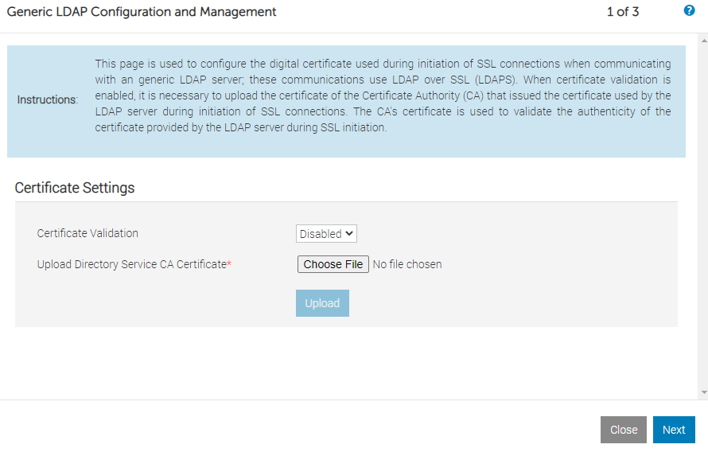
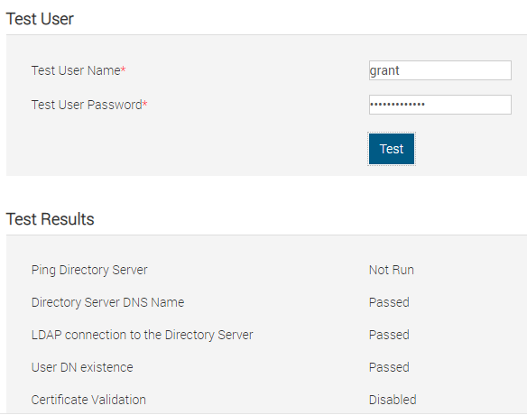

# idrac with LDAP

- [idrac with LDAP](#idrac-with-ldap)
  - [Version Info](#version-info)
  - [Setup FreeIPA](#setup-freeipa)
    - [Helpful Commands](#helpful-commands)
  - [Setup idrac](#setup-idrac)
  - [YouTube Video of Login](#youtube-video-of-login)

## Version Info

```
Fedora release 33 (Thirty Three)
NAME=Fedora
VERSION="33 (Workstation Edition)"
ID=fedora
VERSION_ID=33
VERSION_CODENAME=""
PLATFORM_ID="platform:f33"
PRETTY_NAME="Fedora 33 (Workstation Edition)"
ANSI_COLOR="0;38;2;60;110;180"
LOGO=fedora-logo-icon
CPE_NAME="cpe:/o:fedoraproject:fedora:33"
HOME_URL="https://fedoraproject.org/"
DOCUMENTATION_URL="https://docs.fedoraproject.org/en-US/fedora/f33/system-administrators-guide/"
SUPPORT_URL="https://fedoraproject.org/wiki/Communicating_and_getting_help"
BUG_REPORT_URL="https://bugzilla.redhat.com/"
REDHAT_BUGZILLA_PRODUCT="Fedora"
REDHAT_BUGZILLA_PRODUCT_VERSION=33
REDHAT_SUPPORT_PRODUCT="Fedora"
REDHAT_SUPPORT_PRODUCT_VERSION=33
PRIVACY_POLICY_URL="https://fedoraproject.org/wiki/Legal:PrivacyPolicy"
VARIANT="Workstation Edition"
VARIANT_ID=workstation
Fedora release 33 (Thirty Three)
Fedora release 33 (Thirty Three)
```

## Setup FreeIPA

1. Install Fedora
2. Change hostname
      1.`hostname freeipa.grant.lan && hostnamectl set-hostname freeipa.grant.lan`
      2.Change in /etc/hostname
      3.Configure DNS to return for this hostname. Double check with `dig +short freeipa.grant.lan A && dig +short -x 192.168.1.95`
3. Follow [RHEL's instructions](https://access.redhat.com/documentation/en-us/red_hat_enterprise_linux/8/html-single/installing_identity_management/index)
      1.I used Chapter 5 for primary installation
      2.Make sure you add the requested DNS entries at the end
4. Run `firewall-cmd --permanent --add-port={80/tcp,443/tcp,389/tcp,636/tcp,88/tcp,464/tcp,88/udp,464/udp,123/udp} && firewall-cmd --reload` to allow the appropriate ports
5. Run `kinit admin` - this allows you to use the command line tools otherwise they'll complain about kerberos.
6.  Log into FreeIPA server at `https://<your_hostname>`. In my case, Windows popped up a username and password prompt. That prompt didn't work - I had to exit it and then log into the webGUI.
    1.  Add a user other than administrator.
7.  Create a new user and new group in the UI and assign the new user to the new group.
    1.  **WARNING** I had to actually add the user to a new group. The group **could not** be admins or it wouldn't work. When I dumped `ldapsearch -x -H ldap://localhost -b "cn=admins,cn=groups,cn=accounts,dc=grant,dc=lan" -D "uid=grant,cn=users,cn=accounts,dc=grant,dc=lan" -w PASSWORD | less` my user actually didn't show in the admins group. When I created my own group and checked it worked fine.

### Helpful Commands

To start the IPA service use `ipactl start|stop|restart`. You can check the status with `ipactl status`.

Test LDAP credentials: `ldapwhoami -vvv -h 192.168.1.95 -p 389 -D 'uid=grant,cn=users,cn=accounts,dc=grant,dc=lan' -x -w <PASSWORD>`

Dump the structure of FreeIPA: `ldapsearch -x -H ldap://localhost -b "cn=accounts,dc=grant,dc=lan" -D "uid=grant,cn=users,cn=accounts,dc=grant,dc=lan" -w <YOUR_USERS_PASSWORD> | less`
You can also use this to check to see if a user is a member of a group by changing the base path to search (-b). Change it to what you think the FQDN of the group is. The user in question should show up.

## Setup idrac

Go into the idrac and click the directories prompt.

1. I ran without certs

2. I used the following values:

        Generic LDAP: Enabled
        Use Distinguished Name to Search Group Membership: Enabled
        LDAP Server Address: freeipa.grant.lan
        LDAP Server Port: 636
        Bind DN: uid=grant,cn=users,cn=accounts,dc=grant,dc=lan
        Bind Password: Your password
        Base DN to Search: cn=accounts,dc=grant,dc=lan
        Attribute of User Login: uid
        Attribute of Group Membership: member

3. Click next and for Group DN I used `cn=grantgroup,cn=groups,cn=accounts,dc=grant,dc=lan` where `grantgroup` was the name of the user group I added
4. I ran the test with the following results:


        # Test Results
        Ping Directory Server	Not Run
        Directory Server DNS Name	Passed
        LDAP connection to the Directory Server	Passed
        User DN existence	Passed
        Certificate Validation	Disabled
        User Authentication	Passed
        User Authorization	Passed

        # Test Log
        16:49:14  Initiating Directory Services Settings Diagnostics:
        16:49:14  trying LDAP server freeipa.grant.lan:636
        16:49:14  Server Address freeipa.grant.lan resolved to 192.168.1.95
        16:49:14  connect to 192.168.1.95:636 passed
        16:49:14  Connecting to ldaps://[freeipa.grant.lan]:636...
        16:49:14  Test user authenticated user=uid=grant,cn=users,cn=accounts,dc=grant,dc=lan host=freeipa.grant.lan
        16:49:14  Search command:
          Bind DN: uid=grant,cn=users,cn=accounts,dc=grant,dc=lan
          Scope: subtree
          Base DN: cn=accounts,dc=grant,dc=lan
          Search filter: (uid=grant)
          Attribute list:
          objectClass
          memberOf
          dn
          uid
          objectCategory
          defaultNamingContext
          namingContexts
          ldapServiceName
          supportedControl
          supportedExtension
        16:49:14  Connecting to ldaps://[freeipa.grant.lan]:636...
        16:49:14  Test user authenticated user=uid=grant,cn=users,cn=accounts,dc=grant,dc=lan host=freeipa.grant.lan
        16:49:15  Connecting to ldaps://[freeipa.grant.lan]:636...
        16:49:15  Test user authenticated user=uid=grant,cn=users,cn=accounts,dc=grant,dc=lan host=freeipa.grant.lan
        16:49:15  Search command:
          Bind DN: uid=grant,cn=users,cn=accounts,dc=grant,dc=lan
          Scope: base
          Base DN: cn=grantgroup,cn=groups,cn=accounts,dc=grant,dc=lan
          Search filter: (member=uid=grant,cn=users,cn=accounts,dc=grant,dc=lan)
          Attribute list:
          objectClass
          memberOf
          dn
          uid
          objectCategory
          defaultNamingContext
          namingContexts
          ldapServiceName
          supportedControl
          supportedExtension
        16:49:15  Privileges gained from role group 'cn=grantgroup,cn=groups,cn=accounts,dc=grant,dc=lan':
          Login
          Config iDRAC
          Config User
          Clear Logs
          Server Control
          Virtual Console
          Virtual Media
          Test Alerts
          Diagnostic Command
        16:49:15  Test user grant authorized

        16:49:15  Cumulative privileges gained:
          Login
          Config iDRAC
          Config User
          Clear Logs
          Server Control
          Virtual Console
          Virtual Media
          Test Alerts
          Diagnostic Command

## YouTube Video of Login

See: https://youtu.be/-fHlHhF9vH4