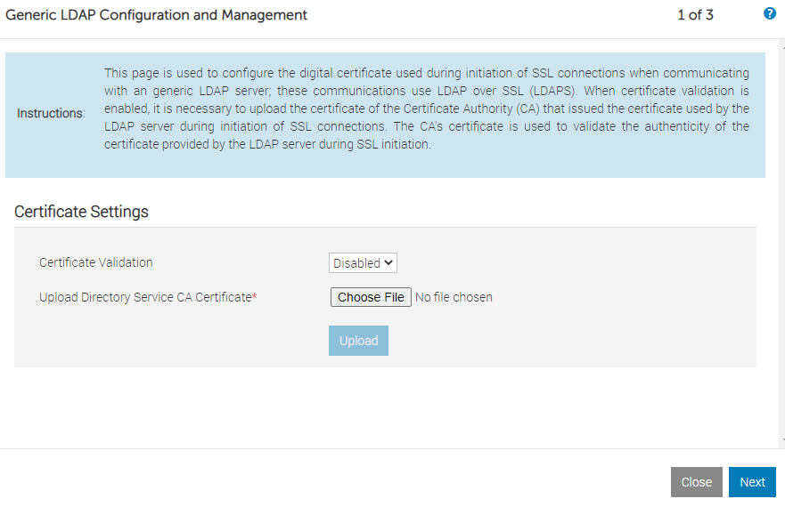
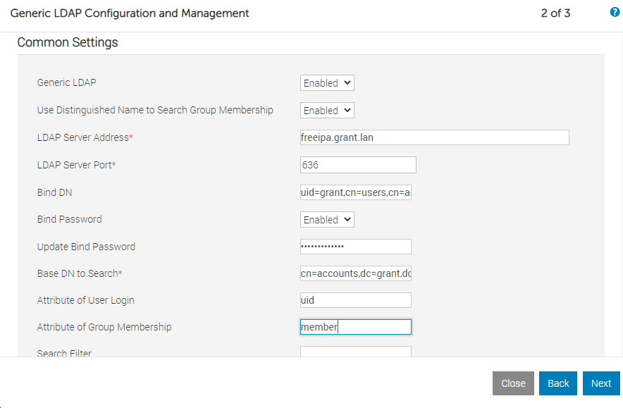

# Configuring idrac with OpenLDAP

- [Configuring idrac with OpenLDAP](#configuring-idrac-with-openldap)
  - [Setup OpenLDAP](#setup-openldap)
    - [Debugging](#debugging)
  - [Configure idrac](#configure-idrac)
  - [Stopped](#stopped)

## Setup OpenLDAP

I used [osixia's openldap container](https://github.com/osixia/docker-openldap) for testing. I used [osixia's phpLDAPadmin container](https://github.com/osixia/docker-phpLDAPadmin) for administration.

1. Add an entry to your DNS server for `ldap.granttest.lan`
2. `podman run -p 389:389 -p 636:636 --name my-openldap-container --env LDAP_TLS=false --env LDAP_LOG_LEVEL=8 --env LDAP_ORGANISATION="Grant Test" --env LDAP_DOMAIN="granttest.lan" --env LDAP_ADMIN_PASSWORD="admin" --detach osixia/openldap:1.5.0 --loglevel debug && podman run -p 6443:443 --env PHPLDAPADMIN_LDAP_HOSTS=ldap.granttest.lan --detach osixia/phpldapadmin:0.9.0`
   1. Test the container: `podman exec my-openldap-container ldapsearch -x -H ldap://localhost -b dc=granttest,dc=lan -D "cn=admin,dc=granttest,dc=lan" -w admin`. That should output:

          # extended LDIF
          #
          # LDAPv3
          # base <dc=example,dc=org> with scope subtree
          # filter: (objectclass=*)
          # requesting: ALL
          #

          [...]

          # numResponses: 3
          # numEntries: 2

3. Configure firewall: `firewall-cmd --add-port=389/tcp --permanent && firewall-cmd --add-port=636/tcp --permanent && firewall-cmd --add-port=6443/tcp --permanent && firewall-cmd --reload`
4. Make sure you can log into `https://<YOUR_IP_ADDRESS>:6443` with username `cn=admin,dc=granttest,dc=lan` and password `admin`

### Debugging

You can use `podman inspect <container_name>` and then search for `Log` to find the location of the logs.

## Configure idrac

1. I disabled certificates (yes I was lazy)

## Stopped

For whatever reason the container networking never quite cooperated. Even though DNS entries were present for the external IP when either OME or idrac would try to hit it they would both say the LDAP server was unavailable. phpldapadmin worked without issue. I know it's a probably with the networking but decided it wasn't worth diving into so I abandonded this approach and went with a baremetal FreeIPA instance.